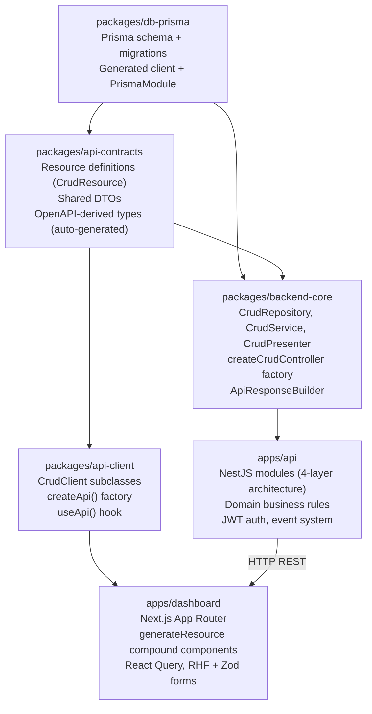
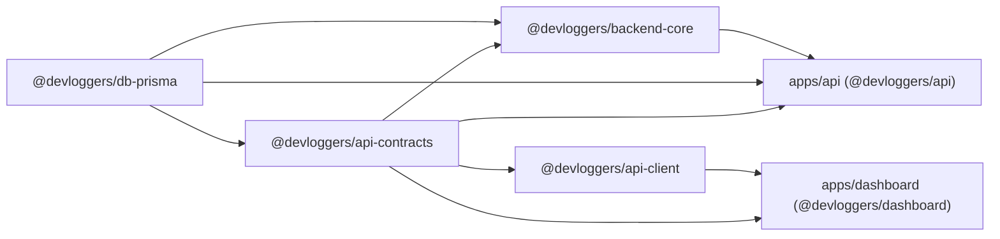

# Architecture

## Architectural Style

The system is a **feature-based, layered monorepo** with light DDD influence:

- **Monorepo** via Turborepo + pnpm workspaces: apps and packages share code through typed workspace packages.
- **Layered architecture** within each NestJS module: Controller → Service → Repository → Presenter.
- **Shared contracts** package (`api-contracts`) is the single source of truth for resource definitions, DTOs, and types.
- **Multi-tenant** application: every database query is scoped by `tenantId`.
- **Event-driven side effects**: `CrudService` emits domain events via `EventEmitter2` after every mutation.

---

## Layer Responsibilities



### Full-Stack Data Flow

```
Prisma model
  → api-contracts resource + DTO
    → NestJS module (Repository → Service → Presenter → Controller)
      → api-client CrudClient
        → dashboard generateResource (Provider → Page → Table / Form)
```

---

## Dependency Flow



Dependency direction rules (from `packages.md`):
- `api-contracts` must never depend on `api` or `dashboard`.
- `api-client` must never depend on `api` directly.
- `backend-core` is infrastructure only — no domain logic.

---

## Design Patterns

### 1. CRUD Factory Pattern (`createCrudController`)

Every resource controller is generated by a factory function:

```typescript
const UnitsCrudBase = createCrudController({
    responseDto: UnitResponseDto,
    createDto: CreateUnitDto,
    updateDto: UpdateUnitDto,
    openApi: UNITS_CRUD_OPENAPI,
})

@ApiTags('Catalog / Units')
@Controller('units')
@UseGuards(JwtAuthGuard)
export class UnitsController extends UnitsCrudBase {
    constructor(service: UnitsService) {
        super(service, 'Unit')
    }
}
```

The factory generates all 5 HTTP routes (GET /, GET /:id, POST /, PATCH /:id, DELETE /:id), tenant scoping, Swagger decorators, and `ApiResponseBuilder` envelopes automatically.

### 2. Repository Pattern (`CrudRepository<T>`)

Abstract base class providing tenant-scoped Prisma queries:

- `findMany(tenantId, options)` — paginated + filtered
- `findById(tenantId, id)` — single record
- `findByIdOrFail(tenantId, id)` — throws `NotFoundException`
- `create(data)` — requires caller to include `tenantId`
- `update(id, data)` — by primary key
- `delete(id)` — hard delete
- `exists(tenantId, where)` — boolean check

### 3. Service Lifecycle Hooks (`CrudService<T>`)

Abstract base class with hook points for business rules:

| Hook | Runs | Typical use |
|------|------|-------------|
| `beforeCreate(tenantId, dto)` | Before DB insert | Uniqueness checks, data enrichment |
| `beforeUpdate(tenantId, id, dto, existing)` | Before DB update | Status transition guards |
| `beforeDelete(tenantId, id, existing)` | Before DB delete | FK constraint checks |
| `onCreated(tenantId, entity)` | After create | Extra side effects (base already emits events) |
| `onUpdated(tenantId, entity, previous)` | After update | Extra side effects |
| `onDeleted(tenantId, entity)` | After delete | Extra side effects |

### 4. Presenter Pattern (`CrudPresenter<TEntity, TResponse>`)

Separates raw Prisma entity from serialized API response:

```typescript
@Injectable()
export class UnitPresenter extends CrudPresenter<Unit, UnitResponseDto> {
    toResponse(entity: Unit): UnitResponseDto {
        return { id: entity.id, name: entity.name, ... }
    }
}
```

### 5. Dashboard Resource Pattern (`generateResource`)

A namespace factory that creates a compound component set from a single config:

```typescript
export const UnitsResource = generateResource<UnitsClient>({
    getClient: (api) => api.units,
    paramKey: "units",
    list: { searchIn: ["name", "abbreviation"], defaultSort: { field: "name", order: "asc" } },
})
```

Exposes: `UnitsResource.Provider`, `.Page`, `.Table`, `.FormDialog`, `.Search`, `.Filter`, `.Toolbar`, `.Grid`, `.Pagination`, `.useContext`.

### 6. Form Pattern (RHF + Zod)

Dashboard forms use `useResourceForm` (initialization/edit mode) + `useFormMutation` (submit with server error mapping):

- Config file (`.config.ts`) — Zod schema, default values, `mapXToFormValues` mapper (no JSX)
- Form component (`.form.tsx`) — calls hooks, renders `RhfTextField`, `RhfCheckboxField`, etc.

---

## Event System

Domain events are emitted by `CrudService` after every successful mutation:

```
unit.created  →  ResourceCreatedEvent { tenantId, resourceName, payload: Unit }
unit.updated  →  ResourceUpdatedEvent { tenantId, resourceName, payload: Unit, previous: Unit }
unit.deleted  →  ResourceDeletedEvent { tenantId, resourceName, payload: Unit }
```

Events use `EventEmitter2` (global, dot-delimiter). Modules listen with `@OnEvent('unit.created')`.

The `InvoicePostingService` demonstrates a more complex flow: posting an invoice triggers stock movements and item price updates as side effects beyond the base CRUD flow.

---

## Key Abstractions

| Abstraction | Package | File |
|-------------|---------|------|
| `CrudRepository<T>` | `backend-core` | `src/base/crud-repository.ts` |
| `CrudService<T,R,C,U>` | `backend-core` | `src/base/crud-service.ts` |
| `CrudPresenter<E,R>` | `backend-core` | `src/base/crud-presenter.ts` |
| `createCrudController(config)` | `backend-core` | `src/base/crud-controller.ts` |
| `ApiResponseBuilder` | `backend-core` | `src/api/api-response-builder.ts` |
| `CrudClient<R>` | `api-client` | `src/infra/crud-client.ts` |
| `createApi()` | `api-client` | `src/api.ts` |
| `generateResource<TClient>()` | `dashboard` | `shared/data-view/resource/generate-resource.tsx` |
| `ResourceProvider<TClient>` | `dashboard` | `shared/data-view/resource/resource-context.tsx` |
| `defineCrudResource()` | `api-contracts` | `src/resources/base/crud-resource.ts` |

---

## API Response Envelope

All successful API responses follow:

```json
{
    "status": "success",
    "message": "Unit list",
    "data": [...],
    "meta": {
        "pagination": {
            "total": 42,
            "page": 1,
            "limit": 10,
            "totalPages": 5
        }
    }
}
```

Error responses:

```json
{
    "status": "error",
    "message": "A unit named \"kg\" already exists",
    "data": null,
    "error": { "code": "CONFLICT", "message": "..." }
}
```
