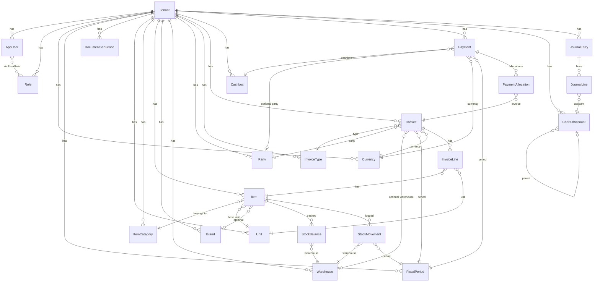

# Database

## Database Engine

**PostgreSQL** accessed via **Prisma ORM**.

- Prisma schema is split across per-entity `.prisma` files under `packages/db-prisma/src/schema/`.
- The `schema.prisma` file declares the datasource and generator; all entity files are merged at `prisma generate` time.
- Generated client output: `packages/db-prisma/generated/client/`.
- Migrations: `packages/db-prisma/src/schema/migrations/`.
- Seed: `packages/db-prisma/src/seed/index.ts` (must be idempotent).

---

## Tenant Scoping Pattern

Every tenant-scoped model follows this convention:

```prisma
model EntityName {
    id        String   @id @default(uuid())
    tenantId  String   @map("tenant_id")
    ...
    createdAt DateTime @default(now()) @map("created_at")
    updatedAt DateTime @updatedAt @map("updated_at")

    tenant Tenant @relation(fields: [tenantId], references: [id], onDelete: Cascade)

    @@index([tenantId])
    @@map("table_name")
}
```

- UUIDs as primary keys (prevent enumeration).
- `@@index([tenantId])` on all tenant-scoped models for query performance.
- `onDelete: Cascade` on the tenant relation — deleting a tenant removes all its data.
- All queries in `CrudRepository.findMany()` automatically merge `tenantId` into the `where` clause.

---

## Schema Overview

### Core Models

| Schema File | Models |
|-------------|--------|
| `tenant.prisma` | `Tenant` |
| `user.prisma` | `AppUser`, `Role`, `UserRole` |
| `tenant-setting.prisma` | `TenantSetting` |
| `unit.prisma` | `Unit` |
| `item-category.prisma` | `ItemCategory` |
| `item.prisma` | `Item` (+ `ItemType` enum) |
| `brand.prisma` | `Brand` |
| `tag.prisma` | `Tag` |
| `tag-assignment.prisma` | `TagAssignment` |
| `item-relation.prisma` | `ItemRelation` |
| `catalog-entity.prisma` | `CatalogEntity` |
| `item-catalog-entity.prisma` | `ItemCatalogEntity` |
| `warehouse.prisma` | `Warehouse`, `WarehouseItem` |
| `stock.prisma` | `StockBalance`, `StockMovement` (+ `StockMovementType` enum) |
| `stock-count.prisma` | `StockCount`, `StockCountLine` (+ `StockCountStatus` enum) |
| `party.prisma` | `Party` (+ `PartyType` enum) |
| `invoice.prisma` | `InvoiceType`, `Invoice`, `InvoiceLine` (+ `InvoiceDirection`, `InvoiceStatus` enums) |
| `cashbox.prisma` | `Cashbox`, `Payment`, `PaymentAllocation` (+ `PaymentType`, `PaymentStatus` enums) |
| `expense.prisma` | `Expense`, `ExpenseItem` (+ `ExpenseStatus` enum) |
| `accounting.prisma` | `ChartOfAccount`, `JournalEntry`, `JournalLine` (+ `AccountType`, `JournalEntryStatus` enums) |
| `currency.prisma` | `Currency` |
| `fiscal-period.prisma` | `FiscalPeriod` (+ `FiscalPeriodStatus` enum) |
| `document-sequence.prisma` | `DocumentSequence` |
| `audit.prisma` | `AuditLog` |
| `ai-chat.prisma` | `AiChatSession`, `AiChatMessage` (+ `MessageRole` enum) |
| `custom-field.prisma` | `CustomField`, `CustomFieldValue` (+ `FieldType` enum) |
| `file.prisma` | `File` |

---

## Entity Descriptions

### Identity

**Tenant** — Organization account. Has name, slug (unique), legal name, tax number, logo. References base currency and default sales document sequence. All other models cascade-delete when a tenant is deleted.

**AppUser** — System user. Belongs to one tenant. Email is unique per tenant. Has password hash, full name, phone, active status. Many-to-many with `Role` via `UserRole`.

**Role** — Permission role. Localized name (JSONB). Has `isSystem` flag for built-in roles.

**TenantSetting** — Key-value settings store. Categories: `localization`, `financial`, `documents`. Values are JSONB for flexibility.

### Catalog

**Unit** — Unit of measure (kg, piece, liter). Unique name per tenant. Referenced by items and invoice lines.

**ItemCategory** — Hierarchical product category. Self-referencing parent/child. Unique name per tenant.

**Item** — Core catalog entity. Has code (unique per tenant), name, barcode, category, base unit, brand, selling price, latest purchase price. `ItemType` enum: product, service, vehicle, bundle. Service items bypass stock logic.

**Brand** — Item brand with optional image URL.

**Tag** — Color-coded label scoped to a module ("items" | "parties" | "invoices" | "warehouses").

**TagAssignment** — Links a tag to any entity by `entityType` + `entityId`.

**ItemRelation** — Directional relationship between two items (e.g., variant, component).

**CatalogEntity** — Generic hierarchical entity tree for flexible catalog extension. `kind` field distinguishes entity types.

**ItemCatalogEntity** — Many-to-many link between items and catalog entities.

### Inventory

**Warehouse** — Physical or logical storage location. Unique code per tenant.

**WarehouseItem** — Item configuration within a warehouse (min/max quantity thresholds).

**StockBalance** — Denormalized current stock level (quantity + average cost) per warehouse/item pair. Updated on every stock movement. Unique constraint on (tenantId, warehouseId, itemId).

**StockMovement** — Immutable ledger entry recording every stock change. Types: OPENING, PURCHASE, SALE, ADJUSTMENT, STOCK_COUNT, TRANSFER_IN, TRANSFER_OUT. References item, warehouse, and fiscal period. Quantity is signed (positive = in, negative = out).

**StockCount** — Physical inventory count document. Lifecycle: DRAFT → POSTED → CANCELLED. Lines compare system vs counted quantities.

### Invoicing

**InvoiceType** — Document type configuration. Has code, localized name, direction (SALE/PURCHASE), `affectsStock` flag.

**Invoice** — Transaction document. Number (auto from DocumentSequence), date, due date, party, warehouse (optional for sales), fiscal period, currency, status (DRAFT/POSTED/CANCELLED). Server-computed subtotal, discount, tax, total. Tracks `createdBy`, `postedBy`, `cancelledBy`.

**InvoiceLine** — Line item on an invoice. Has item, unit, quantity, unit price, discount %, tax %, computed totals.

### Payments and Finance

**Cashbox** — Cash register or bank account. Has currency, running balance, optional linked chart-of-account entry.

**Payment** — Cash receipt or disbursement. Types: RECEIPT, PAYMENT, ADJUSTMENT. Status: DRAFT/POSTED/CANCELLED. Has amount, allocated amount, unallocated amount.

**PaymentAllocation** — Links a payment to an invoice. Enables partial allocations.

**Expense** — Expense voucher with multiple items mapped to GL accounts. Status: DRAFT/POSTED/CANCELLED. Optional journal entry reference.

**ExpenseItem** — Single line on an expense — account, description, amount.

### Accounting

**ChartOfAccount** — Account in the chart. Types: ASSET, LIABILITY, EQUITY, REVENUE, EXPENSE. Hierarchical (parent/child). Unique code per tenant. Localized name (JSONB).

**JournalEntry** — Double-entry bookkeeping record. Status: DRAFT/POSTED. References fiscal period. Has reference type/ID (e.g., "invoice").

**JournalLine** — Single debit or credit line on a journal entry.

**Currency** — Multi-currency support. Has code (SYP, USD, etc.), localized name and symbol. `isBase` flag for the tenant's base currency.

**FiscalPeriod** — Accounting period with start/end date. Status: OPEN/CLOSED/LOCKED. All financial documents (invoices, payments, stock movements, journal entries) reference a fiscal period.

**DocumentSequence** — Auto-increment counter per document type. Has prefix, next number, and padding width.

### System

**AuditLog** — Append-only record of mutations. Fields: userId, action, entityType, entityId, oldValues (JSON), newValues (JSON), ipAddress.

**AiChatSession** — AI chat conversation container. Belongs to a user within a tenant.

**AiChatMessage** — Individual message in an AI chat session. Role: USER or ASSISTANT.

**CustomField** — Tenant-defined extension field for any module. Types: TEXT, DATE, NUMBER, SELECT, BOOLEAN, MULTI_SELECT, FILE.

**CustomFieldValue** — Stored value for a custom field on a specific entity (entityType + entityId).

**File** — Uploaded file metadata. Stores original name, MIME type, size, path, URL, checksum.

---

## ER Diagram (Core Relationships)



---

## Commands

```bash
# Generate Prisma client after schema changes
pnpm --filter @devloggers/db-prisma db:generate

# Create + apply a migration
pnpm --filter @devloggers/db-prisma db:migrate:dev

# Run seed
pnpm --filter @devloggers/db-prisma db:seed

# Open Prisma Studio
pnpm --filter @devloggers/db-prisma db:studio
```
