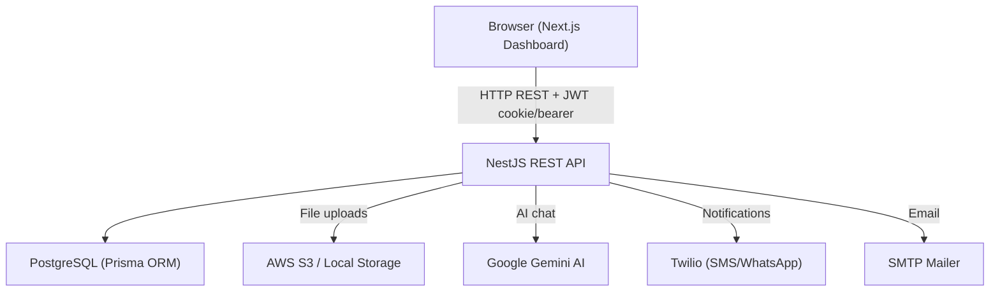
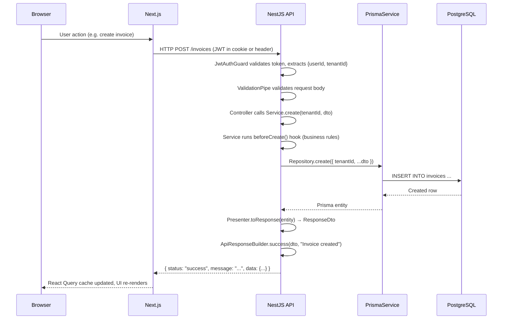

# Overview

## Project Purpose

**Devloggers ERP** is a full-featured, multi-tenant ERP system targeting small-to-medium businesses (SMBs) in the MENA (Middle East and North Africa) region. It covers the complete business operations cycle:

- Sales and purchase **invoicing**
- **Customer and supplier** management
- **Inventory** tracking (warehouses, stock movements, stock counts)
- **Financial accounting** (chart of accounts, cashboxes, currencies, fiscal periods)
- **Catalog** management (items, categories, units, brands, custom fields)
- **Reporting** and a real-time **dashboard**
- An embedded **AI assistant** (Google Gemini-powered chat)

The product is built for business operators — not engineers. It supports **Arabic, English, and Turkish** natively, with RTL as the primary design direction and Tajawal font stack for Arabic rendering.

---

## High-Level Architecture

---

## Main Modules / Domains

| Domain | Purpose |
|--------|---------|
| **Identity** | Authentication (JWT), tenants, users, roles |
| **Catalog** | Items, categories, units, brands, tags, custom fields, catalog entities |
| **Inventory** | Warehouses, stock balances (projection), stock movements (ledger), stock counts |
| **Invoicing** | Invoice types, invoices (sales + purchase), invoice posting/cancel |
| **Parties** | Customers, suppliers (unified `Party` model with `PartyType` enum) |
| **Accounting** | Chart of accounts, journal entries, currencies, fiscal periods, document sequences |
| **Finance** | Cashboxes, payments, expenses |
| **Reports** | Dashboard metrics, stock/sales/purchase reports |
| **AI Chat** | Gemini-powered contextual assistant with persistent sessions |
| **Audit** | Append-only audit log for all mutations |
| **Files** | Multipart upload, local or S3 storage, stored metadata in DB |
| **Custom Fields** | Per-tenant extensible fields on any entity |
| **Settings** | Tenant-level localization, financial, and document settings |

---

## Data Flow (Browser to Response)

---

## External Integrations

| Integration | Purpose | Config key |
|-------------|---------|-----------|
| **AWS S3** | File storage (images, documents) | `STORAGE_TYPE=s3`, `AWS_*` env vars |
| **Local filesystem** | File storage fallback (development) | `STORAGE_TYPE=local`, serves via `/uploads` |
| **Google Gemini** | AI chat assistant | `GEMINI_API_KEY`, `AI_MODEL` |
| **Twilio** | SMS / WhatsApp notifications | `TWILIO_*` env vars |
| **SMTP / Nodemailer** | Email delivery | `@nestjs-modules/mailer` |
| **PostgreSQL** | Primary database | `DATABASE_URL` |
