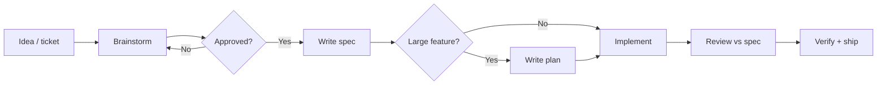

# Superpowers — Spec-Driven Development

This folder is the **single source of truth** for feature designs and implementation plans.
Any developer or AI agent entering the project should start here before building non-trivial work.

Inspired by the [Superpowers](https://github.com/obra/superpowers) plugin workflow and adapted for the Devloggers ERP monorepo.

---

## Directory layout

```
docs/superpowers/
├── README.md                 ← you are here
├── templates/
│   ├── spec-template.md      ← copy → specs/
│   └── plan-template.md      ← copy → plans/
├── specs/                    ← approved technical designs
│   └── YYYY-MM-DD-<topic>-design.md
└── plans/                    ← checkbox task breakdowns (large features)
    └── YYYY-MM-DD-<topic>.md
```

---

## Workflow at a glance



### Step 1 — Orient

- Read `AGENTS.md` and skill **`erp-project-map`**
- Trace the **units** golden slice if adding CRUD
- Invoke **`/caveman`** or superpowers **brainstorming** for new features

### Step 2 — Design spec (required for non-trivial work)

1. Copy `templates/spec-template.md`
2. Save as `specs/YYYY-MM-DD-<kebab-topic>-design.md`
3. Fill: context, requirements, approach, file map, verification
4. Get explicit approval before coding

**HARD-GATE:** No implementation until the spec is approved.

### Step 3 — Implementation plan (optional, recommended for cross-stack work)

1. Copy `templates/plan-template.md`
2. Save as `plans/YYYY-MM-DD-<kebab-topic>.md`
3. Link to the source spec
4. Use checkbox tasks (`- [ ]`) per file/group
5. Agents: use superpowers **executing-plans** or **subagent-driven-development**

### Step 4 — Implement

Follow layer skills in order:

| Layer | Skill / rule |
|-------|----------------|
| Database | `.ai/rules/database.md` |
| Contracts | `api-contracts` |
| API | `backend-resource-module`, `.ai/rules/api.md` |
| Client | `api-client` |
| Dashboard | `dashboard-resource-page`, `frontend-resource-pattern` |
| Full stack | `add-crud-feature` or `feature-scaffold` |

### Step 5 — Review & verify

- Compare code to the spec line-by-line
- Run builds on touched packages
- Regenerate OpenAPI types if API DTOs changed: `pnpm generate:dev`

---

## When to write what

| Change | Spec | Plan |
|--------|------|------|
| Typo, one-liner | ❌ | ❌ |
| Single-layer bugfix | Optional | ❌ |
| New endpoint or UI section | ✅ | Optional |
| Full feature (DB → UI) | ✅ | ✅ |
| Refactor touching 5+ files | ✅ | ✅ |

---

## Naming conventions

| Artifact | Pattern | Example |
|----------|---------|---------|
| Design spec | `YYYY-MM-DD-<topic>-design.md` | `2026-07-06-units-export-design.md` |
| Plan | `YYYY-MM-DD-<topic>.md` | `2026-07-06-units-export.md` |

Use **today's date** when creating new files. Keep topics short and kebab-case.

---

## AI tooling map

| Tool | Config | Skills path |
|------|--------|-------------|
| **Cursor** | `.cursor/settings.json` (superpowers enabled) | `.cursor/skills/`, `.ai/skills/` |
| Claude Code teammates | `.claude/settings.json` | `.claude/skills/` via `pnpm sync:claude` |
| **OpenCode** | `opencode.json` | `.ai/skills/` |

### Key orchestration skills

| Skill | Purpose |
|-------|---------|
| `caveman` | Full cycle: orient → brainstorm → spec → implement → review |
| `feature-scaffold` | File map + naming for new entities |
| `add-crud-feature` | Layer-by-layer checklist |
| `erp-project-map` | Where everything lives |

### Superpowers plugin skills (external)

Loaded when the Superpowers plugin is enabled:

- `brainstorming` — design exploration before code
- `writing-plans` / `executing-plans` — plan authoring and execution
- `subagent-driven-development` — parallel task execution
- `verification-before-completion` — evidence before "done"
- `systematic-debugging` — structured bug investigation

---

## Existing specs & plans

Browse `specs/` and `plans/` for prior art on:

- Chart of accounts, invoices, expenses, tenant settings
- Dashboard widgets, onboarding wizard, accounting integration
- Item relations, landing pages, form refactors

**Before starting similar work**, search this folder for an existing design to extend rather than duplicate.

---

## Quick start for a new feature

```bash
# 1. Copy templates
cp docs/superpowers/templates/spec-template.md \
   docs/superpowers/specs/$(date +%Y-%m-%d)-my-feature-design.md

# 2. In Cursor chat:
#    "/caveman I want to add <feature>"

# 3. After approval, implement with:
#    skill add-crud-feature OR feature-scaffold
```

---

## Related documentation

- [AI Engineering Guide](../ai-engineering.md) — full onboarding for humans + agents
- [AGENTS.md](../../AGENTS.md) — agent entry point
- [Architecture](../architecture.md) — system design
- [Code patterns](../code-patterns.md) — recurring implementation patterns
- [Forms architecture](../../.ai/docs/forms-architecture.md) — dashboard forms deep dive
