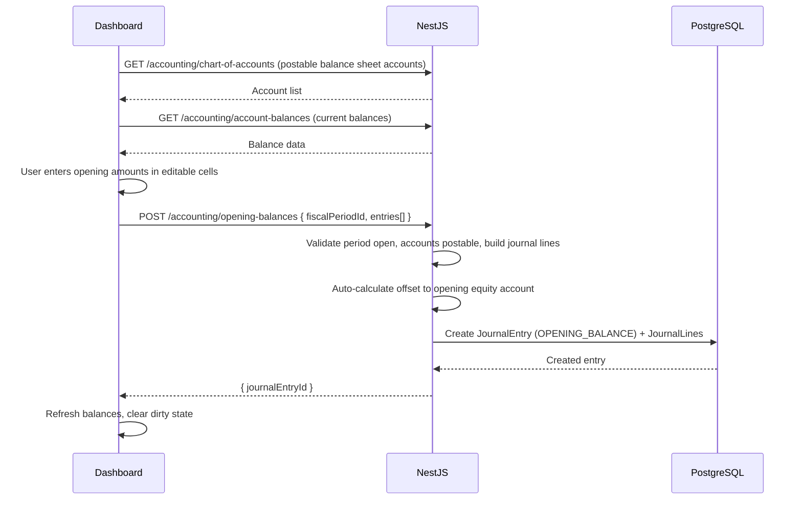
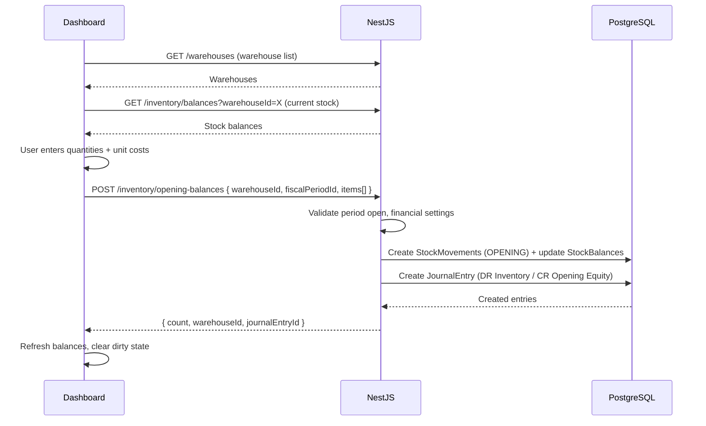

# Opening Balance & Opening Stock Pages — Design

**Date:** 2026-07-20  
**Author:** agent  
**Status:** Approved  
**Scope:** Dashboard → Finance → Opening Balances; Dashboard → Inventory → Opening Balances  
**Primary goal:** Provide spreadsheet-style pages for entering initial GL account balances and initial stock quantities/values when setting up a tenant or starting a new fiscal year.

---

## Context

- **Opening Stock API** already exists: `POST /inventory/opening-balances` in `apps/api/src/modules/inventory/inventory.controller.ts` with full implementation (`registerOpeningBalance` creates OPENING stock movements + journal entry).
- **Opening Balance API** does NOT exist — no endpoint for entering GL account opening balances.
- **Nav items:** Opening Balances exists under Inventory in `navGroups.tsx` (with `ScaleIcon`). No nav item for finance opening balances.
- **Dashboard pages:** Neither page exists. No `modules/opening-balances/` or `modules/opening-stock/` directories.
- **Related specs:** `docs/superpowers/specs/2026-07-16-accounting-coa-refactor-design.md` (accounting refactor with `ReferenceType.OPENING_BALANCE`, `JournalPostingService`, `isPostable`, contra accounts)
- **Golden reference:** units vertical slice for CRUD patterns.

---

## Requirements

### Functional

- [ ] **Opening Balance (GL):** Spreadsheet table of balance sheet accounts (ASSET, LIABILITY, EQUITY) with editable opening amount column
- [ ] **Opening Balance (GL):** Fiscal period selector — only OPEN periods allow posting
- [ ] **Opening Balance (GL):** Save All creates a single balanced journal entry with `ReferenceType.OPENING_BALANCE`
- [ ] **Opening Balance (GL):** Auto-offset to `defaultOpeningEquityAccountId` from FinancialSettings
- [ ] **Opening Balance (GL):** Shows current balance per account (from account balances API)
- [ ] **Opening Stock:** Spreadsheet table of items with editable quantity + unit cost columns
- [ ] **Opening Stock:** Warehouse selector + fiscal period selector
- [ ] **Opening Stock:** Save All calls existing `POST /inventory/opening-balances`
- [ ] **Opening Stock:** Shows current stock quantity per item (from stock balances API)
- [ ] **Opening Stock:** Only submits rows where quantity > 0

### Non-functional

- [ ] Tenant isolation (`tenantId` on all mutations)
- [ ] i18n: en, ar, tr
- [ ] RTL-safe UI (logical CSS)
- [ ] OpenAPI/Swagger completeness for new API endpoint
- [ ] Shared `EditableGrid` component to avoid duplication between the two pages

---

## UX requirements

### Shared: EditableGrid

- Spreadsheet-style table built on TanStack Table
- Editable columns render `<Input>` cells (number type for amounts/quantities)
- Read-only columns render plain text
- Dirty row tracking — visual indicator on rows with unsaved changes
- Toolbar area for selectors (fiscal period, warehouse)
- "Save All" button in toolbar — disabled when no dirty rows
- Loading state while saving
- Error display on save failure

### Opening Balance (GL) page

- **Route:** `/finance/opening-balances`
- **Toolbar:** Fiscal period dropdown (filtered to OPEN periods only)
- **Table:** Lists all postable balance sheet accounts (type IN [ASSET, LIABILITY, EQUITY], isPostable=true, isActive=true, deletedAt=null)
- **Columns:** Code (read-only), Name (read-only), Type (read-only badge), Current Balance (read-only), Opening Amount (editable number input)
- **Validation:** Total debits must equal total credits. If imbalanced, show the difference and auto-calculate offset to opening equity account. Display summary row: total debits, total credits, difference.
- **Save behavior:** Sends all rows with non-zero opening amounts as a single journal entry

### Opening Stock page

- **Route:** `/inventory/opening-balances`
- **Toolbar:** Warehouse dropdown + Fiscal period dropdown (filtered to OPEN periods only)
- **Table:** Lists all active items
- **Columns:** Code (read-only), Name (read-only), Category (read-only), Current Qty (read-only), Opening Qty (editable number), Unit Cost (editable number)
- **Save behavior:** Sends rows with quantity > 0 to `POST /inventory/opening-balances`

---

## Proposed approach

### Option A (recommended): Shared EditableGrid + two page modules

Create a shared `EditableGrid` component in `apps/dashboard/shared/components/editable-grid/` that abstracts the spreadsheet pattern. Build two page modules that use it:

1. `modules/opening-balances/` — for GL account opening balances (finance)
2. `modules/opening-stock/` — for inventory opening stock

New API endpoint `POST /accounting/opening-balances` for the GL page. Existing API endpoint for the stock page.

**Why this option:** Both pages share the same UX pattern (fiscal period selector + editable table + batch save). Extracting `EditableGrid` avoids duplication while staying lean (only 2 consumers). No heavy external dependencies.

### Option B (rejected): Per-page editable tables

Build editable tables directly in each module without a shared abstraction. Less upfront design but duplicated logic for dirty tracking, editable cells, and batch submit.

### Option C (rejected): Spreadsheet library (AG Grid / Handsontable)

Full spreadsheet experience but heavy dependency (~200KB+), inconsistent with existing TanStack Table patterns, overkill for 2 pages.

---

## Data flow

### Opening Balance (GL)



### Opening Stock



---

## File map

### Create

| Path | Purpose |
|------|---------|
| `apps/dashboard/shared/components/editable-grid/editable-grid.tsx` | Core EditableGrid component |
| `apps/dashboard/shared/components/editable-grid/editable-grid.types.ts` | Types for EditableGrid |
| `apps/dashboard/shared/components/editable-grid/index.ts` | Barrel export |
| `apps/dashboard/modules/opening-balances/index.ts` | Module barrel |
| `apps/dashboard/modules/opening-balances/components/opening-balances-page.tsx` | Page component |
| `apps/dashboard/modules/opening-balances/components/opening-balances-columns.tsx` | Column definitions |
| `apps/dashboard/modules/opening-balances/hooks/use-opening-balances.ts` | Data fetching + mutation hook |
| `apps/dashboard/app/[locale]/(authenticated)/finance/opening-balances/page.tsx` | App Router page |
| `apps/dashboard/modules/opening-stock/index.ts` | Module barrel |
| `apps/dashboard/modules/opening-stock/components/opening-stock-page.tsx` | Page component |
| `apps/dashboard/modules/opening-stock/components/opening-stock-columns.tsx` | Column definitions |
| `apps/dashboard/modules/opening-stock/hooks/use-opening-stock.ts` | Data fetching + mutation hook |
| `apps/dashboard/app/[locale]/(authenticated)/inventory/opening-balances/page.tsx` | App Router page |
| `apps/api/src/modules/accounting/accounts/controllers/opening-balances.controller.ts` | New API controller |
| `apps/api/src/modules/accounting/accounts/services/opening-balances.service.ts` | New API service |
| `apps/api/src/modules/accounting/accounts/dto/opening-balance.dto.ts` | Request/response DTOs |
| `packages/api-contracts/src/resources/account-opening-balance.resource.ts` | API contract resource |
| `packages/api-client/src/clients/account-opening-balances.client.ts` | API client for GL opening balances |
| `packages/api-client/src/clients/inventory-opening-balances.client.ts` | API client for inventory opening balances |

### Modify

| Path | Change |
|------|--------|
| `apps/dashboard/config/navGroups.tsx` | Add "Opening Balances" nav entry under Finance > Accounting section |
| `apps/dashboard/messages/en.json` | i18n keys for both pages |
| `apps/dashboard/messages/ar.json` | i18n keys for both pages |
| `apps/dashboard/messages/tr.json` | i18n keys for both pages |
| `packages/api-client/src/api-client.ts` | Register new clients |
| `apps/api/src/modules/accounting/accounts/accounts.module.ts` | Register new controller + service |

---

## Layer details

### 1. Database

No schema changes required. Uses existing models:
- `ChartOfAccount` (with `isPostable`, `type` filter)
- `JournalEntry` + `JournalLine` (for GL opening balance entry)
- `StockBalance` + `StockMovement` (for inventory opening stock)
- `FiscalPeriod` (period selector)
- `FinancialSetting` (for `defaultOpeningEquityAccountId`)

### 2. API contracts

**New resource: `account-opening-balance.resource.ts`**

```ts
export const accountOpeningBalanceResource = {
  key: 'account-opening-balances',
  routes: {
    post: '/accounting/opening-balances',
  },
} as const;
```

**DTOs:**

```ts
// Request
interface PostAccountOpeningBalanceDto {
  fiscalPeriodId: string;
  entries: AccountOpeningBalanceEntryDto[];
}

interface AccountOpeningBalanceEntryDto {
  accountId: string;
  amount: number;  // Positive = normal side (debit for assets, credit for liabilities/equity)
}

// Response
interface AccountOpeningBalanceResponseDto {
  journalEntryId: string;
  entriesCount: number;
}
```

**Existing resource update: `inventory.resource.ts`**

Already has `openingBalances: '/inventory/opening-balances'`. No change needed.

### 3. NestJS API

#### Opening Balances Controller (`opening-balances.controller.ts`)

```
POST /accounting/opening-balances
  Body: PostAccountOpeningBalanceDto
  Response: ApiResponse<AccountOpeningBalanceResponseDto>
```

#### Opening Balances Service (`opening-balances.service.ts`)

**`postOpeningBalances(tenantId, userId, dto)` flow:**

1. **Validate fiscal period** — `assertFiscalPeriodOpen(fiscalPeriodId)`
2. **Validate financial settings** — ensure `defaultOpeningEquityAccountId` is configured
3. **Fetch accounts** — validate all `accountId`s exist, are postable, active, not deleted, and type IN [ASSET, LIABILITY, EQUITY]
4. **Build journal lines:**
   - For each entry with non-zero amount:
     - ASSET accounts: debit = amount (positive amount means debit)
     - LIABILITY/EQUITY accounts: credit = amount (positive amount means credit)
   - Calculate total debits and total credits
   - Auto-balance: add offset line to `defaultOpeningEquityAccountId`
     - If debits > credits: credit opening equity for the difference
     - If credits > debits: debit opening equity for the difference
5. **Validate balanced** — after offset, total debits must equal total credits
6. **Create journal entry** via `JournalPostingService.post`:
   - `referenceType: ReferenceType.OPENING_BALANCE`
   - `date: fiscalPeriod.startDate`
   - Lines from step 4
7. **Return** `{ journalEntryId, entriesCount }`

**Edge cases:**
- Empty entries array → `BadRequestException`
- All amounts zero → skip (no journal entry created)
- Account not found / not postable / wrong type → `BadRequestException` with account code
- Fiscal period not open → `BadRequestException`
- Opening equity account not configured → `BadRequestException`

### 4. API client

**`account-opening-balances.client.ts`:**

```ts
class AccountOpeningBalancesClient {
  post(dto: PostAccountOpeningBalanceDto): Promise<ApiResponse<AccountOpeningBalanceResponseDto>>
}
```

**`inventory-opening-balances.client.ts`:**

```ts
class InventoryOpeningBalancesClient {
  post(dto: PostOpeningBalanceDto): Promise<ApiResponse<OpeningBalanceResponseDto>>
}
```

Both registered on `ApiClient` as `api.accountOpeningBalances` and `api.inventoryOpeningBalances`.

### 5. Dashboard

#### EditableGrid component

**Props:**

```ts
interface EditableGridProps<TData> {
  data: TData[];
  columns: ColumnDef<TData>[];
  editableColumns: string[];  // column IDs that are editable
  getRowId: (row: TData) => string;
  onDirtyChange?: (dirtyRows: TData[]) => void;
  toolbarStart?: ReactNode;  // Left side of toolbar (selectors)
  toolbarEnd?: ReactNode;    // Right side of toolbar (save button)
}
```

**Behavior:**
- Wraps TanStack Table with `useReactTable`
- Editable cells render `<Input type="number">` with `onChange` updating local state
- Tracks dirty rows via a `Map<rowId, originalValue>` comparison
- Exposes dirty rows via `onDirtyChange` callback
- Toolbar renders `toolbarStart` and `toolbarEnd` slots

#### Opening Balances Page (GL)

**`opening-balances-page.tsx`:**
- Fetches accounts via `api.chartOfAccounts.list()` filtered to postable balance sheet
- Fetches current balances via account balances hook
- Fetches fiscal periods via `api.fiscalPeriods.list()` filtered to OPEN
- Merges account data with current balances
- Renders `EditableGrid` with fiscal period selector in toolbar
- "Save All" calls `api.accountOpeningBalances.post()`
- On success: invalidates balance queries, shows toast, clears dirty state

**`opening-balances-columns.tsx`:**
- Code, Name, Type (badge), Current Balance (formatted number), Opening Amount (editable)

#### Opening Stock Page

**`opening-stock-page.tsx`:**
- Fetches warehouses via `api.warehouses.list()`
- Fetches items via items API
- Fetches stock balances via `api.stockBalances.list({ warehouseId })`
- Fetches fiscal periods filtered to OPEN
- Merges item data with current stock quantities
- Renders `EditableGrid` with warehouse + fiscal period selectors in toolbar
- "Save All" calls `api.inventoryOpeningBalances.post()`
- On success: invalidates stock balance queries, shows toast, clears dirty state

**`opening-stock-columns.tsx`:**
- Code, Name, Category, Current Qty, Opening Qty (editable), Unit Cost (editable)

---

## Verification

```bash
pnpm turbo run build --filter=@devloggers/api-contracts
pnpm turbo run build --filter=@devloggers/api-client
pnpm turbo run build --filter=@devloggers/api
pnpm turbo run build --filter=@devloggers/dashboard
```

### Manual smoke test

- [ ] Opening Balance page loads with balance sheet accounts
- [ ] Fiscal period selector shows only OPEN periods
- [ ] Entering amounts marks rows as dirty
- [ ] Save All creates a balanced journal entry
- [ ] Opening Stock page loads with items
- [ ] Warehouse selector filters stock balances
- [ ] Save All creates stock movements + journal entry
- [ ] i18n renders in ar (RTL) and en
- [ ] Error states display correctly (closed period, missing equity account)

---

## Out of scope

- Per-warehouse inventory/COGS accounts (roadmap item per accounting refactor spec)
- Trial balance / closing entries
- Cancellation/reversal of opening balance entries (already supported by `ReferenceType.OPENING_BALANCE_CANCELLATION` but no UI)
- Bulk import from CSV/spreadsheet
- Materialized-path tree optimization

---

## Open questions

None — all decisions resolved during brainstorming.

---

## Approval

- [x] Design reviewed by: user
- [x] Approved on: 2026-07-20
