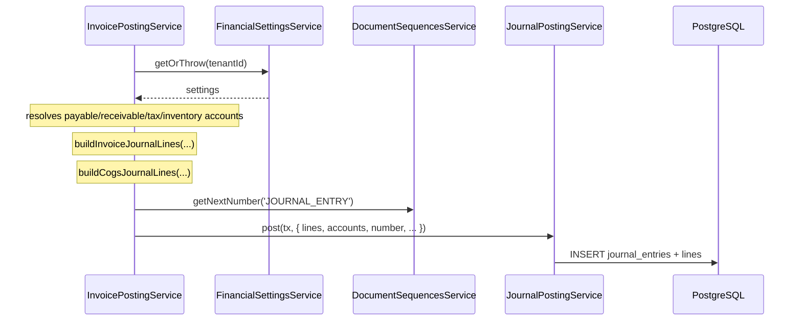
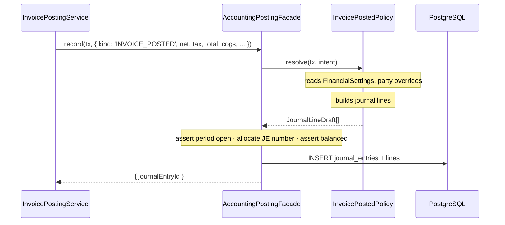

# Architecture Refactor Roadmap — Design

**Date:** 2026-07-25
**Author:** Claude (Opus 5) with Mohammad Khyata
**Status:** Draft
**Scope:** Cross-cutting — `apps/api`, `apps/dashboard`, `packages/*`
**Primary goal:** Remove accounting/GL policy from six non-accounting modules, restore type safety in the API, and prepare the codebase for modular/microservice extraction — without changing any posted GL output.

---

## Context

### What exists today

The monorepo follows a consistent, well-documented vertical slice
(`Prisma → api-contracts → NestJS 4-layer → api-client → dashboard generateResource`).
That structure is sound and is **not** what this refactor changes.

What this refactor changes is the **semantic coupling** that grew inside that structure.

| Area | Files |
|---|---|
| GL posting engine | `apps/api/src/modules/accounting/accounts/services/journal-posting.service.ts` |
| GL account resolution | `apps/api/src/modules/accounting/financial-settings/services/financial-settings.service.ts` |
| JE numbering | `apps/api/src/modules/accounting/document-sequences/services/document-sequences.service.ts` |
| Period guard | `apps/api/src/modules/accounting/accounts/utils/assert-period-open.ts` |
| Journal line builders | `invoicing/invoices/invoice-journal.ts`, `invoicing/payments/payment-journal.ts`, `invoicing/expenses/expense-journal.ts`, `accounting/accounts/utils/inventory-journal.ts` |

### Related specs

- `docs/superpowers/specs/2026-07-02-accounting-integration-blueprint-design.md`
- `docs/superpowers/specs/2026-07-16-accounting-coa-refactor-design.md`
- `docs/superpowers/specs/2026-07-20-opening-balance-stock-design.md`

### System review summary

Overall rating: **6.2 / 10** — a well-structured skeleton with a thin enforcement layer.

| Dimension | Score | Evidence |
|---|---|---|
| Layering & conventions | 5.5 | The 4-layer pattern is excellent — but only **18 of 42 controllers** and **18 of 46 services** actually use it (F9) |
| Contracts / type pipeline | 4.5 | Pipeline is correct; **63 of 200 `2xx` responses generate as `unknown` or `never`** because hand-rolled controllers declare no response DTO (F9) |
| Domain modeling (GL) | 6.5 | Double-entry, reversals, fiscal periods, perpetual COGS all present and correct |
| **Module coupling** | **3.5** | GL policy resolved inside 6 non-accounting services |
| **Type safety (API)** | **3.0** | `apps/api` is the only non-strict workspace — but `strictNullChecks` is already on, so the gap is **84 errors, 81 of them one mechanical DTO pattern** (F4). Cheap to close, and it gates the trustworthiness of every other phase's verification |
| **AuthZ** | **1.5** | `JwtAuthGuard` is the only guard; no permission model |
| **Auditability** | **2.0** | `AuditLog` model + read API exist; nothing writes to it |
| Testing | 4.0 | 23 spec files across ~37k LOC; 3 in dashboard, 1 in packages |
| Financial reporting | 3.0 | No trial balance, P&L, or balance sheet |

### Findings driving this spec

**F1 — GL coupling is semantic, not merely structural.**
Ten call sites across six services call `journalPosting.post()` / `.reverse()`:

| Service | Lines |
|---|---|
| `accounting/accounts/services/opening-balances.service.ts` | 134 |
| `inventory/inventory.service.ts` | 141 |
| `inventory/stock-counts/stock-counts.service.ts` | 139 |
| `invoicing/expenses/expenses.service.ts` | 146, 193 |
| `invoicing/invoices/invoice-posting.service.ts` | 98, 208, 283 |
| `invoicing/payments/payments.service.ts` | 145, 201 |

Each caller **also** resolves GL accounts, allocates the JE number, asserts the period is open,
and builds journal lines. `invoice-posting.service.ts:40-75` is representative: it reads
`FinancialSettings`, falls back from party-level to tenant-level payable/receivable accounts,
validates that an Inventory account exists, then calls `buildInvoiceJournalLines`. That is
accounting policy living in the invoicing module.

This is a violation of `.ai/rules/domain.md` §1 (Sub-Ledger Isolation) in substance, even though
the letter is satisfied (movements do route through `JournalPostingService`).

**F2 — `post(tx: any, ...)` is a load-bearing `any`.**
`journal-posting.service.ts:57` and `:118` type the transaction handle as `any`. This defeats
Prisma's `TransactionClient` type and is the direct cause of `tx as any` at
`inventory.service.ts:141` and `stock-counts.service.ts:139`.

**F3 — The event infrastructure has zero consumers.**
`CrudService` emits `ResourceCreatedEvent` / `ResourceUpdatedEvent` / `ResourceDeletedEvent` on
every mutation. There are **no `@OnEvent` handlers anywhere in the API** — all nine grep matches
are documentation comments. There is also no outbox table, so moving GL posting to async events
today would break the ACID guarantee `.ai/rules/domain.md` §4 requires.

**F4 — `apps/api` is the only workspace that is not strict — and the gap is 5 hours of work, not a phase.**

`apps/api/tsconfig.json` does not extend `packages/typescript-config/base.json`. It sets
`"noImplicitAny": false`, `"strictBindCallApply": false`, and never sets `strict`.

Everything else in the monorepo already is strict: `apps/dashboard` sets `strict: true`
directly; `backend-core`, `api-contracts`, and `api-client` all extend the strict base.
**`apps/api` is the sole hole in the type system.**

The original draft of this spec assumed a long strangler migration. That assumption was wrong.
`apps/api/tsconfig.json:19` **already sets `strictNullChecks: true`** — normally 60–80% of a
strict migration's cost. Measured cost of each remaining flag (`tsc --noEmit -p tsconfig.json
--<flag>`, baseline is clean at exit 0):

| Flag | Errors | Nature |
|---|---|---|
| `strictBindCallApply` | **0** | free |
| `strictFunctionTypes` | **0** | free |
| `noImplicitThis` | **0** | free |
| `useUnknownInCatchVariables` | **0** | free |
| `alwaysStrict` | **0** | free |
| `noImplicitAny` | **3** | all `TS7016` — missing `@types/js-yaml`, `@types/passport-jwt`. **Zero application-code errors.** |
| `strictPropertyInitialization` | **81** | all `TS2564`, all in DTO files |
| `noUncheckedIndexedAccess` | 24 | 17 in `.spec.ts`, 7 in source |

Full `strict: true` for `apps/api` costs **84 errors, 81 of them one mechanical pattern** — a
missing DTO field initializer, which the project's own
`.ai/skills/backend-resource-module/SKILL.md` already mandates ("Initialize all `XResponseDto`
fields (e.g. `id: string = ''`) to satisfy strict mode"). These are convention violations the
compiler was configured not to report.

**Why this outranks everything else in the roadmap:** the verification loop this spec depends on
is `pnpm turbo run build --filter=@devloggers/api`. With `noImplicitAny: false`, that command
exits 0 on refactors that dropped a parameter type or mistyped an intent field. Phase 1 moves
ten posting call sites across six services and Phase 1.5 rewrites four more — the exact work
where an honest compiler is the primary safety net. Golden-master tests (0.1) cover the 8
posting paths; **the type-checker is the only guardrail covering everything else.** Sequencing
strictness after that refactor means performing the refactor with the safety net switched off.

Repo-wide escape hatches: 404 `: any`, 112 `@ts-ignore`/`@ts-expect-error`, 67 `as never`,
55 `as unknown`, 34 `as any` in the dashboard, 27 in the API. Note these are *not* what the
strict flags above catch — they are deliberate silencing, addressed by lint rules (0.4.5) and,
for the dashboard, by Phase 2 once response types exist.

**F11 — DTO field initializers silently disable input validation.**

Discovered while executing 0.4, and it invalidates this spec's original guidance. The global
`ValidationPipe` (`app.module.ts:63`) runs with `transform: true`, so `plainToInstance`
constructs the DTO class and **any field initializer becomes a real runtime value**. A field
absent from the request body therefore reaches the validators already populated — and passes.

Measured with `plainToInstance(Dto, {})` + `validateSync`, counting rejected fields:

| DTO style | Fields rejected on an empty body |
|---|---|
| No initializer (current) | **5 / 5** |
| Value initializers | **1 / 5** — only the `@IsNotEmpty()` string |
| Definite assignment (`!`) | **5 / 5** |

Initializers defeat `@IsEnum`, `@IsBoolean`, `@IsNumber`, and `@IsArray` entirely. `@IsNotEmpty()`
strings survive only incidentally, because `''` is itself rejected.

The dangerous case is enums. `CreatePaymentDto.type: PaymentTypeEnum = PaymentTypeEnum.RECEIPT`
would let a client omit `type` and have the payment silently become a **RECEIPT** —
`payment-journal.ts` branches on exactly that value to choose the debit/credit direction. An
omitted field would post cash to the wrong side of the ledger.

`!` is a compile-time assertion with no runtime emit, so the field stays `undefined` and is still
rejected. **Request DTOs must use `!`; only response DTOs may use initializers.**

Note this means `CreateUnitDto.abbreviation: string = ''` and the other conforming Create DTOs
carry the same latent pattern — currently harmless because every field is an `@IsNotEmpty()`
string. `.ai/skills/backend-resource-module/SKILL.md` states the initializer rule without this
qualification and must be corrected (0.4.8).

**F4b — dead duplicate module trees.**
`src/modules/tenants/dto/tenant.dto.ts` and `src/modules/users/dto/user.dto.ts` are orphans left
from the `identity/` domain reorganisation — no module, no controller, zero imports anywhere in
`apps/api`. They still compile, and contribute 9 of the 81 `TS2564` errors. Delete rather than fix.

**F5 — `AuditLog` is write-never.**
`audit.service.ts` exposes `findMany`, `count`, and a `create` — but `create` has no callers
outside the module. No mutation path in the system records who did what.

**F6 — No permission system.**
`Role` and `UserRole` models exist (`packages/db-prisma/src/schema/user.prisma:23,41`), and a
roles CRUD module exists. There is no `Permission` model, no `RolePermission` join, no
`PermissionsGuard`, and no `@RequirePermission()` decorator. Any authenticated user can post,
cancel, and reverse journal entries.

**F7 — No financial statements.**
`reports.controller.ts` provides stock-balance, sales/purchase summary, customer/supplier
statements, and profit-summary. There is no Trial Balance, P&L, or Balance Sheet endpoint.

**F8 — Secondary issues.**
Soft delete (`deletedAt`) exists only on `ChartOfAccount`; 44 `console.log` calls in source
(including `ApiClient`'s constructor logging the API base URL on every instantiation);
15 `eslint-disable` comments; denormalized balance caches (`ChartOfAccount.currentBalance`,
`Cashbox.balance`, `StockBalance`) with no reconciliation job.

**F9 — The 4-layer pattern is applied to less than half the API, and the gap breaks the type pipeline.**

The `backend-core` base classes are good and the 18 modules that use them are consistent. The
problem is everything else:

| Layer | Conforming | Total | Non-conforming |
|---|---|---|---|
| Service `extends CrudService` | 18 | 46 | 28 (4 of which correctly extend `CrudExportServiceBase` / `CrudImportServiceBase` instead → **24 genuinely unlayered**) |
| Controller via `createCrudController` | 18 | 42 | 24 |
| Presenter `extends CrudPresenter` | 24 | — | 5 exist but are wired at the controller, not the service (`invoices`, `stock-counts`, `inventory`, `users`, `tenants`) |

This is not a cosmetic duplication problem. **It silently breaks the OpenAPI → TypeScript
contract**, which is the single mechanism `.ai/rules/code-quality.md` §4 depends on.

Hand-rolled controllers document responses with a literal example instead of a DTO:

```ts
// payments.controller.ts:23 — no response DTO
@ApiOkResponse({ description: 'Paginated list of payments', schema: { example: { … } } })

// expenses.controller.ts:22 — no schema at all
@ApiOkResponse({ description: 'Paginated list of expenses' })
```

`openapi-typescript` therefore has nothing to emit. Measured against the committed
`packages/api-contracts/types/index.ts`:

| Generated `2xx` response | Count | Usable by `CrudClient`? |
|---|---|---|
| Typed (`components["schemas"][…]`) | 137 | yes |
| `"application/json": unknown` | 39 | no |
| `content?: never` | 24 | no |

**63 of 200 (32%) of success responses carry no type.** Every one of them traces to a
hand-rolled controller — `Payments.*`, `Expenses.*`, `Users.*`, `StockCounts.*`,
`Accounting.*`, `Reports.*`, `Inventory.*`, `Audit.*`, `AiChat.*`, `Tenants.*`,
`Invoices.postInvoice/cancelInvoice/addPayment`, `Accounts.restore/convertToGroup`,
`OpeningBalances.postOpeningBalances`, `Files.uploadFile`, `Dashboard.summary`.

The dashboard escape hatches counted under F4 are the **downstream symptom**, not the disease:

```
expenses.controller.ts:22   @ApiOkResponse({ description: '…' })          ← no response DTO
      ↓ pnpm generate
types/index.ts              "Expenses.findAll".responses.200.content?: never
      ↓
expenses-columns.tsx:36     const status = (row as any).status
expenses-columns.tsx:111    const cashbox = (row.original as any).cashbox
```

Seven of the dashboard's `as any` casts live in `modules/expenses` alone. Fixing them in the
dashboard is forbidden by `code-quality.md` §4 — the fix must be the missing response DTO.

Secondary consequence: hand-rolled `findAll` methods accept only ad-hoc query params
(`payments.controller.ts:19-22` → `type`, `status`, `page`, `limit`). They do **not** support the
`filterSchema`, `search`, `searchIn`, `sortField`, or `sortOrder` contract that
`createCrudController` generates and that the dashboard's `generateResource` expects. These
resources are structurally unable to use the standard list toolbar.

**F10 — `CrudService` as it stands does not fit transactional documents.**

The user-visible symmetry between `payments.service.ts`, `expenses.service.ts`, and
`invoices.service.ts` is real, but the base class cannot absorb them as written. Five concrete
mismatches:

| Requirement of a financial document | `CrudService` today |
|---|---|
| Actor for `createdBy` / `postedBy` / audit | `create(tenantId, dto)` — **no `userId` parameter at all** |
| Document number from `DocumentSequencesService` | `create` spreads the DTO straight into `repository.create({ tenantId, ...dto })` |
| Derived fields (`totalAmount`, `unallocatedAmount`) and nested writes (`items: { create: [] }`) | flat DTO spread only |
| Status lifecycle verbs (`post`, `cancel`, `allocate`) | not modelled |
| **A `POSTED` document must never be hard-deleted** | `delete()` calls `repository.delete(id)` unconditionally |

That last row is the important one. `invoices.service.ts:380` correctly guards
`Only draft invoices can be deleted. Posted invoices must be cancelled.` Making
`InvoicesService extends CrudService` without addressing this would **expose an unguarded
hard-delete route on a posted financial document** — precisely what `.ai/rules/domain.md`
workflow rules forbid. The base class is right for master data (`units`, `brands`,
`currencies`); documents need a sibling that adds actor, numbering, and lifecycle guards.

---

## Requirements

### Functional

- [ ] No module outside `modules/accounting/**` imports `JournalPostingService`,
      `FinancialSettingsService`, `DocumentSequencesService`, `assertFiscalPeriodOpen`, or any
      journal-line builder.
- [ ] Callers describe **economic facts**; accounting decides accounts, sides, sequence, and period.
- [ ] GL posting stays inside the caller's Prisma transaction (ACID preserved).
- [ ] Posted journal entries are byte-identical before and after Phase 1.
- [ ] **`apps/api` compiles under `strict: true` across `src/**` — completed in Phase 0.4,
      before any refactor phase begins**, so that `pnpm turbo run build` is a trustworthy
      verification signal for every phase that follows.
- [ ] `packages/api-client/src/infra/crud-client.ts` contains no `as any` / `as never`.
- [ ] **Every `2xx` response in `openapi.yaml` resolves to a named schema.** Zero occurrences of
      `"application/json": unknown` or `content?: never` on a success response in
      `packages/api-contracts/types/index.ts` (Phase 1.5).
- [ ] Every controller returns a presenter output, never a raw Prisma entity (Phase 1.5).
- [ ] No `POSTED` financial document is reachable by a hard-delete route (Phase 1.5).
- [ ] Every mutation writes an `AuditLog` row (Phase 5).
- [ ] Every mutating route carries an explicit permission (Phase 6).

### Non-functional

- [ ] Tenant isolation preserved on every path touched.
- [ ] No new runtime dependencies without explicit approval.
- [ ] Each phase independently mergeable and revertable.
- [ ] Boundary violations fail CI, not code review.
- [ ] Existing i18n (en, ar, tr, ar-SY) and RTL behavior unaffected.

### Explicitly not a requirement

- Changing any accounting *outcome*. Phase 1 is a behavior-preserving refactor.
- Splitting into actual microservices. This spec prepares the seam only.

---

## Proposed approach

### Option A — Posting Port + Policy Registry (**selected**)

Non-accounting modules emit a typed **posting intent** describing what happened economically.
An `AccountingPostingFacade` inside the accounting module receives the intent, dispatches to a
policy that owns account selection and line construction, then applies the shared invariants
(period open, JE number, balanced, persisted). All synchronous, inside the caller's transaction.

**Why this option:**

- Removes semantic coupling, not just import coupling. The policy — which accounts, which side —
  moves to accounting where it belongs.
- Preserves ACID, which `.ai/rules/domain.md` §2 and §4 mandate. An unbalanced or missing JE is
  never observable.
- The facade barrel becomes the future service boundary. Phase 4 swaps its body for an outbox
  publisher; call sites never change.
- Testable: policies are pure functions from intent → journal lines, unit-testable without a DB.

### Option B — Transactional outbox + async handlers (deferred to Phase 4)

Callers write an outbox row in their own transaction; an accounting worker consumes it and posts
in a separate transaction.

**Why deferred:** it makes the GL eventually consistent. An invoice could be `POSTED` with no
journal entry yet, requiring retry, dead-letter, and compensation machinery. Correct end state
for a distributed system, wrong first step for a system that does not yet have a clean posting
boundary. Phase 4 introduces the outbox *behind the facade*, once the intent contract is proven.

### Option C — Emit domain events on the existing EventEmitter2 bus (rejected)

**Why rejected:** `EventEmitter2` handlers run outside the Prisma transaction. A handler failure
would leave an invoice posted with no GL entry, silently. This is the specific failure mode
`.ai/rules/domain.md` §4 exists to prevent.

### Service & controller layering — three tiers, not one (addresses F9 / F10)

The 24 unlayered services are not one problem. Forcing all of them onto `CrudService`
would be as wrong as leaving them alone. They split into three tiers with different targets.

| Tier | Services | Target |
|---|---|---|
| **A — Master data** <br>(pure CRUD, already fits) | `users`, `tag-assignments`, `custom-field-values`, `files` | `CrudService` + `CrudRepository` + `CrudPresenter` + `createCrudController`, unchanged |
| **B — Transactional documents** <br>(CRUD + actor + numbering + lifecycle) | `invoices`, `payments`, `expenses`, `stock-counts` | New `DocumentCrudService` base; controller extends `createCrudController` output **and adds** its lifecycle routes |
| **C — Genuinely not CRUD** <br>(engines, queries, singletons, sagas) | `auth`, `onboarding`, `settings`, `data-reset`, `reports`, `dashboard`, `ai-chat`, `audit`, `accounting` (JE reads), `inventory`, `stock-ledger`, `journal-posting`, `invoice-posting`, `account-balances`, `opening-balances`, `financial-settings`, `tenants` | **Keep bespoke.** Do *not* extend `CrudService`. But **must** gain a response DTO + presenter so their OpenAPI output is typed |

Not listed: the four `*-import` / `*-export` services already extend
`CrudImportServiceBase` / `CrudExportServiceBase`. They are correctly layered — just on a
different base — and need no change.

Tier C is the important correction to the premise: roughly two-thirds of the flagged services
*should* stay bespoke. `JournalPostingService` is a posting engine, `ReportsService` is a query
service, `FinancialSettingsService` is a 1-to-1 singleton — none of them has a
list/show/create/update/delete shape and pretending otherwise would add indirection for nothing.

**What all three tiers share is the obligation the codebase is actually failing: a typed
response contract.** Tier C keeps its hand-written controller; it just stops using
`schema: { example: … }` and starts declaring `@ApiOkResponseStandard(XResponseDto)`.

#### `DocumentCrudService` (Tier B)

A sibling of `CrudService` in `backend-core`, not a replacement:

```ts
export abstract class DocumentCrudService<TEntity, TResponse, TCreate, TUpdate>
  extends CrudService<TEntity, TResponse, TCreate, TUpdate> {

  /** Doc-sequence key, e.g. 'PAYMENT'. Number allocated before create. */
  protected abstract readonly documentType: string;

  /** Statuses at which update/delete are still legal. Default: ['DRAFT']. */
  protected readonly mutableStatuses: readonly string[] = ['DRAFT'];

  /** Actor-carrying create — the overload documents cannot live without. */
  abstract createAs(tenantId: string, userId: string, dto: TCreate): Promise<TResponse>;

  /** Enforced for every document: no update or hard delete once posted. */
  protected override async beforeUpdate(t: string, id: string, dto: TUpdate, existing: TEntity) { … }
  protected override async beforeDelete(t: string, id: string, existing: TEntity) { … }
}
```

The guard lives in the base class, so `.ai/rules/domain.md`'s "reverse, never delete" rule
becomes structural rather than per-module — matching the intent already stated in **3.4.3**
("Enforce in `CrudRepository` so it cannot be bypassed per module").

Lifecycle verbs (`post`, `cancel`, `allocate`) stay on the concrete service. They are domain
operations, not CRUD, and `createCrudController` returns a **base class** — so
`PaymentsController extends PaymentsCrudBase` keeps its `@Post(':id/post')` routes while
inheriting typed list/show/create/update/delete, pagination, filter schema, and bulk ops.

**Why this ordering (Phase 1.5, after the posting port):** extracting GL policy in Phase 1 is
what shrinks these services enough for the base class to fit. `payments.service.ts` is 291 LOC
today; ~60 of those are account resolution and journal-line construction that Phase 1 deletes.
Attempting the layering first would mean re-doing it after Phase 1 moves the seams.

---

## Data flow

### Before



### After



---

## File map

### Create

| Path | Purpose |
|---|---|
| `apps/api/src/modules/accounting/posting/index.ts` | **The only legal import surface** for non-accounting modules |
| `apps/api/src/modules/accounting/posting/contracts/posting-intent.ts` | Discriminated union of economic events |
| `apps/api/src/modules/accounting/posting/contracts/prisma-tx.ts` | `PrismaTransactionClient` type alias |
| `apps/api/src/modules/accounting/posting/contracts/journal-line-draft.ts` | Policy output type |
| `apps/api/src/modules/accounting/posting/accounting-posting.facade.ts` | Invariants + dispatch + persist |
| `apps/api/src/modules/accounting/posting/posting-policy.registry.ts` | `kind → policy` map |
| `apps/api/src/modules/accounting/posting/policies/invoice-posted.policy.ts` | Sales + purchase, incl. COGS |
| `apps/api/src/modules/accounting/posting/policies/invoice-cancelled.policy.ts` | Reversal |
| `apps/api/src/modules/accounting/posting/policies/payment-recorded.policy.ts` | + cancellation |
| `apps/api/src/modules/accounting/posting/policies/expense-recorded.policy.ts` | + cancellation |
| `apps/api/src/modules/accounting/posting/policies/stock-count-adjusted.policy.ts` | Variance JE |
| `apps/api/src/modules/accounting/posting/policies/opening-balance.policy.ts` | Suspense routing |
| `apps/api/src/modules/accounting/posting/policies/opening-stock.policy.ts` | Opening inventory |
| `apps/api/src/modules/accounting/posting/posting.module.ts` | Wires facade + policies; exports facade only |
| `apps/api/src/modules/accounting/posting/__tests__/golden-master.spec.ts` | Characterization suite (Phase 0) |
| `apps/api/src/common/interceptors/audit.interceptor.ts` | Phase 5 |
| `apps/api/src/modules/accounting/reconciliation/balance-drift.service.ts` | Phase 0 tool, Phase 5 job |
| `packages/backend-core/src/base/document-crud-service.ts` | **Phase 1.5** — Tier B base: actor, doc numbering, lifecycle guards |
| `scripts/audit-openapi-response-types.mjs` | **Phase 1.5** — fails CI on any untyped `2xx` response |
| `apps/api/src/modules/invoicing/payments/{dto/payment-response.dto.ts, presenters/payment.presenter.ts, repositories/payments.repository.ts}` | Phase 1.5 |
| `apps/api/src/modules/invoicing/expenses/{dto/expense-response.dto.ts, presenters/expense.presenter.ts, repositories/expenses.repository.ts}` | Phase 1.5 |
| `apps/api/src/modules/inventory/stock-counts/{dto/…-response.dto.ts, repositories/…}` | Phase 1.5 (presenter already exists) |
| `apps/api/src/modules/identity/users/{repositories/users.repository.ts}` | Phase 1.5 (presenter + DTO already exist) |
| Response DTOs for every Tier C controller | Phase 1.5 — `reports`, `dashboard`, `audit`, `ai-chat`, `accounting`, `inventory`, `stock-ledger`, `tenants`, `files`, `settings`, `onboarding` |

### Modify

| Path | Change |
|---|---|
| `apps/api/tsconfig.json` | **Phase 0.4** — extend `@devloggers/typescript-config/base.json`; delete `noImplicitAny: false` and `strictBindCallApply: false` |
| `apps/api/src/**/dto/*.dto.ts` (~72 fields) | Phase 0.4 — add field initializers to clear `TS2564` |
| `apps/api/package.json` | Phase 0.4 — add `@types/js-yaml`, `@types/passport-jwt` |
| `apps/api/src/modules/accounting/accounts/services/journal-posting.service.ts` | `tx: any` → `PrismaTransactionClient`; becomes facade-internal |
| `apps/api/src/modules/invoicing/invoices/invoice-posting.service.ts` | Delete GL resolution; emit intents |
| `apps/api/src/modules/invoicing/payments/payments.service.ts` | Same |
| `apps/api/src/modules/invoicing/expenses/expenses.service.ts` | Same |
| `apps/api/src/modules/inventory/inventory.service.ts` | Same; removes `tx as any` |
| `apps/api/src/modules/inventory/stock-counts/stock-counts.service.ts` | Same; removes `tx as any` |
| `apps/api/src/modules/accounting/accounts/services/opening-balances.service.ts` | Route through facade |
| `packages/api-client/src/infra/crud-client.ts` | Replace `as any` / `as never` with correct generics |
| `packages/api-client/src/infra/client.ts` | Remove constructor `console.log` |
| `packages/eslint-config/*` | Add `no-restricted-imports` boundary rules; escape-hatch bans |
| `apps/api/src/modules/invoicing/payments/payments.controller.ts` | **Phase 1.5** — extend `createCrudController` base; lifecycle routes keep explicit `@Post`; drop `schema: { example }` |
| `apps/api/src/modules/invoicing/expenses/expenses.controller.ts` | Same |
| `apps/api/src/modules/invoicing/invoices/invoices.controller.ts` | Phase 1.5 — already presenter-backed; move presenter call into the service, type the 3 `content?: never` lifecycle routes |
| `apps/api/src/modules/inventory/stock-counts/stock-counts.controller.ts` | Same |
| `apps/api/src/modules/identity/users/users.controller.ts` | Same |
| The 12 Tier C controllers using `schema: { example: … }` | Phase 1.5 — swap for `@ApiOkResponseStandard(XResponseDto)` / `@ApiOkResponsePaginated(…)`; keep bespoke routes |
| `apps/dashboard/modules/expenses/**` | Phase 1.5 — delete the 7 `as any` casts once the response type exists |
| `.ai/rules/api.md` | Phase 1.5 — document the three service tiers + mandatory typed response contract |

### Move (into `accounting/posting/policies/`)

| From | Rationale |
|---|---|
| `invoicing/invoices/invoice-journal.ts` | Journal line construction is accounting policy |
| `invoicing/payments/payment-journal.ts` | Same |
| `invoicing/expenses/expense-journal.ts` | Same |
| `accounting/accounts/utils/inventory-journal.ts` | Already in accounting; relocate under `posting/` |

Their `.spec.ts` files move with them.

---

## Phase details

Phases 0 → 1 → 1.5 → 2 are strictly sequential. Phases 3–5 may overlap. Phase 6 is independent
but blocking before production.

| Phase | Depends on | Why |
|---|---|---|
| **0.4 — API strictness** | **nothing — start here** | Every later phase's verification is `pnpm turbo run build`. Under `noImplicitAny: false` that command exits 0 on broken refactors. ~84 errors (F4); fixing it first makes all subsequent work verifiable |
| 1 — GL posting port | 0 (golden-masters **and** 0.4) | Golden-masters cover the 8 posting paths; the type-checker covers the other ~37k LOC the refactor touches |
| 1.5 — Service layering | 1 | Phase 1 removes ~60 LOC of GL policy from each Tier B service, exposing the seam the base classes attach to |
| 2 — Client & dashboard types | 1.5 | `crud-client` generics and the dashboard casts are unfixable while 63 responses generate as `unknown` / `never` |

**On ordering strictness first:** the two halves of F4 have different dependencies and belong in
different phases. Making `apps/api` strict depends on nothing — it is pure config plus 84
mechanical fixes. Making `crud-client.ts` and the dashboard type-safe genuinely requires the
response DTOs from 1.5. Bundling both into one late phase (as the first draft did) delayed the
independent half for no reason and left the refactor phases unguarded.

---

### Phase 0 — Guardrails

**Goal:** make Phase 1 provably safe before touching a single posting call site.

**Success criteria:** a test suite that fails if any journal entry changes shape, a compiler that
reports type errors honestly, and a CI job that runs both on every PR.

> **0.4 is the first thing to do in this entire roadmap.** Golden-masters cover the 8 posting
> paths; the type-checker covers everything else. Refactoring ten posting call sites while
> `noImplicitAny: false` means the primary verification signal — `pnpm turbo run build` — can
> exit 0 on a broken refactor. Measured cost is ~84 errors (F4), so there is no reason to defer
> it. Do 0.4 before 0.1 if you want the golden-master suite itself to be type-checked properly.

- [ ] **0.1 — Golden-master characterization suite**
  - [ ] 0.1.1 Build an in-memory Prisma transaction double that records `journalEntry.create` payloads verbatim.
  - [ ] 0.1.2 Snapshot the current JE output for each of the 8 posting paths:
        purchase invoice, sales invoice (with COGS), invoice cancellation, payment,
        payment cancellation, expense, expense cancellation, stock-count variance,
        opening balance, opening stock.
  - [ ] 0.1.3 Cover the branch matrix per path: with/without tax, with/without party-level
        account override, service-only vs stock lines, zero-COGS sales.
  - [ ] 0.1.4 Assert on: account IDs, debit/credit amounts, `sortOrder`, `description`,
        `referenceType`, `partyId`, and total debit = total credit.
  - [ ] 0.1.5 Commit snapshots. **These files must not be regenerated during Phase 1.**
- [ ] **0.2 — Balance-drift checker**
  - [ ] 0.2.1 Service comparing `ChartOfAccount.currentBalance` against `SUM(JournalLine)` per account.
  - [ ] 0.2.2 Same for `Cashbox.balance` and `StockBalance` vs `StockMovement`.
  - [ ] 0.2.3 Expose as an authenticated diagnostic endpoint returning drifted rows.
  - [ ] 0.2.4 Record a baseline drift report before Phase 1 (pre-existing drift is not a Phase 1 regression).
- [ ] **0.3 — CI gate**
  - [ ] 0.3.1 Workflow running `pnpm turbo run lint typecheck test` on PR.
  - [ ] 0.3.2 Fail the build on any new `eslint-disable` in `apps/api/src/modules/**`.
- [ ] **0.4 — API strictness (do this first; ~84 errors, one PR)**
  - [ ] 0.4.1 Delete the dead trees `src/modules/tenants/` and `src/modules/users/` (F4b).
        Removes 9 of the 81 errors and eliminates two decoys for anyone grepping for DTOs.
  - [ ] 0.4.2 `pnpm --filter @devloggers/api add -D @types/js-yaml @types/passport-jwt` —
        clears all 3 `noImplicitAny` errors. No application code changes.
  - [ ] 0.4.3 Fix the remaining 72 `TS2564`. **The fix differs by DTO kind — this was measured,
        not assumed (see F11).**
        - **Request DTOs (65 sites)** — use definite assignment (`name!: string`).
        - **Response DTOs (7 sites, all `ChartOfAccountTreeDto`)** — use initializers
          (`id: string = ''`), matching `UnitResponseDto` and the
          `backend-resource-module` skill. Presenter-built, never validated, so no hazard.
        - Add a regression test pinning the distinction so it cannot be "tidied" back.
  - [ ] 0.4.4 Fix the 24 `noUncheckedIndexedAccess` errors (17 in specs, 7 in source:
        `reports.service.ts` ×4, `s3.utils.ts` ×2, `onboarding.service.ts` ×1).
  - [ ] 0.4.5 Make `apps/api/tsconfig.json` extend `@devloggers/typescript-config/base.json`;
        delete `noImplicitAny: false` and `strictBindCallApply: false`. `apps/api` now matches
        every other workspace.
  - [ ] 0.4.6 ESLint, error-level from here on: `@typescript-eslint/no-explicit-any`,
        `no-unnecessary-type-assertion`, `ban-ts-comment`. Scope to `apps/api/src/**` initially
        so the dashboard's 34 pre-existing casts don't block the gate — they come off in Phase 2.
  - [ ] 0.4.7 Add `typecheck` to the 0.3.1 CI workflow and confirm it fails on a deliberately
        introduced implicit `any`. **A guardrail unverified is not a guardrail.**

**Verification**
```bash
pnpm --filter @devloggers/api exec tsc --noEmit    # must be 0 errors under the strict base
pnpm --filter @devloggers/api test
pnpm turbo run lint typecheck
```

---

### Phase 1 — GL Posting Port

**Goal:** accounting owns all GL policy. No non-accounting module knows what an account is.

**Success criteria:** golden-master snapshots byte-identical; boundary lint rule passes;
zero imports of accounting internals from outside accounting.

- [ ] **1.1 — Contracts**
  - [ ] 1.1.1 `prisma-tx.ts`: `export type PrismaTransactionClient = Prisma.TransactionClient`.
  - [ ] 1.1.2 `posting-intent.ts`: discriminated union on `kind`, one member per `ReferenceType`
        pair. Shared base: `tenantId`, `userId`, `date`, `fiscalPeriodId`, `exchangeRate`.
  - [ ] 1.1.3 Intents carry **only economic facts** — amounts, quantities, party, direction.
        No `accountId` field may appear on any intent. Enforce by review checklist.
  - [ ] 1.1.4 `journal-line-draft.ts`: policy output — `accountId`, `debit`, `credit`,
        `description`, `sortOrder`, `partyId`.
  - [ ] 1.1.5 `index.ts` barrel exporting **only** `AccountingPostingFacade`, `PostingIntent`,
        `PrismaTransactionClient`.
- [ ] **1.2 — Typed transaction (removes F2)**
  - [ ] 1.2.1 Change `JournalPostingService.post`/`.reverse` signatures to `PrismaTransactionClient`.
  - [ ] 1.2.2 Remove `tx as any` at `inventory.service.ts:141` and `stock-counts.service.ts:139`.
  - [ ] 1.2.3 Fix any resulting type errors at their source — no new casts.
  - [ ] 1.2.4 Golden-masters must stay green.
- [ ] **1.3 — Facade + registry**
  - [ ] 1.3.1 `AccountingPostingFacade.record(tx, intent): Promise<{ journalEntryId: string }>`.
  - [ ] 1.3.2 Facade responsibilities, in order: resolve policy → policy builds lines →
        `assertFiscalPeriodOpen` → `getNextNumber('JOURNAL_ENTRY')` → assert balanced →
        `JournalPostingService.post`.
  - [ ] 1.3.3 `AccountingPostingFacade.reverse(tx, intent)` for the six `*_CANCELLATION` types.
  - [ ] 1.3.4 Registry: exhaustive `kind → policy` map, `never`-checked so a new intent kind
        without a policy is a compile error.
  - [ ] 1.3.5 `posting.module.ts` exports the facade only — not policies, not `JournalPostingService`.
- [ ] **1.4 — Policies (one PR each, golden-masters green after every one)**
  - [ ] 1.4.1 `invoice-posted.policy.ts` — absorbs `invoice-posting.service.ts:40-75` account
        resolution + `invoice-journal.ts` + `inventory-journal.ts` COGS lines.
  - [ ] 1.4.2 `invoice-cancelled.policy.ts`.
  - [ ] 1.4.3 `payment-recorded.policy.ts` — absorbs `payment-journal.ts`.
  - [ ] 1.4.4 `expense-recorded.policy.ts` — absorbs `expense-journal.ts`.
  - [ ] 1.4.5 `stock-count-adjusted.policy.ts`.
  - [ ] 1.4.6 `opening-balance.policy.ts` — retains suspense-account routing per
        `.ai/rules/domain.md` §2.
  - [ ] 1.4.7 `opening-stock.policy.ts`.
  - [ ] 1.4.8 Each policy gets a unit test asserting lines from a fixed intent — no DB.
- [ ] **1.5 — Migrate call sites (one service per PR)**
  - [ ] 1.5.1 `invoice-posting.service.ts` (3 sites) — delete `FinancialSettingsService`,
        `DocumentSequencesService`, `JournalPostingService`, `buildCogsJournalLines`,
        `assertFiscalPeriodOpen` imports.
  - [ ] 1.5.2 `payments.service.ts` (2 sites).
  - [ ] 1.5.3 `expenses.service.ts` (2 sites).
  - [ ] 1.5.4 `stock-counts.service.ts` (1 site).
  - [ ] 1.5.5 `inventory.service.ts` (1 site).
  - [ ] 1.5.6 `opening-balances.service.ts` (1 site) — inside accounting, but route through the
        facade for uniformity.
  - [ ] 1.5.7 Update each service's existing `.spec.ts` to mock the facade instead of
        `journalPosting`.
- [ ] **1.6 — Lock the boundary**
  - [ ] 1.6.1 ESLint `no-restricted-imports`: `modules/accounting/**` is unreachable from outside
        accounting except `modules/accounting/posting`.
  - [ ] 1.6.2 Delete now-unused exports from `accounts.module.ts` (`JournalPostingService` should
        no longer be exported).
  - [ ] 1.6.3 Run the balance-drift checker; compare against the 0.2.4 baseline. Any new drift is
        a Phase 1 regression and blocks merge.
  - [ ] 1.6.4 Log any accounting bug the policies surfaced in **Open questions** below — do not
        fix inside Phase 1.

**Verification**
```bash
pnpm --filter @devloggers/api test          # golden-masters must be unchanged
pnpm turbo run build --filter=@devloggers/api
pnpm turbo run lint                          # boundary rule
```

---

### Phase 1.5 — Service & controller layering

**Goal:** every API resource has a typed response contract, and the 4-layer pattern covers the
whole API instead of 43% of it.

**Success criteria:** zero untyped `2xx` responses in the generated types; every controller
returns presenter output; no hard-delete path on a posted document; the `expenses` dashboard
module compiles with no `as any`.

> Sequenced after Phase 1 because extracting GL policy is what shrinks the Tier B services
> enough for the base classes to fit. Sequenced before Phase 2 because typed responses are what
> make the dashboard's escape hatches removable at all — Phase 2 cannot close F4 while 63
> responses are `unknown`.

- [ ] **1.5.1 — Type audit gate (do this first)**
  - [ ] 1.5.1.1 `scripts/audit-openapi-response-types.mjs` — parse
        `packages/api-contracts/types/index.ts`, report every `2xx` whose content is `unknown`
        or `never`, grouped by operation.
  - [ ] 1.5.1.2 Record the baseline: **137 typed / 39 `unknown` / 24 `never`** (200 total).
  - [ ] 1.5.1.3 Wire into the Phase 0 CI gate as a **ratchet** — the untyped count may only
        decrease. Flip to hard-fail-at-zero after 1.5.5.
- [ ] **1.5.2 — `DocumentCrudService` base (Tier B)**
  - [ ] 1.5.2.1 Add to `packages/backend-core/src/base/document-crud-service.ts`, extending
        `CrudService`; export from `base/index.ts`.
  - [ ] 1.5.2.2 `documentType` abstract field → allocates the number via an injected
        `IDocumentNumberAllocator` port (keeps `backend-core` free of a domain import).
  - [ ] 1.5.2.3 `createAs(tenantId, userId, dto)` — the actor-carrying create.
  - [ ] 1.5.2.4 `beforeUpdate` / `beforeDelete` throw unless `status ∈ mutableStatuses`
        (default `['DRAFT']`). This makes the `invoices.service.ts:380` guard structural.
  - [ ] 1.5.2.5 Unit tests: posted document rejects update **and** delete; draft accepts both.
- [ ] **1.5.3 — Tier B migration (one service per PR)**
  - [ ] 1.5.3.1 `payments` — repository + `PaymentResponseDto` + presenter; service extends
        `DocumentCrudService`; controller extends the factory base and keeps `post`, `cancel`,
        `allocate`, `removeAllocation` as explicit routes.
  - [ ] 1.5.3.2 `expenses` — same; nested `items` write stays in an overridden `createAs`.
  - [ ] 1.5.3.3 `stock-counts` — same; presenter already exists.
  - [ ] 1.5.3.4 `invoices` — largest; move `InvoicePresenter` from the controller into the
        service, then migrate. Split per **3.5.1** if the diff gets unreviewable.
  - [ ] 1.5.3.5 Each PR: `pnpm generate` → the audit count drops → dashboard casts for that
        resource deleted in the same PR.
  - [ ] 1.5.3.6 Golden-masters stay green — Phase 1.5 must not change GL output either.
- [ ] **1.5.4 — Tier A migration**
  - [ ] 1.5.4.1 `users`, `tag-assignments`, `custom-field-values`, `files` → plain
        `CrudService` + factory controller. Presenter and DTO already exist for `users`.
- [ ] **1.5.5 — Tier C typed responses (no restructuring)**
  - [ ] 1.5.5.1 For each of the 12 controllers using `schema: { example: … }`: add a response
        DTO with full `@ApiProperty` per `.ai/rules/api.md`, swap in
        `@ApiOkResponseStandard` / `@ApiOkResponsePaginated`.
  - [ ] 1.5.5.2 Add a presenter wherever a raw Prisma entity is currently returned
        (`accounting.service.ts` returns `journalEntry` with nested `lines` verbatim).
  - [ ] 1.5.5.3 **Do not** convert these to `CrudService`. Record in the PR description why each
        stayed bespoke.
  - [ ] 1.5.5.4 `Decimal` fields must serialize deterministically — pick `number` or `string`
        once, in `CrudPresenter`, and apply everywhere (see **Q7**).
- [ ] **1.5.6 — List-contract parity**
  - [ ] 1.5.6.1 Tier A/B resources gain `filterSchema` so `search`, `searchIn`, `sortField`,
        `sortOrder`, and `filters[…]` work — matching what `generateResource` already sends.
  - [ ] 1.5.6.2 Verify the dashboard toolbar (filter · search · sort) on `payments` and
        `expenses`, which cannot use it today.
- [ ] **1.5.7 — Lock it in**
  - [ ] 1.5.7.1 Audit script hard-fails at any untyped `2xx`.
  - [ ] 1.5.7.2 ESLint: ban `schema: { example` inside `apps/api/src/**/*.controller.ts`.
  - [ ] 1.5.7.3 Update `.ai/rules/api.md` and `.ai/skills/backend-resource-module/SKILL.md` with
        the three tiers — the current skill implies every module is Tier A.

**Verification**
```bash
pnpm generate                                        # regenerate types from the spec
node scripts/audit-openapi-response-types.mjs        # must report 0 untyped 2xx
pnpm --filter @devloggers/api test                   # golden-masters unchanged
pnpm turbo run build --filter=@devloggers/dashboard  # proves the casts were removable
```

---

### Phase 2 — Client & dashboard type safety

**Goal:** close the client edge of the type pipeline — the half of F4 that genuinely cannot be
done earlier.

> **Scope note:** this phase used to also contain the `apps/api` strict migration. That work
> moved to **0.4** after measurement showed it costs ~84 errors, not a multi-PR strangler, and
> that deferring it means running Phases 1 and 1.5 with the compiler half-blind. What remains
> here is only the work that has a real dependency: `crud-client` generics and the dashboard
> casts both need Phase 1.5's response types to exist first.

**Success criteria:** zero `as any` / `as never` in `crud-client.ts`; the dashboard's 34 casts
are gone or individually justified; escape-hatch lint rules are error-level repo-wide.

- [ ] **2.1 — `crud-client.ts` (user-flagged instance of F4)**
  - [ ] 2.1.1 Root cause: `openapi-fetch` infers per-path unions; passing a `R["routes"]["list"]`
        widens to the union of all paths, so `as never` is used to silence the mismatch.
  - [ ] 2.1.2 Fix: constrain `CrudResource` route generics so each method narrows to its own path,
        and introduce typed private helpers (`getAt`, `postAt`, …) that carry the narrowing —
        rather than casting at every call.
  - [ ] 2.1.3 Target: zero `as any` / `as never` in the file. `list`, `show`, `create`, `update`,
        `destroy` return their inferred `ApiResponse` without assertion.
  - [ ] 2.1.4 `bulkDelete` / `bulkUpdate` reuse the `list` route with a different verb — model this
        explicitly in the resource type rather than `as unknown as ApiPathByMethod<"delete">`.
  - [ ] 2.1.5 Add type-level tests (`expectTypeOf`) pinning the inferred return types.
- [ ] **2.2 — Dashboard escape hatches**
  - [ ] 2.2.1 Remove the 34 `as any` / `as unknown` casts. Most should already be gone: Phase 1.5
        deletes them per-resource as each response type lands (1.5.3.5).
  - [ ] 2.2.2 Any cast that survives indicates a **still-missing or wrong response DTO** — fix the
        API DTO and regenerate. Never patch the consumer (`code-quality.md` §4).
  - [ ] 2.2.3 Extend the 0.4.6 ESLint rules to `apps/dashboard/**` at error level.
- [ ] **2.3 — Residual cleanup**
  - [ ] 2.3.1 Remove the 44 `console.log` calls; replace with the Nest `Logger`.
  - [ ] 2.3.2 Audit the 15 `eslint-disable` comments; each must have a justification or be removed.
  - [ ] 2.3.3 Remove `ApiClient`'s constructor `console.log` of the API base URL.

**Verification**
```bash
pnpm --filter @devloggers/api-client build
pnpm turbo run lint typecheck build
```

---

### Phase 3 — Remaining coupling

**Goal:** apply the Phase 1 pattern to the other cross-domain dependencies.

**Success criteria:** no service imports another domain's internals; boundary lint covers all domains.

- [ ] **3.1 — Inventory port**
  - [ ] 3.1.1 `InventoryMovementFacade` with typed movement intents, mirroring the posting port.
  - [ ] 3.1.2 Migrate `invoice-posting.service.ts` (3 `postMovementTx` sites) and
        `stock-counts.service.ts`.
  - [ ] 3.1.3 Removes the remaining `tx as any` at movement call sites.
- [ ] **3.2 — Onboarding saga**
  - [ ] 3.2.1 `onboarding.service.ts` (333 LOC) imports four domain services directly.
  - [ ] 3.2.2 Convert to a coordinator composing domain facades, with per-step idempotency.
- [ ] **3.3 — Boundary lint for all domains**
  - [ ] 3.3.1 Extend `no-restricted-imports`: each domain exposes exactly one barrel.
  - [ ] 3.3.2 Document the allowed dependency graph in `.ai/rules/api.md`.
- [ ] **3.4 — Deletion semantics (F8)**
  - [ ] 3.4.1 Decide per model: hard delete, soft delete, or archive. Currently only
        `ChartOfAccount` has `deletedAt`.
  - [ ] 3.4.2 Financial documents (`Invoice`, `Payment`, `Expense`, `JournalEntry`) must never
        hard-delete — reverse or cancel only, per `.ai/rules/domain.md` workflow rules.
  - [ ] 3.4.3 Enforce in `CrudRepository` so it cannot be bypassed per module. **Partly
        delivered by 1.5.2.4** — `DocumentCrudService` already blocks update/delete on non-draft
        documents; 3.4 extends the same idea to soft-delete/archive across all models.
- [ ] **3.5 — Split oversized services**
  - [ ] 3.5.1 `invoices.service.ts` (397 LOC), `onboarding.service.ts` (333),
        `items-import.service.ts` (299), `payments.service.ts` (291).
  - [ ] 3.5.2 Split along the seams Phase 1 exposed, not arbitrarily.

---

### Phase 4 — Modularity / feature-flag prep

**Goal:** each domain is independently loadable and independently testable — the precondition for
both feature toggles and service extraction.

**Success criteria:** every facade passes its contract tests with all other modules unloaded.

- [ ] **4.1 — Capability manifest**
  - [ ] 4.1.1 Each domain module declares `{ key, dependsOn[], provides[] }`.
  - [ ] 4.1.2 Build-time check that the declared graph matches the actual import graph.
- [ ] **4.2 — Dynamic registration**
  - [ ] 4.2.1 `AppModule` composes domain modules from a config-driven registry.
  - [ ] 4.2.2 Disabled modules return 404, not 500 — with a clear message.
  - [ ] 4.2.3 Accounting is non-optional; document why (every sub-ledger posts to it).
- [ ] **4.3 — Contract tests per facade**
  - [ ] 4.3.1 Test each facade against its intent contract in isolation.
  - [ ] 4.3.2 These become the service-boundary tests if extraction happens.
- [ ] **4.4 — Outbox seam**
  - [ ] 4.4.1 Add an `Outbox` model (`tenantId`, `topic`, `payload`, `status`, `attempts`, timestamps).
  - [ ] 4.4.2 `AccountingPostingFacade` gains an optional outbox mode behind config — writes the
        intent instead of posting inline.
  - [ ] 4.4.3 Worker consuming outbox rows, with retry and dead-letter.
  - [ ] 4.4.4 **Off by default.** Synchronous posting remains the production path until a real
        service split requires otherwise.
  - [ ] 4.4.5 Decide the fate of the unused `EventEmitter2` CRUD events (F3): either give them
        consumers or stop emitting them.

---

### Phase 5 — Audit + observability

**Goal:** every state change is attributable; cached balances are provably correct.

**Success criteria:** `AuditLog` has a row for every mutation; drift report is empty.

- [ ] **5.1 — Audit interceptor (F5)**
  - [ ] 5.1.1 `AuditInterceptor` writing on every non-GET route: actor, tenant, entity type,
        entity id, action, before/after diff, correlation id.
  - [ ] 5.1.2 Redact `passwordHash` and any secret-bearing field.
  - [ ] 5.1.3 Audit writes must not fail the business transaction — log and continue on error.
- [ ] **5.2 — GL-specific audit**
  - [ ] 5.2.1 Journal post, reverse, and period close/reopen are always audited, independent of
        the interceptor.
  - [ ] 5.2.2 `AuditLog` rows for GL actions are append-only — no update or delete path.
- [ ] **5.3 — Structured logging**
  - [ ] 5.3.1 Nest `Logger` with JSON output in production.
  - [ ] 5.3.2 Request correlation id propagated through the transaction and into audit rows.
- [ ] **5.4 — Reconciliation job**
  - [ ] 5.4.1 Promote the Phase 0 drift checker to a scheduled job.
  - [ ] 5.4.2 Surface drift on the dashboard for tenant admins.

---

### Phase 6 — AuthZ (blocking before first production tenant)

**Goal:** permission-gated access with separation of duties on GL operations.

**Success criteria:** no mutating route reachable without an explicit permission; a user without
`journals.reverse` cannot reverse a journal entry.

> Sequenced last because the system is pre-production. It is **blocking, not optional** — today
> any authenticated user can post, cancel, and reverse journal entries.

- [ ] **6.1 — Permission catalog**
  - [ ] 6.1.1 Derive `resource.action` strings from the existing `resources` map in
        `packages/api-contracts`.
  - [ ] 6.1.2 Add non-CRUD actions explicitly: `invoices.post`, `invoices.cancel`,
        `payments.cancel`, `journals.post`, `journals.reverse`, `periods.close`,
        `openingBalances.manage`, `settings.manage`, `danger.reset`.
  - [ ] 6.1.3 Export as a const union so both API and dashboard type-check against it.
- [ ] **6.2 — Schema**
  - [ ] 6.2.1 `Permission` (global catalog, not tenant-scoped) and `RolePermission` join.
  - [ ] 6.2.2 Idempotent seed: catalog sync + default system roles (Owner, Accountant,
        Sales, Inventory, Viewer).
  - [ ] 6.2.3 `Role.isSystem` roles are not editable by tenants.
- [ ] **6.3 — Enforcement**
  - [ ] 6.3.1 `PermissionsGuard` + `@RequirePermission()` decorator.
  - [ ] 6.3.2 Default permissions wired into `createCrudController` so new modules are gated
        by construction.
  - [ ] 6.3.3 A route with no permission metadata **denies** rather than allows.
  - [ ] 6.3.4 Resolve permissions from DB per request with a short-lived cache — not from JWT
        claims, so revocation takes effect immediately.
- [ ] **6.4 — Separation of duties**
  - [ ] 6.4.1 `journals.post` and `journals.reverse` are distinct permissions.
  - [ ] 6.4.2 `periods.close` is separate from both.
  - [ ] 6.4.3 Default roles reflect this split.
- [ ] **6.5 — Dashboard**
  - [ ] 6.5.1 `/auth/me` returns effective permissions.
  - [ ] 6.5.2 `usePermissions()` + `can(...)` helper.
  - [ ] 6.5.3 Gate `navGroups.tsx`, row action menus, `FormDialog` triggers, and danger-zone.
  - [ ] 6.5.4 UI gating is cosmetic — the API is the enforcement point.
  - [ ] 6.5.5 Roles admin UI for assigning permissions; i18n keys in en, ar, tr, ar-SY.

---

## Cross-cutting: test strategy

Testing is a gate on every phase, not a phase of its own. Current state: 23 spec files across
~37k LOC (3 in dashboard, 1 in packages), no API e2e suite.

| Phase | Test obligation |
|---|---|
| 0 | Golden-master JE snapshots for all 8 posting paths **+ `tsc --noEmit` clean under the strict base (0.4), verified to fail on a deliberately introduced implicit `any`** |
| 1 | Per-policy unit tests; golden-masters unchanged; balance drift ≤ baseline |
| 1.5 | `DocumentCrudService` lifecycle-guard tests (posted rejects update **and** delete); OpenAPI response-type audit at 0 untyped; golden-masters unchanged |
| 2 | `expectTypeOf` tests for `crud-client` inference |
| 3 | Facade contract tests for inventory |
| 4 | Module isolation tests (each domain boots alone) |
| 5 | Audit row asserted for each mutation path |
| 6 | Negative authz tests — permission denied returns 403, not 200 |

---

## Verification

```bash
# Per phase
pnpm --filter @devloggers/api test
pnpm --filter @devloggers/api exec tsc --noEmit   # strict from Phase 0.4 onward
pnpm turbo run lint typecheck build

# Phase 0.4 — per-flag cost, if re-measuring before starting
cd apps/api && npx tsc --noEmit -p tsconfig.json --strictPropertyInitialization

# After API DTO/Swagger changes
pnpm generate
pnpm --filter @devloggers/api-contracts build

# Phase 1.5 — response-type contract (baseline: 39 unknown + 24 never, target 0)
node scripts/audit-openapi-response-types.mjs

# After schema changes (Phases 4, 6)
pnpm --filter @devloggers/db-prisma db:migrate:dev
pnpm --filter @devloggers/db-prisma db:seed
```

### Manual smoke test (after Phase 1)

- [ ] Post a purchase invoice → JE lines match pre-refactor values
- [ ] Post a sales invoice with stock lines → revenue + COGS legs both present
- [ ] Cancel a posted invoice → reversal JE mirrors the original
- [ ] Record and cancel a payment → both JEs correct
- [ ] Record and cancel an expense
- [ ] Post a stock count with variance → variance JE correct
- [ ] Record an opening balance → suspense routing intact
- [ ] Balance-drift report shows no new drift vs. baseline

### Manual smoke test (after Phase 1.5)

- [ ] Payments and expenses list pages: filter, search, and column sort all work (they cannot today)
- [ ] Attempt to delete a POSTED invoice / payment / expense → rejected with the cancel guidance
- [ ] Attempt to edit a POSTED document → rejected
- [ ] Create → post → cancel each document type; response payloads unchanged in shape
- [ ] Journal-entry list and detail render (now presenter-backed, previously raw Prisma entities)
- [ ] Reports and dashboard pages render — their responses are newly typed

---

## Part B — ERP gap register

Named and sized, not decomposed. Each requires its own spec before implementation.

| Gap | Size | Priority | Notes |
|---|---|---|---|
| Trial Balance / P&L / Balance Sheet | L | **P0** | No financial statements exist today (F7) |
| Period close & year-end closing entry | M | **P0** | `FiscalPeriod.status` exists; no retained-earnings rollover |
| Credit notes / sales & purchase returns | L | P1 | Only full cancellation exists |
| Tax rate master | M | P1 | Tax is free-form amounts on invoice lines |
| Bank accounts + reconciliation | L | P1 | Only `Cashbox` exists |
| SO/PO lifecycle (quote → order → invoice) | XL | P2 | |
| Cost centers / dimensions | L | P2 | Required for segment reporting |
| FX revaluation | M | P2 | `exchangeRate` locked at posting, never revalued |
| Batch / lot / serial + expiry | L | P2 | |
| Price lists / discount policies | M | P3 | |
| Approval workflows | L | P3 | Pairs naturally with Phase 6 |
| Landed costs | M | P3 | |

---

## Out of scope

- Any change to posted GL output. Phase 1 is behavior-preserving by construction.
- Actual microservice extraction. Phase 4 builds the seam only.
- Every item in Part B — each needs its own spec.
- Dashboard visual redesign.
- Migrating off `EventEmitter2` (decision deferred to 4.4.5).

---

## Open questions

- [ ] **Q1** — Does `ReferenceType` need an `OPENING_STOCK` member? `inventory.service.ts:141`
      posts opening stock; the enum has `OPENING_BALANCE` but no stock-specific variant.
      **Decision:** TBD during 1.4.7.
- [ ] **Q2** — Accounting bugs surfaced while extracting policies. **Decision:** log here, fix in
      a follow-up spec, never inside Phase 1.
- [ ] **Q3** — Should `Permission` be global or tenant-scoped? Recommendation: global catalog,
      tenant-scoped `RolePermission`. **Decision:** confirm at Phase 6 start.
- [ ] **Q4** — Retention policy for `AuditLog`. **Decision:** TBD at Phase 5.
- [ ] **Q5** — Baseline balance drift from 0.2.4 — if pre-existing drift is found, does it get
      corrected before Phase 1 or tracked separately? **Decision:** TBD after 0.2.4 runs.
- [ ] **Q6** — Tier placement of the two singletons. `FinancialSettingsService` (1-to-1 with
      `Tenant`) and `SettingsService` (grouped key-value) have `get` + `update` but no list or
      create. Recommendation: **Tier C** — a `SingletonResourceService` base would serve exactly
      two call sites and is not worth the abstraction. They still need typed responses (1.5.5).
      **Decision:** confirm at Phase 1.5 start.
- [ ] **Q7** — `Decimal` serialization in response DTOs. Prisma returns `Decimal`; hand-rolled
      controllers leak whatever `JSON.stringify` produces, and the untyped responses have hidden
      the inconsistency. The layered path has already chosen: `invoice.presenter.ts:6-9` defines
      a local `toNum()` that calls `.toNumber()`. So the de-facto contract is **`number`**.
      Recommendation: **standardise on `number`, and lift `toNum` out of `invoice.presenter.ts`
      into a shared `CrudPresenter` helper** rather than re-declaring it per module. `number`
      loses exactness above 2^53, which `@db.Decimal(18,4)` can exceed — flag as a known
      limitation with a follow-up spec rather than breaking every typed endpoint mid-refactor.
      **Decision:** confirm at 1.5.5.4.
- [ ] **Q8** — Does `DocumentCrudService` belong in `@devloggers/backend-core`? It encodes
      "financial document" semantics, and `.ai/rules/packages.md` says *no domain logic in
      backend-core — infrastructure only*. Lifecycle-guard-by-status is arguably generic
      (status + mutable-status list), but the naming is domain-flavoured. Alternative: keep it in
      `apps/api/src/common/base/`. Recommendation: **`backend-core`, named
      `StatusGuardedCrudService`** — generic mechanism, domain-neutral name.
      **Decision:** confirm at 1.5.2.

---

## Approval

- [ ] Design reviewed by: ___
- [ ] Approved on: ___
