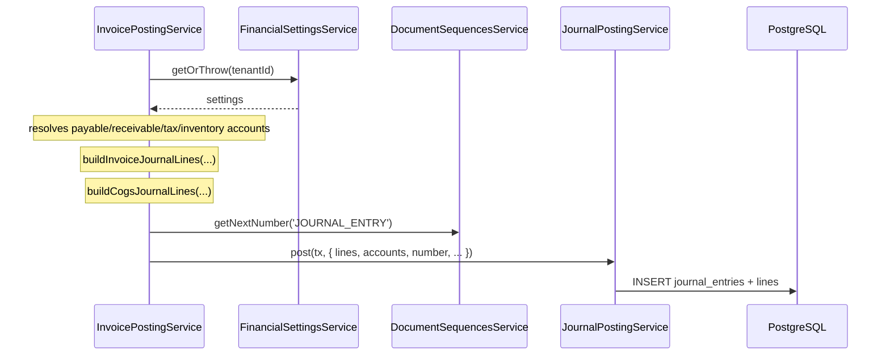
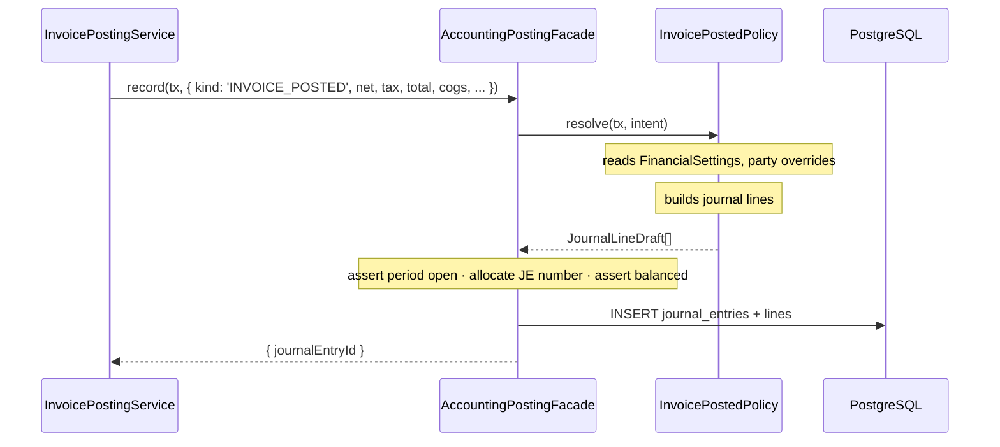

# Architecture Refactor Roadmap — Design

**Date:** 2026-07-25
**Author:** Claude (Opus 5) with Mohammad Khyata
**Status:** Draft
**Scope:** Cross-cutting — `apps/api`, `apps/dashboard`, `packages/*`
**Primary goal:** Remove accounting/GL policy from six non-accounting modules, restore type safety in the API, and prepare the codebase for modular/microservice extraction — without changing any posted GL output.

---

## Context

### What exists today

The monorepo follows a consistent, well-documented vertical slice
(`Prisma → api-contracts → NestJS 4-layer → api-client → dashboard generateResource`).
That structure is sound and is **not** what this refactor changes.

What this refactor changes is the **semantic coupling** that grew inside that structure.

| Area | Files |
|---|---|
| GL posting engine | `apps/api/src/modules/accounting/accounts/services/journal-posting.service.ts` |
| GL account resolution | `apps/api/src/modules/accounting/financial-settings/services/financial-settings.service.ts` |
| JE numbering | `apps/api/src/modules/accounting/document-sequences/services/document-sequences.service.ts` |
| Period guard | `apps/api/src/modules/accounting/accounts/utils/assert-period-open.ts` |
| Journal line builders | `invoicing/invoices/invoice-journal.ts`, `invoicing/payments/payment-journal.ts`, `invoicing/expenses/expense-journal.ts`, `accounting/accounts/utils/inventory-journal.ts` |

### Related specs

- `docs/superpowers/specs/2026-07-02-accounting-integration-blueprint-design.md`
- `docs/superpowers/specs/2026-07-16-accounting-coa-refactor-design.md`
- `docs/superpowers/specs/2026-07-20-opening-balance-stock-design.md`

### System review summary

Overall rating: **6.2 / 10** — a well-structured skeleton with a thin enforcement layer.

| Dimension | Score | Evidence |
|---|---|---|
| Layering & conventions | 8.5 | 4-layer NestJS + `generateResource` applied consistently across 30+ modules |
| Contracts / type pipeline | 7.0 | OpenAPI→types pipeline correct; leaks at the client edge |
| Domain modeling (GL) | 6.5 | Double-entry, reversals, fiscal periods, perpetual COGS all present and correct |
| **Module coupling** | **3.5** | GL policy resolved inside 6 non-accounting services |
| **Type safety (API)** | **3.0** | `apps/api/tsconfig.json` does not extend the strict base config |
| **AuthZ** | **1.5** | `JwtAuthGuard` is the only guard; no permission model |
| **Auditability** | **2.0** | `AuditLog` model + read API exist; nothing writes to it |
| Testing | 4.0 | 23 spec files across ~37k LOC; 3 in dashboard, 1 in packages |
| Financial reporting | 3.0 | No trial balance, P&L, or balance sheet |

### Findings driving this spec

**F1 — GL coupling is semantic, not merely structural.**
Ten call sites across six services call `journalPosting.post()` / `.reverse()`:

| Service | Lines |
|---|---|
| `accounting/accounts/services/opening-balances.service.ts` | 134 |
| `inventory/inventory.service.ts` | 141 |
| `inventory/stock-counts/stock-counts.service.ts` | 139 |
| `invoicing/expenses/expenses.service.ts` | 146, 193 |
| `invoicing/invoices/invoice-posting.service.ts` | 98, 208, 283 |
| `invoicing/payments/payments.service.ts` | 145, 201 |

Each caller **also** resolves GL accounts, allocates the JE number, asserts the period is open,
and builds journal lines. `invoice-posting.service.ts:40-75` is representative: it reads
`FinancialSettings`, falls back from party-level to tenant-level payable/receivable accounts,
validates that an Inventory account exists, then calls `buildInvoiceJournalLines`. That is
accounting policy living in the invoicing module.

This is a violation of `.ai/rules/domain.md` §1 (Sub-Ledger Isolation) in substance, even though
the letter is satisfied (movements do route through `JournalPostingService`).

**F2 — `post(tx: any, ...)` is a load-bearing `any`.**
`journal-posting.service.ts:57` and `:118` type the transaction handle as `any`. This defeats
Prisma's `TransactionClient` type and is the direct cause of `tx as any` at
`inventory.service.ts:141` and `stock-counts.service.ts:139`.

**F3 — The event infrastructure has zero consumers.**
`CrudService` emits `ResourceCreatedEvent` / `ResourceUpdatedEvent` / `ResourceDeletedEvent` on
every mutation. There are **no `@OnEvent` handlers anywhere in the API** — all nine grep matches
are documentation comments. There is also no outbox table, so moving GL posting to async events
today would break the ACID guarantee `.ai/rules/domain.md` §4 requires.

**F4 — `apps/api/tsconfig.json` opts out of strictness.**
It does not extend `packages/typescript-config/base.json` (which correctly sets
`"strict": true` and `"noUncheckedIndexedAccess": true`). Instead it sets
`"noImplicitAny": false`, `"strictBindCallApply": false`, and never sets `strict`.

Repo-wide escape hatches: 404 `: any`, 112 `@ts-ignore`/`@ts-expect-error`, 67 `as never`,
55 `as unknown`, 34 `as any` in the dashboard, 27 in the API.

**F5 — `AuditLog` is write-never.**
`audit.service.ts` exposes `findMany`, `count`, and a `create` — but `create` has no callers
outside the module. No mutation path in the system records who did what.

**F6 — No permission system.**
`Role` and `UserRole` models exist (`packages/db-prisma/src/schema/user.prisma:23,41`), and a
roles CRUD module exists. There is no `Permission` model, no `RolePermission` join, no
`PermissionsGuard`, and no `@RequirePermission()` decorator. Any authenticated user can post,
cancel, and reverse journal entries.

**F7 — No financial statements.**
`reports.controller.ts` provides stock-balance, sales/purchase summary, customer/supplier
statements, and profit-summary. There is no Trial Balance, P&L, or Balance Sheet endpoint.

**F8 — Secondary issues.**
Soft delete (`deletedAt`) exists only on `ChartOfAccount`; 44 `console.log` calls in source
(including `ApiClient`'s constructor logging the API base URL on every instantiation);
15 `eslint-disable` comments; denormalized balance caches (`ChartOfAccount.currentBalance`,
`Cashbox.balance`, `StockBalance`) with no reconciliation job.

---

## Requirements

### Functional

- [ ] No module outside `modules/accounting/**` imports `JournalPostingService`,
      `FinancialSettingsService`, `DocumentSequencesService`, `assertFiscalPeriodOpen`, or any
      journal-line builder.
- [ ] Callers describe **economic facts**; accounting decides accounts, sides, sequence, and period.
- [ ] GL posting stays inside the caller's Prisma transaction (ACID preserved).
- [ ] Posted journal entries are byte-identical before and after Phase 1.
- [ ] `apps/api` compiles under `strict: true` for all migrated directories.
- [ ] `packages/api-client/src/infra/crud-client.ts` contains no `as any` / `as never`.
- [ ] Every mutation writes an `AuditLog` row (Phase 5).
- [ ] Every mutating route carries an explicit permission (Phase 6).

### Non-functional

- [ ] Tenant isolation preserved on every path touched.
- [ ] No new runtime dependencies without explicit approval.
- [ ] Each phase independently mergeable and revertable.
- [ ] Boundary violations fail CI, not code review.
- [ ] Existing i18n (en, ar, tr, ar-SY) and RTL behavior unaffected.

### Explicitly not a requirement

- Changing any accounting *outcome*. Phase 1 is a behavior-preserving refactor.
- Splitting into actual microservices. This spec prepares the seam only.

---

## Proposed approach

### Option A — Posting Port + Policy Registry (**selected**)

Non-accounting modules emit a typed **posting intent** describing what happened economically.
An `AccountingPostingFacade` inside the accounting module receives the intent, dispatches to a
policy that owns account selection and line construction, then applies the shared invariants
(period open, JE number, balanced, persisted). All synchronous, inside the caller's transaction.

**Why this option:**

- Removes semantic coupling, not just import coupling. The policy — which accounts, which side —
  moves to accounting where it belongs.
- Preserves ACID, which `.ai/rules/domain.md` §2 and §4 mandate. An unbalanced or missing JE is
  never observable.
- The facade barrel becomes the future service boundary. Phase 4 swaps its body for an outbox
  publisher; call sites never change.
- Testable: policies are pure functions from intent → journal lines, unit-testable without a DB.

### Option B — Transactional outbox + async handlers (deferred to Phase 4)

Callers write an outbox row in their own transaction; an accounting worker consumes it and posts
in a separate transaction.

**Why deferred:** it makes the GL eventually consistent. An invoice could be `POSTED` with no
journal entry yet, requiring retry, dead-letter, and compensation machinery. Correct end state
for a distributed system, wrong first step for a system that does not yet have a clean posting
boundary. Phase 4 introduces the outbox *behind the facade*, once the intent contract is proven.

### Option C — Emit domain events on the existing EventEmitter2 bus (rejected)

**Why rejected:** `EventEmitter2` handlers run outside the Prisma transaction. A handler failure
would leave an invoice posted with no GL entry, silently. This is the specific failure mode
`.ai/rules/domain.md` §4 exists to prevent.

---

## Data flow

### Before



### After



---

## File map

### Create

| Path | Purpose |
|---|---|
| `apps/api/src/modules/accounting/posting/index.ts` | **The only legal import surface** for non-accounting modules |
| `apps/api/src/modules/accounting/posting/contracts/posting-intent.ts` | Discriminated union of economic events |
| `apps/api/src/modules/accounting/posting/contracts/prisma-tx.ts` | `PrismaTransactionClient` type alias |
| `apps/api/src/modules/accounting/posting/contracts/journal-line-draft.ts` | Policy output type |
| `apps/api/src/modules/accounting/posting/accounting-posting.facade.ts` | Invariants + dispatch + persist |
| `apps/api/src/modules/accounting/posting/posting-policy.registry.ts` | `kind → policy` map |
| `apps/api/src/modules/accounting/posting/policies/invoice-posted.policy.ts` | Sales + purchase, incl. COGS |
| `apps/api/src/modules/accounting/posting/policies/invoice-cancelled.policy.ts` | Reversal |
| `apps/api/src/modules/accounting/posting/policies/payment-recorded.policy.ts` | + cancellation |
| `apps/api/src/modules/accounting/posting/policies/expense-recorded.policy.ts` | + cancellation |
| `apps/api/src/modules/accounting/posting/policies/stock-count-adjusted.policy.ts` | Variance JE |
| `apps/api/src/modules/accounting/posting/policies/opening-balance.policy.ts` | Suspense routing |
| `apps/api/src/modules/accounting/posting/policies/opening-stock.policy.ts` | Opening inventory |
| `apps/api/src/modules/accounting/posting/posting.module.ts` | Wires facade + policies; exports facade only |
| `apps/api/src/modules/accounting/posting/__tests__/golden-master.spec.ts` | Characterization suite (Phase 0) |
| `apps/api/tsconfig.strict.json` | Strict allowlist strangler config |
| `apps/api/src/common/interceptors/audit.interceptor.ts` | Phase 5 |
| `apps/api/src/modules/accounting/reconciliation/balance-drift.service.ts` | Phase 0 tool, Phase 5 job |

### Modify

| Path | Change |
|---|---|
| `apps/api/tsconfig.json` | Extend strict base; remove `noImplicitAny: false` (Phase 2) |
| `apps/api/src/modules/accounting/accounts/services/journal-posting.service.ts` | `tx: any` → `PrismaTransactionClient`; becomes facade-internal |
| `apps/api/src/modules/invoicing/invoices/invoice-posting.service.ts` | Delete GL resolution; emit intents |
| `apps/api/src/modules/invoicing/payments/payments.service.ts` | Same |
| `apps/api/src/modules/invoicing/expenses/expenses.service.ts` | Same |
| `apps/api/src/modules/inventory/inventory.service.ts` | Same; removes `tx as any` |
| `apps/api/src/modules/inventory/stock-counts/stock-counts.service.ts` | Same; removes `tx as any` |
| `apps/api/src/modules/accounting/accounts/services/opening-balances.service.ts` | Route through facade |
| `packages/api-client/src/infra/crud-client.ts` | Replace `as any` / `as never` with correct generics |
| `packages/api-client/src/infra/client.ts` | Remove constructor `console.log` |
| `packages/eslint-config/*` | Add `no-restricted-imports` boundary rules; escape-hatch bans |

### Move (into `accounting/posting/policies/`)

| From | Rationale |
|---|---|
| `invoicing/invoices/invoice-journal.ts` | Journal line construction is accounting policy |
| `invoicing/payments/payment-journal.ts` | Same |
| `invoicing/expenses/expense-journal.ts` | Same |
| `accounting/accounts/utils/inventory-journal.ts` | Already in accounting; relocate under `posting/` |

Their `.spec.ts` files move with them.

---

## Phase details

Phases 0→2 are strictly sequential. Phases 3–5 may overlap. Phase 6 is independent but blocking
before production.

---

### Phase 0 — Guardrails

**Goal:** make Phase 1 provably safe before touching a single posting call site.

**Success criteria:** a test suite that fails if any journal entry changes shape, and a CI job
that runs it on every PR.

- [ ] **0.1 — Golden-master characterization suite**
  - [ ] 0.1.1 Build an in-memory Prisma transaction double that records `journalEntry.create` payloads verbatim.
  - [ ] 0.1.2 Snapshot the current JE output for each of the 8 posting paths:
        purchase invoice, sales invoice (with COGS), invoice cancellation, payment,
        payment cancellation, expense, expense cancellation, stock-count variance,
        opening balance, opening stock.
  - [ ] 0.1.3 Cover the branch matrix per path: with/without tax, with/without party-level
        account override, service-only vs stock lines, zero-COGS sales.
  - [ ] 0.1.4 Assert on: account IDs, debit/credit amounts, `sortOrder`, `description`,
        `referenceType`, `partyId`, and total debit = total credit.
  - [ ] 0.1.5 Commit snapshots. **These files must not be regenerated during Phase 1.**
- [ ] **0.2 — Balance-drift checker**
  - [ ] 0.2.1 Service comparing `ChartOfAccount.currentBalance` against `SUM(JournalLine)` per account.
  - [ ] 0.2.2 Same for `Cashbox.balance` and `StockBalance` vs `StockMovement`.
  - [ ] 0.2.3 Expose as an authenticated diagnostic endpoint returning drifted rows.
  - [ ] 0.2.4 Record a baseline drift report before Phase 1 (pre-existing drift is not a Phase 1 regression).
- [ ] **0.3 — CI gate**
  - [ ] 0.3.1 Workflow running `pnpm turbo run lint typecheck test` on PR.
  - [ ] 0.3.2 Fail the build on any new `eslint-disable` in `apps/api/src/modules/**`.

**Verification**
```bash
pnpm --filter @devloggers/api test
pnpm turbo run lint typecheck
```

---

### Phase 1 — GL Posting Port

**Goal:** accounting owns all GL policy. No non-accounting module knows what an account is.

**Success criteria:** golden-master snapshots byte-identical; boundary lint rule passes;
zero imports of accounting internals from outside accounting.

- [ ] **1.1 — Contracts**
  - [ ] 1.1.1 `prisma-tx.ts`: `export type PrismaTransactionClient = Prisma.TransactionClient`.
  - [ ] 1.1.2 `posting-intent.ts`: discriminated union on `kind`, one member per `ReferenceType`
        pair. Shared base: `tenantId`, `userId`, `date`, `fiscalPeriodId`, `exchangeRate`.
  - [ ] 1.1.3 Intents carry **only economic facts** — amounts, quantities, party, direction.
        No `accountId` field may appear on any intent. Enforce by review checklist.
  - [ ] 1.1.4 `journal-line-draft.ts`: policy output — `accountId`, `debit`, `credit`,
        `description`, `sortOrder`, `partyId`.
  - [ ] 1.1.5 `index.ts` barrel exporting **only** `AccountingPostingFacade`, `PostingIntent`,
        `PrismaTransactionClient`.
- [ ] **1.2 — Typed transaction (removes F2)**
  - [ ] 1.2.1 Change `JournalPostingService.post`/`.reverse` signatures to `PrismaTransactionClient`.
  - [ ] 1.2.2 Remove `tx as any` at `inventory.service.ts:141` and `stock-counts.service.ts:139`.
  - [ ] 1.2.3 Fix any resulting type errors at their source — no new casts.
  - [ ] 1.2.4 Golden-masters must stay green.
- [ ] **1.3 — Facade + registry**
  - [ ] 1.3.1 `AccountingPostingFacade.record(tx, intent): Promise<{ journalEntryId: string }>`.
  - [ ] 1.3.2 Facade responsibilities, in order: resolve policy → policy builds lines →
        `assertFiscalPeriodOpen` → `getNextNumber('JOURNAL_ENTRY')` → assert balanced →
        `JournalPostingService.post`.
  - [ ] 1.3.3 `AccountingPostingFacade.reverse(tx, intent)` for the six `*_CANCELLATION` types.
  - [ ] 1.3.4 Registry: exhaustive `kind → policy` map, `never`-checked so a new intent kind
        without a policy is a compile error.
  - [ ] 1.3.5 `posting.module.ts` exports the facade only — not policies, not `JournalPostingService`.
- [ ] **1.4 — Policies (one PR each, golden-masters green after every one)**
  - [ ] 1.4.1 `invoice-posted.policy.ts` — absorbs `invoice-posting.service.ts:40-75` account
        resolution + `invoice-journal.ts` + `inventory-journal.ts` COGS lines.
  - [ ] 1.4.2 `invoice-cancelled.policy.ts`.
  - [ ] 1.4.3 `payment-recorded.policy.ts` — absorbs `payment-journal.ts`.
  - [ ] 1.4.4 `expense-recorded.policy.ts` — absorbs `expense-journal.ts`.
  - [ ] 1.4.5 `stock-count-adjusted.policy.ts`.
  - [ ] 1.4.6 `opening-balance.policy.ts` — retains suspense-account routing per
        `.ai/rules/domain.md` §2.
  - [ ] 1.4.7 `opening-stock.policy.ts`.
  - [ ] 1.4.8 Each policy gets a unit test asserting lines from a fixed intent — no DB.
- [ ] **1.5 — Migrate call sites (one service per PR)**
  - [ ] 1.5.1 `invoice-posting.service.ts` (3 sites) — delete `FinancialSettingsService`,
        `DocumentSequencesService`, `JournalPostingService`, `buildCogsJournalLines`,
        `assertFiscalPeriodOpen` imports.
  - [ ] 1.5.2 `payments.service.ts` (2 sites).
  - [ ] 1.5.3 `expenses.service.ts` (2 sites).
  - [ ] 1.5.4 `stock-counts.service.ts` (1 site).
  - [ ] 1.5.5 `inventory.service.ts` (1 site).
  - [ ] 1.5.6 `opening-balances.service.ts` (1 site) — inside accounting, but route through the
        facade for uniformity.
  - [ ] 1.5.7 Update each service's existing `.spec.ts` to mock the facade instead of
        `journalPosting`.
- [ ] **1.6 — Lock the boundary**
  - [ ] 1.6.1 ESLint `no-restricted-imports`: `modules/accounting/**` is unreachable from outside
        accounting except `modules/accounting/posting`.
  - [ ] 1.6.2 Delete now-unused exports from `accounts.module.ts` (`JournalPostingService` should
        no longer be exported).
  - [ ] 1.6.3 Run the balance-drift checker; compare against the 0.2.4 baseline. Any new drift is
        a Phase 1 regression and blocks merge.
  - [ ] 1.6.4 Log any accounting bug the policies surfaced in **Open questions** below — do not
        fix inside Phase 1.

**Verification**
```bash
pnpm --filter @devloggers/api test          # golden-masters must be unchanged
pnpm turbo run build --filter=@devloggers/api
pnpm turbo run lint                          # boundary rule
```

---

### Phase 2 — TypeScript strictness

**Goal:** the API type-checks under the same strict config as the rest of the monorepo.

**Success criteria:** `tsc -p apps/api/tsconfig.strict.json` passes; no new escape hatches
can be introduced without an explicit lint override.

- [ ] **2.1 — Strangler config**
  - [ ] 2.1.1 Create `apps/api/tsconfig.strict.json` extending `@devloggers/typescript-config/base.json`.
  - [ ] 2.1.2 Seed its `include` with `src/modules/accounting/posting/**` (new, already strict-clean).
  - [ ] 2.1.3 Add `typecheck:strict` script; wire into the Phase 0 CI gate.
  - [ ] 2.1.4 Rule: every subsequent PR may only **add** to the allowlist, never remove.
- [ ] **2.2 — Migrate directories (one PR each)**
  - [ ] 2.2.1 `modules/accounting/**`
  - [ ] 2.2.2 `modules/invoicing/**`
  - [ ] 2.2.3 `modules/inventory/**`
  - [ ] 2.2.4 `modules/catalog/**`, `modules/parties/**`
  - [ ] 2.2.5 `modules/identity/**`, `modules/reports/**`, remainder
  - [ ] 2.2.6 For each: fix at the source. Prefer narrowing, type guards, and generic constraints
        over assertions. Every remaining assertion needs a one-line comment justifying it.
- [ ] **2.3 — `crud-client.ts` (user-flagged instance of F4)**
  - [ ] 2.3.1 Root cause: `openapi-fetch` infers per-path unions; passing a `R["routes"]["list"]`
        widens to the union of all paths, so `as never` is used to silence the mismatch.
  - [ ] 2.3.2 Fix: constrain `CrudResource` route generics so each method narrows to its own path,
        and introduce typed private helpers (`getAt`, `postAt`, …) that carry the narrowing —
        rather than casting at every call.
  - [ ] 2.3.3 Target: zero `as any` / `as never` in the file. `list`, `show`, `create`, `update`,
        `destroy` return their inferred `ApiResponse` without assertion.
  - [ ] 2.3.4 `bulkDelete` / `bulkUpdate` reuse the `list` route with a different verb — model this
        explicitly in the resource type rather than `as unknown as ApiPathByMethod<"delete">`.
  - [ ] 2.3.5 Add type-level tests (`expectTypeOf`) pinning the inferred return types.
- [ ] **2.4 — Flip the main config**
  - [ ] 2.4.1 When the allowlist covers `src/**`, make `tsconfig.json` extend the strict base.
  - [ ] 2.4.2 Delete `noImplicitAny: false` and `strictBindCallApply: false`.
  - [ ] 2.4.3 Delete `tsconfig.strict.json`.
- [ ] **2.5 — Prevent regression**
  - [ ] 2.5.1 ESLint: `@typescript-eslint/no-explicit-any`, `no-unnecessary-type-assertion`,
        `ban-ts-comment` — warn during migration, error after 2.4.
  - [ ] 2.5.2 Remove the 44 `console.log` calls; replace with the Nest `Logger`.
  - [ ] 2.5.3 Audit the 15 `eslint-disable` comments; each must have a justification or be removed.

**Verification**
```bash
pnpm --filter @devloggers/api typecheck:strict
pnpm --filter @devloggers/api-client build
pnpm turbo run lint typecheck build
```

---

### Phase 3 — Remaining coupling

**Goal:** apply the Phase 1 pattern to the other cross-domain dependencies.

**Success criteria:** no service imports another domain's internals; boundary lint covers all domains.

- [ ] **3.1 — Inventory port**
  - [ ] 3.1.1 `InventoryMovementFacade` with typed movement intents, mirroring the posting port.
  - [ ] 3.1.2 Migrate `invoice-posting.service.ts` (3 `postMovementTx` sites) and
        `stock-counts.service.ts`.
  - [ ] 3.1.3 Removes the remaining `tx as any` at movement call sites.
- [ ] **3.2 — Onboarding saga**
  - [ ] 3.2.1 `onboarding.service.ts` (333 LOC) imports four domain services directly.
  - [ ] 3.2.2 Convert to a coordinator composing domain facades, with per-step idempotency.
- [ ] **3.3 — Boundary lint for all domains**
  - [ ] 3.3.1 Extend `no-restricted-imports`: each domain exposes exactly one barrel.
  - [ ] 3.3.2 Document the allowed dependency graph in `.ai/rules/api.md`.
- [ ] **3.4 — Deletion semantics (F8)**
  - [ ] 3.4.1 Decide per model: hard delete, soft delete, or archive. Currently only
        `ChartOfAccount` has `deletedAt`.
  - [ ] 3.4.2 Financial documents (`Invoice`, `Payment`, `Expense`, `JournalEntry`) must never
        hard-delete — reverse or cancel only, per `.ai/rules/domain.md` workflow rules.
  - [ ] 3.4.3 Enforce in `CrudRepository` so it cannot be bypassed per module.
- [ ] **3.5 — Split oversized services**
  - [ ] 3.5.1 `invoices.service.ts` (397 LOC), `onboarding.service.ts` (333),
        `items-import.service.ts` (299), `payments.service.ts` (291).
  - [ ] 3.5.2 Split along the seams Phase 1 exposed, not arbitrarily.

---

### Phase 4 — Modularity / feature-flag prep

**Goal:** each domain is independently loadable and independently testable — the precondition for
both feature toggles and service extraction.

**Success criteria:** every facade passes its contract tests with all other modules unloaded.

- [ ] **4.1 — Capability manifest**
  - [ ] 4.1.1 Each domain module declares `{ key, dependsOn[], provides[] }`.
  - [ ] 4.1.2 Build-time check that the declared graph matches the actual import graph.
- [ ] **4.2 — Dynamic registration**
  - [ ] 4.2.1 `AppModule` composes domain modules from a config-driven registry.
  - [ ] 4.2.2 Disabled modules return 404, not 500 — with a clear message.
  - [ ] 4.2.3 Accounting is non-optional; document why (every sub-ledger posts to it).
- [ ] **4.3 — Contract tests per facade**
  - [ ] 4.3.1 Test each facade against its intent contract in isolation.
  - [ ] 4.3.2 These become the service-boundary tests if extraction happens.
- [ ] **4.4 — Outbox seam**
  - [ ] 4.4.1 Add an `Outbox` model (`tenantId`, `topic`, `payload`, `status`, `attempts`, timestamps).
  - [ ] 4.4.2 `AccountingPostingFacade` gains an optional outbox mode behind config — writes the
        intent instead of posting inline.
  - [ ] 4.4.3 Worker consuming outbox rows, with retry and dead-letter.
  - [ ] 4.4.4 **Off by default.** Synchronous posting remains the production path until a real
        service split requires otherwise.
  - [ ] 4.4.5 Decide the fate of the unused `EventEmitter2` CRUD events (F3): either give them
        consumers or stop emitting them.

---

### Phase 5 — Audit + observability

**Goal:** every state change is attributable; cached balances are provably correct.

**Success criteria:** `AuditLog` has a row for every mutation; drift report is empty.

- [ ] **5.1 — Audit interceptor (F5)**
  - [ ] 5.1.1 `AuditInterceptor` writing on every non-GET route: actor, tenant, entity type,
        entity id, action, before/after diff, correlation id.
  - [ ] 5.1.2 Redact `passwordHash` and any secret-bearing field.
  - [ ] 5.1.3 Audit writes must not fail the business transaction — log and continue on error.
- [ ] **5.2 — GL-specific audit**
  - [ ] 5.2.1 Journal post, reverse, and period close/reopen are always audited, independent of
        the interceptor.
  - [ ] 5.2.2 `AuditLog` rows for GL actions are append-only — no update or delete path.
- [ ] **5.3 — Structured logging**
  - [ ] 5.3.1 Nest `Logger` with JSON output in production.
  - [ ] 5.3.2 Request correlation id propagated through the transaction and into audit rows.
- [ ] **5.4 — Reconciliation job**
  - [ ] 5.4.1 Promote the Phase 0 drift checker to a scheduled job.
  - [ ] 5.4.2 Surface drift on the dashboard for tenant admins.

---

### Phase 6 — AuthZ (blocking before first production tenant)

**Goal:** permission-gated access with separation of duties on GL operations.

**Success criteria:** no mutating route reachable without an explicit permission; a user without
`journals.reverse` cannot reverse a journal entry.

> Sequenced last because the system is pre-production. It is **blocking, not optional** — today
> any authenticated user can post, cancel, and reverse journal entries.

- [ ] **6.1 — Permission catalog**
  - [ ] 6.1.1 Derive `resource.action` strings from the existing `resources` map in
        `packages/api-contracts`.
  - [ ] 6.1.2 Add non-CRUD actions explicitly: `invoices.post`, `invoices.cancel`,
        `payments.cancel`, `journals.post`, `journals.reverse`, `periods.close`,
        `openingBalances.manage`, `settings.manage`, `danger.reset`.
  - [ ] 6.1.3 Export as a const union so both API and dashboard type-check against it.
- [ ] **6.2 — Schema**
  - [ ] 6.2.1 `Permission` (global catalog, not tenant-scoped) and `RolePermission` join.
  - [ ] 6.2.2 Idempotent seed: catalog sync + default system roles (Owner, Accountant,
        Sales, Inventory, Viewer).
  - [ ] 6.2.3 `Role.isSystem` roles are not editable by tenants.
- [ ] **6.3 — Enforcement**
  - [ ] 6.3.1 `PermissionsGuard` + `@RequirePermission()` decorator.
  - [ ] 6.3.2 Default permissions wired into `createCrudController` so new modules are gated
        by construction.
  - [ ] 6.3.3 A route with no permission metadata **denies** rather than allows.
  - [ ] 6.3.4 Resolve permissions from DB per request with a short-lived cache — not from JWT
        claims, so revocation takes effect immediately.
- [ ] **6.4 — Separation of duties**
  - [ ] 6.4.1 `journals.post` and `journals.reverse` are distinct permissions.
  - [ ] 6.4.2 `periods.close` is separate from both.
  - [ ] 6.4.3 Default roles reflect this split.
- [ ] **6.5 — Dashboard**
  - [ ] 6.5.1 `/auth/me` returns effective permissions.
  - [ ] 6.5.2 `usePermissions()` + `can(...)` helper.
  - [ ] 6.5.3 Gate `navGroups.tsx`, row action menus, `FormDialog` triggers, and danger-zone.
  - [ ] 6.5.4 UI gating is cosmetic — the API is the enforcement point.
  - [ ] 6.5.5 Roles admin UI for assigning permissions; i18n keys in en, ar, tr, ar-SY.

---

## Cross-cutting: test strategy

Testing is a gate on every phase, not a phase of its own. Current state: 23 spec files across
~37k LOC (3 in dashboard, 1 in packages), no API e2e suite.

| Phase | Test obligation |
|---|---|
| 0 | Golden-master JE snapshots for all 8 posting paths |
| 1 | Per-policy unit tests; golden-masters unchanged; balance drift ≤ baseline |
| 2 | `expectTypeOf` tests for `crud-client` inference |
| 3 | Facade contract tests for inventory |
| 4 | Module isolation tests (each domain boots alone) |
| 5 | Audit row asserted for each mutation path |
| 6 | Negative authz tests — permission denied returns 403, not 200 |

---

## Verification

```bash
# Per phase
pnpm --filter @devloggers/api test
pnpm --filter @devloggers/api typecheck:strict
pnpm turbo run lint typecheck build

# After API DTO/Swagger changes
pnpm generate
pnpm --filter @devloggers/api-contracts build

# After schema changes (Phases 4, 6)
pnpm --filter @devloggers/db-prisma db:migrate:dev
pnpm --filter @devloggers/db-prisma db:seed
```

### Manual smoke test (after Phase 1)

- [ ] Post a purchase invoice → JE lines match pre-refactor values
- [ ] Post a sales invoice with stock lines → revenue + COGS legs both present
- [ ] Cancel a posted invoice → reversal JE mirrors the original
- [ ] Record and cancel a payment → both JEs correct
- [ ] Record and cancel an expense
- [ ] Post a stock count with variance → variance JE correct
- [ ] Record an opening balance → suspense routing intact
- [ ] Balance-drift report shows no new drift vs. baseline

---

## Part B — ERP gap register

Named and sized, not decomposed. Each requires its own spec before implementation.

| Gap | Size | Priority | Notes |
|---|---|---|---|
| Trial Balance / P&L / Balance Sheet | L | **P0** | No financial statements exist today (F7) |
| Period close & year-end closing entry | M | **P0** | `FiscalPeriod.status` exists; no retained-earnings rollover |
| Credit notes / sales & purchase returns | L | P1 | Only full cancellation exists |
| Tax rate master | M | P1 | Tax is free-form amounts on invoice lines |
| Bank accounts + reconciliation | L | P1 | Only `Cashbox` exists |
| SO/PO lifecycle (quote → order → invoice) | XL | P2 | |
| Cost centers / dimensions | L | P2 | Required for segment reporting |
| FX revaluation | M | P2 | `exchangeRate` locked at posting, never revalued |
| Batch / lot / serial + expiry | L | P2 | |
| Price lists / discount policies | M | P3 | |
| Approval workflows | L | P3 | Pairs naturally with Phase 6 |
| Landed costs | M | P3 | |

---

## Out of scope

- Any change to posted GL output. Phase 1 is behavior-preserving by construction.
- Actual microservice extraction. Phase 4 builds the seam only.
- Every item in Part B — each needs its own spec.
- Dashboard visual redesign.
- Migrating off `EventEmitter2` (decision deferred to 4.4.5).

---

## Open questions

- [ ] **Q1** — Does `ReferenceType` need an `OPENING_STOCK` member? `inventory.service.ts:141`
      posts opening stock; the enum has `OPENING_BALANCE` but no stock-specific variant.
      **Decision:** TBD during 1.4.7.
- [ ] **Q2** — Accounting bugs surfaced while extracting policies. **Decision:** log here, fix in
      a follow-up spec, never inside Phase 1.
- [ ] **Q3** — Should `Permission` be global or tenant-scoped? Recommendation: global catalog,
      tenant-scoped `RolePermission`. **Decision:** confirm at Phase 6 start.
- [ ] **Q4** — Retention policy for `AuditLog`. **Decision:** TBD at Phase 5.
- [ ] **Q5** — Baseline balance drift from 0.2.4 — if pre-existing drift is found, does it get
      corrected before Phase 1 or tracked separately? **Decision:** TBD after 0.2.4 runs.

---

## Approval

- [ ] Design reviewed by: ___
- [ ] Approved on: ___
