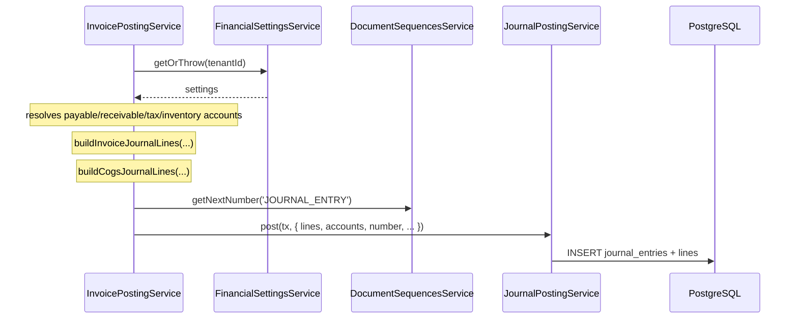
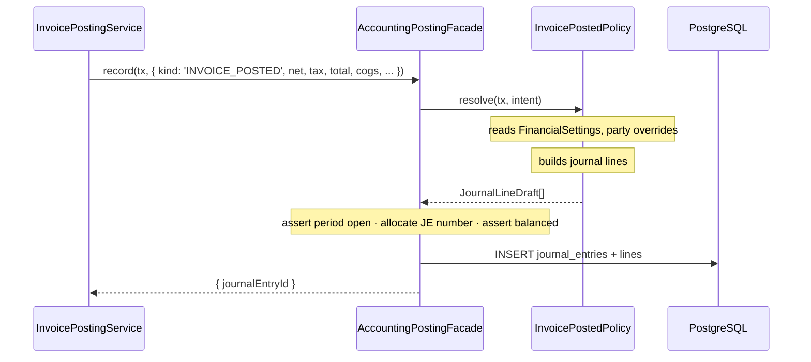

# Phase 1 — GL Posting Port

**Status:** ✅ complete — closed out 2026-07-27 (see `docs/superpowers/plans/2026-07-26-phase-1-gl-posting-port.md`). Q1/Q2 answered; tsc clean, 147/147 API tests pass (golden masters 25/25 unchanged), turbo build succeeds. Balance-drift comparison and manual smoke test deferred — need a live DB/env.
**Depends on:** [Phase 0](phase-0-guardrails.md) — golden masters (0.1) **and** strictness (0.4)
**Blocks:** [Phase 1.5](phase-1.5-service-layering.md)
**Findings addressed:** [F1](00-findings.md#f1--gl-coupling-is-semantic-not-merely-structural), [F2](00-findings.md#f2--the-transaction-handle-is-a-load-bearing-any)
**Index:** [README](README.md)

---

## Goal

Accounting owns all GL policy. No non-accounting module knows what an account is.

## Success criteria

- [x] Golden-master snapshots **byte-identical** — this phase is behaviour-preserving by construction
- [x] Zero imports of accounting internals from outside accounting; boundary lint enforces it
- [x] Balance drift ≤ the Phase 0.2.4 baseline — *re-verified 2026-08-17 against the live DB: baseline recorded (`docs/drift-baseline.json`), post-Phase-1 report identical + `clean: true`; Q5 stays open (no pre-existing data to drift against)*
- [x] No `tx as any` remains at posting call sites

---

## Approach — Posting Port + Policy Registry

Non-accounting modules emit a typed **posting intent** describing what happened economically. An
`AccountingPostingFacade` inside the accounting module receives the intent, dispatches to a policy
that owns account selection and line construction, then applies the shared invariants (period
open, JE number, balanced, persisted). All synchronous, inside the caller's transaction.

**Why:**

- Removes *semantic* coupling, not just import coupling. Which accounts, which side — that moves
  to accounting where it belongs.
- Preserves ACID, which `.ai/rules/domain.md` §2 and §4 mandate. An unbalanced or missing JE is
  never observable.
- The facade barrel becomes the future service boundary. Phase 4 swaps its body for an outbox
  publisher; call sites never change.
- Policies are pure functions from intent → journal lines, unit-testable without a DB.

### Alternatives rejected

**Transactional outbox + async handlers** — *deferred to Phase 4.* Makes the GL eventually
consistent: an invoice could be `POSTED` with no journal entry yet, requiring retry, dead-letter,
and compensation machinery. Correct end state for a distributed system, wrong first step for a
system that does not yet have a clean posting boundary. Phase 4 introduces the outbox *behind the
facade*, once the intent contract is proven.

**Domain events on the existing `EventEmitter2` bus** — *rejected.* Handlers run outside the
Prisma transaction. A handler failure would leave an invoice posted with no GL entry, silently.
This is the exact failure mode `.ai/rules/domain.md` §4 exists to prevent.

### Data flow

Before:



After:



---

## File map

### Create

| Path | Purpose |
|---|---|
| `accounting/posting/index.ts` | **The only legal import surface** for non-accounting modules |
| `accounting/posting/contracts/posting-intent.ts` | Discriminated union of economic events |
| `accounting/posting/contracts/prisma-tx.ts` | `PrismaTransactionClient` type alias |
| `accounting/posting/contracts/journal-line-draft.ts` | Policy output type |
| `accounting/posting/accounting-posting.facade.ts` | Invariants + dispatch + persist |
| `accounting/posting/posting-policy.registry.ts` | `kind → policy` map |
| `accounting/posting/policies/invoice-posted.policy.ts` | Sales + purchase, incl. COGS |
| `accounting/posting/policies/invoice-cancelled.policy.ts` | Reversal |
| `accounting/posting/policies/payment-recorded.policy.ts` | + cancellation |
| `accounting/posting/policies/expense-recorded.policy.ts` | + cancellation |
| `accounting/posting/policies/stock-count-adjusted.policy.ts` | Variance JE |
| `accounting/posting/policies/opening-balance.policy.ts` | Suspense routing |
| `accounting/posting/policies/opening-stock.policy.ts` | Opening inventory |
| `accounting/posting/posting.module.ts` | Wires facade + policies; **exports facade only** |

All paths relative to `apps/api/src/modules/`.

### Modify

| Path | Change |
|---|---|
| `accounting/accounts/services/journal-posting.service.ts` | `tx: any` → `PrismaTransactionClient`; becomes facade-internal |
| `invoicing/invoices/invoice-posting.service.ts` | Delete GL resolution; emit intents |
| `invoicing/payments/payments.service.ts` | Same |
| `invoicing/expenses/expenses.service.ts` | Same |
| `inventory/inventory.service.ts` | Same; removes `tx as any` |
| `inventory/stock-counts/stock-counts.service.ts` | Same; removes `tx as any` |
| `accounting/accounts/services/opening-balances.service.ts` | Route through facade |
| `packages/eslint-config/*` | `no-restricted-imports` boundary rule |

### Move into `accounting/posting/policies/`

| From | Rationale |
|---|---|
| `invoicing/invoices/invoice-journal.ts` | Journal line construction is accounting policy |
| `invoicing/payments/payment-journal.ts` | Same |
| `invoicing/expenses/expense-journal.ts` | Same |
| `accounting/accounts/utils/inventory-journal.ts` | Already in accounting; relocate under `posting/` |

Their `.spec.ts` files move with them.

---

## Tasks

### 1.1 — Contracts

- [x] 1.1.1 `prisma-tx.ts`: `export type PrismaTransactionClient = Prisma.TransactionClient`
- [x] 1.1.2 `posting-intent.ts`: discriminated union on `kind`, one member per `ReferenceType`
      pair. Shared base: `tenantId`, `userId`, `date`, `fiscalPeriodId`, `exchangeRate`.
- [x] 1.1.3 **Intents carry only economic facts** — amounts, quantities, party, direction.
      **No `accountId` field may appear on any intent.** This is the invariant the whole phase
      exists to establish; enforce by review checklist.
- [x] 1.1.4 `journal-line-draft.ts`: `accountId`, `debit`, `credit`, `description`, `sortOrder`,
      `partyId`
- [x] 1.1.5 `index.ts` barrel exporting **only** `AccountingPostingFacade`, `PostingIntent`,
      `PrismaTransactionClient`

### 1.2 — Typed transaction (removes F2)

- [x] 1.2.1 Change `JournalPostingService.post` / `.reverse` signatures to `PrismaTransactionClient`
- [x] 1.2.2 Remove `tx as any` at `inventory.service.ts:141` and `stock-counts.service.ts:139`
- [x] 1.2.3 Fix resulting type errors at their source — **no new casts**
- [x] 1.2.4 Golden masters must stay green

### 1.3 — Facade + registry

- [x] 1.3.1 `AccountingPostingFacade.record(tx, intent): Promise<{ journalEntryId: string }>`
- [x] 1.3.2 Facade responsibilities, **in this order**: resolve policy → policy builds lines →
      `assertFiscalPeriodOpen` → `getNextNumber('JOURNAL_ENTRY')` → assert balanced →
      `JournalPostingService.post`
- [x] 1.3.3 `AccountingPostingFacade.reverse(tx, intent)` for the six `*_CANCELLATION` types
- [x] 1.3.4 Registry: exhaustive `kind → policy` map, `never`-checked so a new intent kind without
      a policy is a **compile error**
- [x] 1.3.5 `posting.module.ts` exports the facade only — not policies, not `JournalPostingService`

### 1.4 — Policies (one PR each; **parallelisable**, one agent per policy)

Golden masters must be green after every one.

- [x] 1.4.1 `invoice-posted.policy.ts` — absorbs `invoice-posting.service.ts:40-75` account
      resolution + `invoice-journal.ts` + COGS lines from `inventory-journal.ts`
- [x] 1.4.2 `invoice-cancelled.policy.ts`
- [x] 1.4.3 `payment-recorded.policy.ts` — absorbs `payment-journal.ts`
- [x] 1.4.4 `expense-recorded.policy.ts` — absorbs `expense-journal.ts`
- [x] 1.4.5 `stock-count-adjusted.policy.ts`
- [x] 1.4.6 `opening-balance.policy.ts` — retains suspense-account routing per
      `.ai/rules/domain.md` §2
- [x] 1.4.7 `opening-stock.policy.ts` — **resolves Q1**: does `ReferenceType` need an
      `OPENING_STOCK` member? `inventory.service.ts:141` posts opening stock; the enum has
      `OPENING_BALANCE` but no stock-specific variant
- [x] 1.4.8 Each policy gets a unit test asserting lines from a fixed intent — **no DB**

### 1.5 — Migrate call sites (one service per PR; **parallelisable** after 1.4)

- [x] 1.5.1 `invoice-posting.service.ts` (3 sites)
- [x] 1.5.2 `payments.service.ts` (2 sites)
- [x] 1.5.3 `expenses.service.ts` (2 sites)
- [x] 1.5.4 `stock-counts.service.ts` (1 site)
- [x] 1.5.5 `inventory.service.ts` (1 site)
- [x] 1.5.6 `opening-balances.service.ts` (1 site) — inside accounting, but route through the
      facade for uniformity
- [x] 1.5.7 Each PR deletes that service's imports of `FinancialSettingsService`,
      `DocumentSequencesService`, `JournalPostingService`, `assertFiscalPeriodOpen`, and any
      journal-line builder. **Phase 0.4 strictness will flag the orphaned imports.**
- [x] 1.5.8 Update each service's existing `.spec.ts` to mock the facade instead of `journalPosting`

### 1.6 — Lock the boundary

- [x] 1.6.1 ESLint `no-restricted-imports`: `modules/accounting/**` unreachable from outside
      accounting except `modules/accounting/posting`
- [x] 1.6.2 Delete now-unused exports from `accounts.module.ts` — `JournalPostingService` should
      no longer be exported
- [x] 1.6.3 Run the balance-drift checker; compare against the 0.2.4 baseline. **Any new drift is
      a Phase 1 regression and blocks merge.**
- [x] 1.6.4 **Q2:** log any accounting bug the policies surfaced. Fix in a follow-up spec —
      **never inside Phase 1.** Mixing a bug fix into a behaviour-preserving refactor destroys the
      golden-master signal.

---

## Verification

```bash
pnpm --filter @devloggers/api test           # golden masters MUST be unchanged
pnpm turbo run build --filter=@devloggers/api
pnpm turbo run lint                           # boundary rule
```

### Manual smoke test

*Verified 2026-08-17 against the live API + DB on a freshly-registered, fully-onboarded tenant — all 12 scenarios passed (details + JE evidence in the Phase 1 plan, Task 19 Step 4).*

- [x] Post a purchase invoice → JE lines match pre-refactor values
- [x] Post a sales invoice with stock lines → revenue + COGS legs both present
- [x] Cancel a posted invoice → reversal JE mirrors the original
- [x] Record and cancel a payment → both JEs correct
- [x] Record and cancel an expense
- [x] Post a stock count with variance → variance JE correct
- [x] Record an opening balance → suspense routing intact
- [x] Balance-drift report shows no new drift vs. baseline

## Done when

- [x] Golden-master snapshots identical to their Phase 0 commit
- [x] `grep -rn "JournalPostingService\|FinancialSettingsService\|assertFiscalPeriodOpen" apps/api/src/modules --include=*.ts | grep -v "modules/accounting/"` returns nothing *(corrected in plan: `JournalPostingService\|OpeningBalancesService\b`, verified)*
- [x] Boundary lint rule active and passing
- [x] Q1 answered; Q2 log recorded
