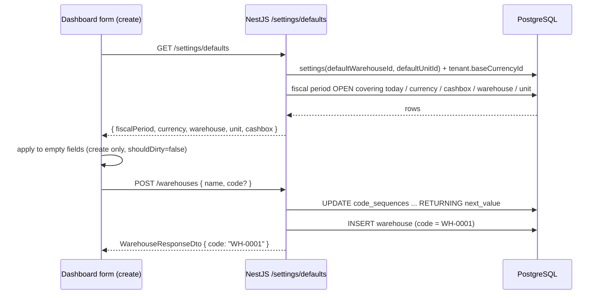

# Form Defaults & Auto-Generated Master-Data Codes — Design

**Date:** 2026-09-22
**Author:** opencode agent
**Status:** Implemented
**Scope:** Cross-stack — `packages/api-contracts` (settings registry), `packages/db-prisma` (code sequences), `apps/api` (settings defaults + code generation), `packages/api-client`, `apps/dashboard` (shared form-defaults hook, 4 code forms, settings UI)
**Primary goal:** Cut friction at creation time — pre-fill the relational values the tenant has already configured (fiscal period, currency, warehouse, base unit, cashbox) and stop forcing users to invent master-data codes.

---

## Context

- **A defaults endpoint already exists but is invoice-only.** `GET /settings/defaults` (`apps/api/src/modules/identity/settings/controllers/settings.controller.ts:18-29`) returns `{ fiscalPeriod, currency, cashbox }`, guarded by `@RequirePermission('settings.manage')`. Its only consumer is the invoice form (`apps/dashboard/modules/settings/hooks/use-form-defaults-query.ts` → `apps/dashboard/modules/invoices/hooks/use-invoice-form.ts:226-241`).
- **Every other create form seeds from a static constant.** `ResourceFormConfig.defaultValues` (`apps/dashboard/shared/hooks/use-resource-form-controller.ts:22-32`) is a `DEFAULT_*` constant; there is no server-fed create-defaults path.
- **Default currency is modelled** as `Tenant.baseCurrencyId` + `Currency.isBase`.
- **The "current" fiscal period is computed**, not flagged: first `status = 'OPEN'` row covering today (`settings.service.ts:34-38`).
- **No "default warehouse" concept exists.** Warehouse has only `isActive`; no `isDefault`, no `Tenant.defaultWarehouseId`.
- **No "default unit" concept exists.** `Unit` has `name` + `abbreviation`, no `code`; "default units" are seed rows (`apps/api/src/modules/catalog/units/default-units.ts`).
- **Master-data codes are never generated.** The only generator is `DocumentSequence` (`apps/api/src/modules/accounting/document-sequences/repositories/document-sequences.repository.ts:22-38`), server-side, document-semantic, not exposed over HTTP. Warehouse/cashbox/item/bank-account codes are manual + uniqueness-checked. `Party` code is optional and its DTO's "Auto-generated if omitted" comment is stale — the service does not generate it.
- Golden reference: **units** vertical slice.
- Related specs: `docs/superpowers/specs/2026-06-08-tenant-settings-design.md`, `docs/superpowers/specs/2026-09-21-onboarding-default-units-design.md`.

---

## Decisions (from the design interview)

| # | Decision |
|---|----------|
| D1 | Pre-fill applies to **create only**, never overwriting an edit load. |
| D2 | Centralised: one shared hook + per-form opt-in map, not per-form hand-wiring. |
| D3 | New tenant defaults are **settings** (registry keys), not `Tenant` FK columns and not `isDefault` flags. |
| D4 | The registry gains **reference-typed keys** (id validated on write, resolved on read). |
| D5 | Default unit is **tenant-wide**, falling back to the **first active unit** when unset. |
| D6 | Auto-generate codes **only for required-code entities**: Warehouse, Cashbox, Item, BankAccount. Not currency (ISO), chart-of-account (chart structure), invoice-type (`SAL`/`PUR`), or party (optional code). |
| D7 | Code field on create: visible, **optional**, placeholder `Auto (e.g. WH-0001)`. Code is **immutable once set** (generated or manual). |
| D8 | Codes are allocated server-side from a dedicated **`CodeSequence`** table (not `DocumentSequence`), prefix + 4-digit padding. |
| D9 | `GET /settings/defaults` permission drops from `settings.manage` to **authenticated-only**. |
| D10 | New `defaults` registry category + a "Defaults" settings section. |
| D11 | The invoice form's ad-hoc defaults effect is **migrated** onto the shared mechanism. |

---

## Requirements

### Functional

- [ ] `GET /settings/defaults` returns `{ fiscalPeriod, currency, warehouse, unit, cashbox }`, each nullable, each `{ id, ...label }`.
- [ ] Warehouse prefill comes from `defaultWarehouseId`; unit prefill from `defaultUnitId`; both resolved to `{ id, code/name }`.
- [ ] When `defaultWarehouseId` is unset, `warehouse` falls back to the **first active warehouse** (mirrors the existing cashbox rule).
- [ ] When `defaultUnitId` is unset, `unit` falls back to the **first active unit** by `createdAt`.
- [ ] Create forms opt in via a declarative map (`fieldName → defaultKey`); values are applied only when the field is empty and only in create mode, with `shouldDirty: false`.
- [ ] Settings page gains a **Defaults** section with two resource selects (warehouse, unit), persisted through `PATCH /settings`.
- [ ] Writing `defaultWarehouseId`/`defaultUnitId` validates the referenced row exists **and belongs to the tenant**; otherwise `422`.
- [ ] Warehouse, Cashbox, Item and BankAccount create accept an **omitted/blank `code`**; the server mints one from `CodeSequence` using the entity prefix.
- [ ] The code field renders optional with an "(auto)" placeholder on create and is disabled on edit.
- [ ] The invoice form consumes the shared defaults mechanism; its bespoke effect is deleted.

### Non-functional

- [ ] Tenant isolation (`tenantId` on every sequence allocation and reference validation).
- [ ] Atomic code allocation (`CodeSequence` increment inside a transaction); unique-constraint collision on `code` retried once.
- [ ] i18n: en, ar, tr for the new Defaults section, code placeholder, and error copy.
- [ ] RTL-safe UI (logical CSS).
- [ ] OpenAPI/Swagger completeness for the new `FormDefaultsResponseDto` fields and optional `code` DTOs.
- [ ] `pnpm --filter @devloggers/api lint:architecture` stays green (domain manifest + boundary probes updated for any new shared module).

### Backend payload / API

- `FormDefaultsResponseDto` (`apps/api/src/modules/identity/settings/dto/settings.dto.ts:83-92`) += `warehouse: { id, code, name } | null`, `unit: { id, name, abbreviation } | null`.
- `CreateWarehouseDto` / `CreateCashboxDto` / `CreateItemDto` / `CreateBankAccountDto`: `code` becomes optional. Response DTOs keep `code` required and non-null.
- `SettingDef` gains an optional `ref?: "warehouse" | "unit"`; `SettingCategory` gains `"defaults"`; `GroupedSettings` gains `defaults: Record<string, unknown>`.

---

## UX requirements

- **Create:** code input shows placeholder `Auto (e.g. WH-0001)`, is not required by the zod schema, and submits `undefined` when blank. On success the list shows the server-minted code.
- **Edit:** code input is disabled/read-only for the four entities (replaces today's inconsistency where warehouse is editable and cashbox is not).
- **Prefill:** happens once per open, only on create, only for empty fields; never marks the form dirty (so a user can clear a value and it won't be re-applied).
- **Defaults settings:** if a selected warehouse/unit is later deleted, the setting resolves to `null` (falls back) rather than erroring the forms.

---

## Proposed approach

### Option A (recommended) — reference-typed settings + dedicated code sequences

**1. Settings registry becomes reference-aware but stays the source of truth.**

```ts
export type SettingCategory = "localization" | "financial" | "documents" | "defaults"

export interface SettingDef {
  category: SettingCategory
  schema: z.ZodTypeAny
  default: unknown
  ref?: "warehouse" | "unit"          // NEW: id-valued, validated on write
}

// registry additions
defaultWarehouseId: { category: "defaults", schema: z.string().uuid().nullable(), default: null, ref: "warehouse" },
defaultUnitId:      { category: "defaults", schema: z.string().uuid().nullable(), default: null, ref: "unit" },
```

`validateSettingsPatch` stays synchronous (zod only). `SettingsService.update` adds an **async** second pass: for every patched key with `ref`, verify the row exists under the tenant; failures accumulate into the same `422` field-error shape. `groupByCategory` gains `defaults`.

**2. `getDefaults` resolves id → label and fixes the early-return.**

Today `settings.service.ts:49-51` returns early when `baseCurrencyId` is null, discarding the rest. Replace with independent resolution of all five values:

```
fiscalPeriod  ← first OPEN period covering today
currency      ← Tenant.baseCurrencyId
cashbox       ← first active cashbox in base currency
warehouse     ← settings.defaultWarehouseId  ?? first active warehouse
unit          ← settings.defaultUnitId       ?? first active unit
```

**3. One shared dashboard hook, declarative opt-in.**

- Move `use-form-defaults-query.ts` to `apps/dashboard/shared/hooks/`.
- Add `useApplyFormDefaults({ form, map, enabled })`, which applies resolved defaults to empty fields in create mode with `shouldDirty: false`.
- `ResourceFormConfig` gains optional `defaults?: Partial<Record<keyof TValues, DefaultKey>>`; `useResourceFormController` wires the hook. Example (items):

```ts
defaults: { baseUnit: "unit", openingWarehouse: "warehouse" }
```

- Custom controllers (invoices, stock-counts) call `useApplyFormDefaults` directly. Invoice's bespoke effect (`use-invoice-form.ts:226-241`) is removed.

**4. Code sequences.**

New model:

```prisma
model CodeSequence {
  id        String   @id @default(uuid())
  tenantId  String   @map("tenant_id")
  entity    String                              // 'warehouse' | 'cashbox' | 'item' | 'bank_account'
  nextValue Int      @default(1) @map("next_value")
  createdAt DateTime @default(now()) @map("created_at")
  updatedAt DateTime @updatedAt @map("updated_at")

  @@unique([tenantId, entity])
  @@map("code_sequences")
}
```

- `allocate(tenantId, entity)`: transaction → upsert sequence → read-and-increment (`nextValue: { increment: 1 }`) → format `${prefix}-${String(n).padStart(4, "0")}`.
- Prefix map (hardcoded defaults): `warehouse: WH`, `cashbox: CSH`, `item: ITM`, `bank_account: BA`.
- Each resource service's `beforeCreate` call-site becomes:

```ts
const code = dto.code ?? await this.codeSequences.allocate(tenantId, "warehouse")
```

- Shared allocation lives in a published module (proposed `apps/api/src/modules/platform/code-sequences/`, exported via barrel) depended on by inventory, catalog, accounting, and invoicing — the same manifest/boundary procedure used by the identity→catalog edge. Exact placement to be confirmed by `lint:architecture` (see Open questions).

**5. Settings UI.** Add a `defaults` group to `settings.config.ts` and a `defaults-form.tsx` section (two `RhfResourceSelect`s) rendered alongside the existing financial/documents/localization sections.

**Why this option:** reuses the endpoint and permission surface that already exist; keeps tenant defaults configurable without schema migrations (registry is migration-free) while refusing to store dangling ids; and puts master-data counters somewhere that isn't user-facing document sequencing.

### Option B (rejected) — `Tenant.defaultWarehouseId` / `defaultUnitId` FK columns

Real referential integrity and no registry-contract change, but it isn't a "setting", needs a migration per new default, and spreads default config across two homes (`Tenant` columns + registry). User chose settings semantics (D3).

### Option C (rejected) — reuse `DocumentSequence` for master-data codes

Would overload a user-facing, document-semantic, configurable table with catalog counters and expose master-data sequences to the document-sequences CRUD UI. Rejected (D8).

---

## Data flow



---

## File map

### Create

| Path | Purpose |
|------|---------|
| `packages/db-prisma/src/schema/code-sequence.prisma` | `CodeSequence` model |
| `apps/api/src/modules/platform/code-sequences/` | Allocation service + repository + module + barrel (location TBC) |
| `apps/dashboard/shared/hooks/use-form-defaults.ts` | `useApplyFormDefaults` + default-key types |
| `apps/dashboard/modules/settings/components/defaults-form.tsx` | Defaults settings section |
| `docs/adr/0001-relational-defaults-in-settings-registry.md` | ADR |
| `docs/adr/0002-master-data-code-sequences.md` | ADR |
| `CONTEXT.md` | Glossary (Default warehouse, Default base unit, System-generated code, Code sequence) |

### Modify

| Path | Change |
|------|--------|
| `packages/api-contracts/src/settings/settings-registry.ts` | `ref`, `defaults` category, two keys, `groupByCategory` |
| `apps/api/src/modules/identity/settings/services/settings.service.ts` | async ref validation; resolve warehouse/unit; fix early return |
| `apps/api/src/modules/identity/settings/dto/settings.dto.ts` | `FormDefaultsResponseDto` += warehouse, unit |
| `apps/api/src/modules/identity/settings/controllers/settings.controller.ts` | drop `settings.manage` on `GET defaults` |
| `apps/api/src/modules/inventory/warehouses/**` | optional `code` + allocation |
| `apps/api/src/modules/accounting/cashboxes/**` | optional `code` + allocation |
| `apps/api/src/modules/catalog/items/**` | optional `code` + allocation |
| `apps/api/src/modules/invoicing/bank-accounts/**` | optional `code` + allocation |
| `apps/api/src/domain/manifest.ts` (+ probes, `.ai/rules/api.md`) | platform→domains edge |
| `packages/api-client/src/clients/tenants.client.ts` | defaults response type |
| `apps/dashboard/shared/hooks/use-resource-form-controller.ts` | `defaults` opt-in map |
| `apps/dashboard/modules/items/`, `warehouses/`, `cashboxes/`, `bank-accounts/` | code optional + prefill map |
| `apps/dashboard/modules/settings/settings.config.ts` | `defaults` group |
| `apps/dashboard/modules/invoices/hooks/use-invoice-form.ts` | remove ad-hoc effect |
| `apps/dashboard/messages/{en,ar,tr}.json` | new keys |

### Delete

- `apps/dashboard/modules/settings/hooks/use-form-defaults-query.ts` (moved to `shared/hooks/`).

---

## Layer details

### 1. Database
`CodeSequence` table + migration. No change to existing tables.

### 2. API contracts
`SettingDef.ref`, `SettingCategory += "defaults"`, `GroupedSettings.defaults`, two registry keys.

### 3. NestJS API
Settings ref-validation + resolution; code allocation in four `beforeCreate` hooks; new shared code-sequences module + manifest edge.

### 4. API client
`tenants.getDefaults()` return type gains `warehouse`/`unit`.

### 5. Dashboard
Shared defaults hook; `ResourceFormConfig.defaults`; code field optional/immutable; Defaults settings section; invoice migration.

---

## Verification

```bash
pnpm --filter @devloggers/db-prisma db:migrate:dev
pnpm --filter @devloggers/api lint:architecture
pnpm turbo run build --filter=@devloggers/api-contracts
pnpm turbo run build --filter=@devloggers/api
pnpm turbo run build --filter=@devloggers/dashboard
pnpm generate:dev   # API must be running
```

### Manual smoke test

- [ ] Warehouse create with blank code → `WH-0001`; next → `WH-0002`.
- [ ] Cashbox/Item/BankAccount same, with their prefixes.
- [ ] Duplicate manually-entered code still returns the existing conflict error.
- [ ] Item create form arrives with `baseUnit` pre-filled; changing the default unit in Settings changes it for the next create.
- [ ] Invoice create still pre-fills fiscal period/currency/cashbox after the migration.
- [ ] A non-admin user (no `settings.manage`) can open create forms and get prefill (no 403).
- [ ] Setting a default warehouse then deleting it degrades to first-active, no form error.
- [ ] i18n renders in en and ar (RTL).

---

## Out of scope

- Auto-codes for Currency, ChartOfAccount, InvoiceType.
- `Party` code generation (currently optional; its stale "Auto-generated" comment should be corrected or removed as cleanup).
- Per-category default unit.
- Backfilling codes for existing rows.
- Reworking `DocumentSequence` or the document-sequences UI.

---

## Open questions

- [x] **Warehouse fallback** — when `defaultWarehouseId` is unset, fall back to the first active warehouse. **Decision:** yes, fall back.
- [x] **Placement of the shared code-sequence allocator** — **Decision:** `platform` domain module in `apps/api`, published via barrel.
- [x] **Format configurable?** — hardcoded per-entity prefixes. **Decision:** yes, hardcoded for now.

---

## Approval

- [x] Design reviewed by: user
- [x] Approved on: 2026-09-22
