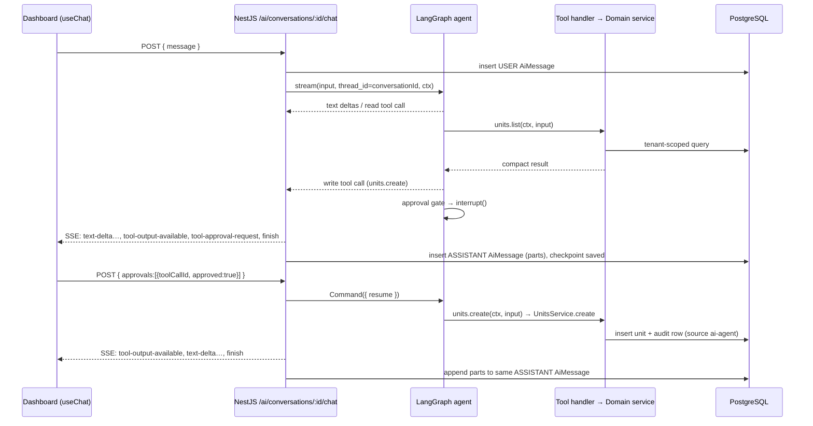

# AI Agent Runtime — Design

**Date:** 2026-09-24
**Author:** Claude (brainstorming session with Mohammad Khyata)
**Status:** Approved (2026-09-24)
**Scope:** API `ai-agent` domain (replaces `ai-chat`) → api-contracts → api-client → Dashboard `/ai` chat
**Primary goal:** An in-app AI agent that can perform app actions through a code-managed, permission-aware tool registry, with stored + streamed chats and a virtualized chat UI. First capability: CRUD on pilot resources.

---

## Context

- Current implementation: `apps/api/src/modules/ai-chat/` — raw `fetch` to Gemini, non-streaming,
  `AiChatSession` / `AiChatMessage` Prisma models, routes under `/ai` guarded by `ai.view` / `ai.use`.
  No dashboard UI consumes it.
- Domain manifest (`apps/api/src/domain/manifest.ts`) lists `ai-chat` as an optional domain with no dependencies.
- Business rules live in domain services (`before*` hooks); request validation is class-validator DTOs
  through the global `ValidationPipe` (`transform: true`).
- Domain constraints: `.ai/rules/domain.md` (no deletes of posted financial docs, zero-trust backend),
  deletion-semantics table in `.ai/rules/api.md`.

### Sub-project decomposition

The overall "agent that can do almost everything" effort is split into separate specs:

| # | Sub-project | Spec |
|---|-------------|------|
| 1 | Agent runtime + streaming/stored chat + code-level tool registry + pilot CRUD tools | **this spec** |
| 2 | Broad CRUD tool rollout across domains | later |
| 3 | Financial tools (invoices, payments, journal entries — cancel/reverse, never delete) | later |
| 4 | RAG | later |

Tool management is **code-only** — no admin UI, no DB-stored tool configuration.

---

## Decisions (from brainstorming)

| Topic | Decision |
|-------|----------|
| Frontend chat | Vercel AI SDK v5 (`@ai-sdk/react` `useChat`) with a custom transport |
| Backend agent | LangChain JS + LangGraph (`createReactAgent`) inside NestJS |
| Provider | OpenAI via `@langchain/openai`; model from env (`AI_MODEL`), provider selected via `AI_PROVIDER` + `initChatModel`, swappable by config only |
| Mutations | Human-in-the-loop for risky tools only: `read` runs immediately; `write` / `destructive` pause via LangGraph `interrupt()` for user approval |
| Tool definition | Hand-written tools calling domain services, plus a `defineCrudAiTools` factory for standard CRUD resources |
| Old chat data | `AiChatSession` / `AiChatMessage` tables dropped (never used by a UI) |
| Checkpointer | Custom `PrismaCheckpointSaver`, tables created by Prisma migration |
| Tests | **No new automated tests in this spec** (explicit user decision). Existing suites must keep passing. |

---

## Plan-time revisions (2026-09-24)

Found while writing the implementation plan; these supersede the sections below where they conflict.

1. **Tool contract lives in `@devloggers/backend-core`, not in `ai-agent`.** `defineAiTool`, `defineCrudAiTools`,
   `dtoInput` and the `@AiToolProvider()` class decorator are infrastructure (no domain logic). Domains contribute
   tools by registering an `@AiToolProvider()` class in their own module; `AiToolRegistry` finds them with Nest
   `DiscoveryService`. Consequences: `ai-agent.dependsOn` is `['audit']` only — **no** `ai-agent → catalog/parties`
   edges, `parties` needs no barrel, and a disabled domain's tools vanish automatically because its module is not
   loaded. (With the original design, `ai-agent` depending on `parties` would have made `parties` impossible to
   disable while `ai-agent` is enabled.)
2. **`permission` is typed `PermissionKey`** (from `@devloggers/api-contracts`), so an unknown permission is a compile
   error; the boot-time permission check is dropped. Hand-written tools also use `dtoInput(SomeDto)` — one input
   mechanism, no Zod in the API.
3. **Model-facing tool names encode `.` as `__`** (`units.create` → `units__create`) because OpenAI function names must
   match `^[a-zA-Z0-9_-]+$`. Registry, permissions, audit and UI keep dotted names.
4. **Approvals use AI SDK v6 native tool approval** (`tool-approval-request` chunk, `approval-requested` /
   `approval-responded` part states, `addToolApprovalResponse`). The API uses the `ai` package server-side only for
   `createUIMessageStream` / `pipeUIMessageStreamToResponse` so the final `UIMessage` for persistence is assembled by
   the SDK, not by hand.
5. **Checkpoint payloads are stored as `Bytes` + serde type** (LangGraph `serde.dumpsTyped`), not JsonB, to round-trip
   LangChain message objects exactly.
6. **Audit source** is `'AI_AGENT'` (added to the `AuditSource` union), matching the existing upper-case convention.
7. **Locales** are `en`, `ar`, `tr` (there is no `ar-SY` folder in `packages/i18n/src`). The existing nav item
   `business.navigation.items.aiAssistant` (href `/ai/chat`) is re-pointed to `/ai`.
8. **Model factory** switches on `AI_PROVIDER` with one `openai` case (`ChatOpenAI`); adding a provider = one case +
   its `@langchain/*` package.

---

## Requirements

### Functional

- [ ] User can create, list, rename, and delete AI conversations (own conversations only).
- [ ] User sends a message; the assistant response streams token-by-token.
- [ ] All messages are stored and a conversation can be reopened with full history.
- [ ] Agent can call tools; read tools execute immediately and their results render as cards.
- [ ] `write` / `destructive` tool calls stop the run and show an approval card; approve executes, reject returns a rejection to the model which continues without retrying.
- [ ] Parallel risky calls are presented as one approval batch; each call is approved/rejected individually.
- [ ] Sending a new message while approvals are pending rejects them with reason `superseded`.
- [ ] Pending approvals survive a page reload (rendered from stored message parts).
- [ ] Pilot tools: `units.*`, `items.*`, `customers.*` (list / show / create / update) + `tools.search`, `tools.load`.
- [ ] Chat UI list is virtualized, sticks to bottom while streaming, loads older history on scroll-up.

### Non-functional

- [ ] Tenant isolation: `tenantId` / `userId` come only from the JWT execution context, never from model output.
- [ ] Tools filtered by the user's permissions and `DISABLED_DOMAINS`; handlers re-check permission.
- [ ] Every executed `write` / `destructive` tool is audited with `source: 'ai-agent'`.
- [ ] i18n: en, ar, tr, ar-SY; RTL-safe (logical CSS).
- [ ] OpenAPI/Swagger complete for all new non-streaming routes; `pnpm generate` run.
- [ ] Domain manifest + `lint:architecture` updated for new `ai-agent` edges.

---

## Architecture

### Backend — `apps/api/src/modules/ai-agent/` (replaces `ai-chat/`)

| Sub-module | Responsibility |
|------------|----------------|
| `tools/` | `defineAiTool()`, `defineCrudAiTools()`, `AiToolRegistry` (collect, validate at boot, filter per request, scope) |
| `runtime/` | Model factory (`initChatModel` from env), LangGraph graph, approval gate, `PrismaCheckpointSaver`, system prompt |
| `conversations/` | 4-layer CRUD for `AiConversation` / `AiMessage` (repository → service → presenter → controller) |
| `stream/` | LangGraph events → AI SDK **UI message stream** protocol over SSE; final message persistence |
| `ai-agent.module.ts` | Wires everything; imports pilot domains' tool modules |

Domain tool exports (each domain owns its tools; `ai-agent` depends on them):

| Domain | New path | Export |
|--------|----------|--------|
| catalog | `catalog/ai-tools/` (exported from `catalog/index.ts`) | `CatalogAiToolsModule` (units, items) |
| parties | `parties/ai-tools/` + new `parties/index.ts` barrel | `PartiesAiToolsModule` (customers) |

Tool definitions are registered via a Nest multi-provider token (`AI_TOOLS`), so a domain contributes tools
by adding a provider — `ai-agent` never imports domain internals.

### Frontend — `apps/dashboard/modules/ai-agent/`

`useChat` + `NestChatTransport` (extends `DefaultChatTransport`: NestJS URL, JWT header, approval payloads),
virtualized message list via `@tanstack/react-virtual`, tool/approval part renderers.

---

## Data flow



---

## Layer details

### 1. Database (`packages/db-prisma/src/schema/ai-agent.prisma`)

Replace `AiChatSession` / `AiChatMessage` (and their `Tenant` relations) with:

```prisma
enum AiMessageRole { USER ASSISTANT SYSTEM }

model AiConversation {
  id            String    @id @default(uuid())
  tenantId      String    @map("tenant_id")
  tenant        Tenant    @relation(fields: [tenantId], references: [id], onDelete: Cascade)
  userId        String    @map("user_id")   // no FK — matches existing ai-chat schema
  title         String?
  lastMessageAt DateTime  @default(now()) @map("last_message_at")
  createdAt     DateTime  @default(now()) @map("created_at")
  updatedAt     DateTime  @updatedAt @map("updated_at")
  messages      AiMessage[]

  @@index([tenantId, userId, lastMessageAt])
  @@map("ai_conversations")
}

model AiMessage {
  id             String         @id @default(uuid())
  tenantId       String         @map("tenant_id")
  tenant         Tenant         @relation(fields: [tenantId], references: [id], onDelete: Cascade)
  conversationId String         @map("conversation_id")
  conversation   AiConversation @relation(fields: [conversationId], references: [id], onDelete: Cascade)
  role           AiMessageRole
  parts          Json           @db.JsonB   // AI SDK UIMessage.parts, verbatim
  metadata       Json?          @db.JsonB   // model, usage, finishReason, error
  createdAt      DateTime       @default(now()) @map("created_at")
  updatedAt      DateTime       @updatedAt @map("updated_at")

  @@index([conversationId, createdAt])
  @@map("ai_messages")
}
```

Checkpointer tables (same migration), modelled in Prisma so the rule "Prisma migrations only" holds:

- `ai_checkpoints` — `thread_id`, `checkpoint_ns`, `checkpoint_id`, `parent_checkpoint_id`, `tenant_id`,
  `checkpoint` (JsonB), `metadata` (JsonB), `created_at`; PK (`thread_id`, `checkpoint_ns`, `checkpoint_id`).
- `ai_checkpoint_writes` — `thread_id`, `checkpoint_ns`, `checkpoint_id`, `task_id`, `idx`, `channel`,
  `value` (JsonB), `tenant_id`; PK (`thread_id`, `checkpoint_ns`, `checkpoint_id`, `task_id`, `idx`).
- `thread_id` = `AiConversation.id`. No FK (LangGraph owns the shape); rows are deleted by
  `ConversationsService.delete` in the same transaction.

Migration drops `ai_chat_sessions` / `ai_chat_messages` (destructive, intentional — no UI ever used them).

### 2. API contracts (`packages/api-contracts`)

- `src/resources/ai-agent.resource.ts` — `defineResource` (non-CRUD) with routes:
  `listConversations`, `createConversation`, `updateConversation`, `deleteConversation`, `listMessages`, `chat`.
- Remove the old `ai-chat` resource if one exists.
- Types consumed via generated OpenAPI types only (`ApiResponse`, `ApiRequestBody`); no hand-written shapes.

### 3. NestJS API

#### Routes (`JwtAuthGuard` + `PermissionsGuard`, tag `AI / Agent`)

| Method | Route | Permission | Notes |
|--------|-------|------------|-------|
| GET | `/ai/conversations` | `ai.view` | Cursor-paginated by `lastMessageAt` |
| POST | `/ai/conversations` | `ai.use` | Optional `title` |
| PATCH | `/ai/conversations/:id` | `ai.use` | Rename |
| DELETE | `/ai/conversations/:id` | `ai.use` | Deletes messages + checkpoints |
| GET | `/ai/conversations/:id/messages` | `ai.view` | Cursor-paginated, newest first |
| POST | `/ai/conversations/:id/chat` | `ai.use` | SSE (`text/event-stream`), AI SDK UI message stream; body `{ message?: UIMessage, approvals?: ApprovalDecisionDto[] }` — exactly one of the two |
| GET | `/ai/model` | `ai.view` | Kept; returns `{ provider, model }` |

All conversation access checks `(tenantId, userId)` ownership → 404 otherwise.

#### Tool definition contract (`tools/define-ai-tool.ts`)

```ts
type AiToolRisk = 'read' | 'write' | 'destructive'

interface AiToolContext {
  tenantId: string; userId: string; permissions: ReadonlySet<string>
  locale: string; conversationId: string
}

interface AiToolDefinition<I, O> {
  name: `${string}.${string}`       // domain-namespaced, unique, e.g. "units.create"
  domain: DomainKey
  description: string               // written for the model
  risk: AiToolRisk
  permission: string                // same key as the HTTP route's @RequirePermission
  input: AiToolInput<I>             // { jsonSchema, validate(raw) → I | validation errors }
  handler(ctx: AiToolContext, input: I): Promise<O>
  summarize?(input: I): { key: string; params: Record<string, string> }  // i18n for approval card
  enabled?: boolean                 // code-level kill switch, default true
}
```

- `AiToolInput` builders: `zodInput(schema)` for hand-written tools; `dtoInput(DtoClass)` for the factory —
  JSON schema derived from `@nestjs/swagger` metadata of the DTO class, validation via
  `plainToInstance` + `validate` (same semantics as the global `ValidationPipe`).
- `tenantId` / `userId` never appear in any input schema.

#### CRUD factory (`tools/define-crud-ai-tools.ts`)

```ts
defineCrudAiTools({
  resource: resources.units, domain: 'catalog', service: UnitsService,
  createDto: CreateUnitDto, updateDto: UpdateUnitDto,
  searchFields: ['name', 'abbreviation'],
  ops: ['list', 'show', 'create', 'update'],   // 'delete' opt-in → risk 'destructive'
  permissions?: { list?, show?, create?, update?, delete? },  // defaults: `${key}.view|create|update|delete`
})
```

| Generated tool | Risk | Behaviour |
|----------------|------|-----------|
| `<key>.list` | read | `{ search?, page?, limit ≤ 50 }` → `service.findMany`, returns `{ items, total }` (presenter output) |
| `<key>.show` | read | `{ id }` → `service.findById` |
| `<key>.create` | write | `CreateDto` → `service.create(ctx.tenantId, dto)` |
| `<key>.update` | write | `{ id, ...UpdateDto }` → `service.update(ctx.tenantId, id, dto)` |
| `<key>.delete` | destructive | only when listed in `ops` |

Permission defaults follow the existing permission key convention; the boot validation below rejects
any key not in the permission catalog, so a wrong default fails fast.

#### Registry (`tools/ai-tool-registry.ts`)

Boot-time validation (throws → app fails to start):
1. Duplicate tool names.
2. `permission` not present in the permission catalog.
3. A `delete` tool whose resource is in the cancel-only / never-delete list
   (Invoice, Payment, Expense, JournalEntry, JournalLine, StockMovement, StockCount) — enforces `domain.md`.
4. `domain` not in `DOMAIN_MANIFESTS`.

Per request: `forUser(ctx)` → tools where `enabled`, domain not disabled, and `ctx.permissions` has `permission`.

Scoping: always expose read tools of pilot domains + `tools.search` (`{ query }` → matching tool names/descriptions
the user may use) + `tools.load` (`{ domain }` → adds that domain's tools to the graph state's active tool set).
With only pilot tools, everything permitted is loaded; the meta-tools exist so the rollout (sub-project 2) does not
change the runtime.

#### Pilot tools

| Domain | Tools | Source |
|--------|-------|--------|
| catalog | `units.list/show/create/update` | factory over `UnitsService` |
| catalog | `items.list/show/create/update` | factory over `ItemsService` |
| parties | `customers.list/show/create/update` | factory over `PartiesService`, party type fixed to customer in handler (not in input schema); permissions overridden to `parties.view/create/update` |
| ai-agent | `tools.search`, `tools.load` | hand-written |

No financial posting tools in this spec.

#### Runtime (`runtime/`)

- `model.factory.ts` — `initChatModel(AI_MODEL, { modelProvider: AI_PROVIDER })`; env: `AI_PROVIDER=openai`,
  `AI_MODEL=<GPT model name>`, `OPENAI_API_KEY`. The reference model used for manual verification is recorded
  in `.env.example`. Remove `GEMINI_API_KEY` / `ai.apiKey` config.
- Graph: LangGraph `createReactAgent` with a custom tool node wrapper:
  - Before executing a batch of tool calls, the **approval gate** splits them into read vs risky.
    Reads execute. If any risky calls exist → `interrupt({ calls: [{ toolCallId, name, input, risk, summary }] })`.
  - On resume, `Command({ resume: { decisions: [{ toolCallId, approved, reason? }] } })`:
    approved → execute; rejected → `ToolMessage` content `"Rejected by user: <reason>. Do not retry."`.
  - Resume validation: decisions must match exactly the pending interrupt's `toolCallId`s, else **409**.
  - New user message while an interrupt is pending → resume with all pending rejected (`superseded`) first,
    then process the new message.
- Tool execution wrapper: re-check permission (→ error result), 30 s timeout, output capped at ~8 KB JSON
  (`truncated: true` when cut), service `HttpException` 4xx → error result `{ error, message, validationErrors? }`
  returned to the model; 5xx/timeout → generic error result, logged with `conversationId` + `toolCallId`.
- `recursionLimit: 25`.
- System prompt: role, tenant/company name, `ctx.locale` reply language, "use tools for facts; never invent IDs;
  risky actions will be confirmed by the user".
- Agent memory trimming: before each model call, trim LangChain messages to the model's context budget
  (keep system + most recent turns, never split a tool call from its result).

#### Stream (`stream/`)

- `ui-stream.translator.ts` — maps `graph.stream(..., { streamMode: ['messages', 'updates'] })` to AI SDK UI
  stream chunks: `start`, `text-start/delta/end`, `tool-input-available`, `tool-output-available`,
  `tool-output-error`, `tool-approval-request`, `error`, `finish`.
- Controller writes SSE with the AI SDK UI stream headers.
- The run is consumed server-side independent of the client connection: on client disconnect the run
  completes and is persisted.
- Persistence: user message inserted on arrival; assistant message inserted on first finish (including
  finish-at-interrupt); a resumed run **appends parts** to that assistant message; `lastMessageAt` updated.
  Model/provider failure → `error` chunk, partial message saved with `metadata.error`.
- Throttle: per-user rate limit on `/chat` (existing throttler if configured, else a simple per-user limiter).

#### Audit

Every executed `write` / `destructive` tool writes through `AuditWriter` (audit domain barrel) with
`source: 'ai-agent'`, `conversationId`, `toolCallId`, tool name, and the approved input (redacted via existing `redact`).

#### Domain manifest / boundaries

- Rename domain key `ai-chat` → `ai-agent`; routes `['ai']`; `optional: true`.
- `ai-agent.dependsOn`: `['catalog', 'parties', 'audit']`.
- `catalog` provides `CatalogAiToolsModule`; `parties` gets `index.ts` providing `PartiesAiToolsModule`.
- Update `apps/api/eslint/domain-boundaries.mjs`, `scripts/check-architecture-rules.mjs` probes,
  and the domain table in `.ai/rules/api.md`.
- Update `enforcement-coverage.spec.ts` expectations for the new routes (existing test, kept green).

### 4. API client (`packages/api-client`)

- `src/clients/ai-agent.client.ts` — custom client (non-CRUD) for conversations + messages; registered in
  `clients/index.ts` and `createApi()` as `aiAgent`. The `chat` stream is consumed by the dashboard transport,
  not this client; the client exposes `chatUrl(id)` from the resource route.
- Remove any old ai-chat client.

### 5. Dashboard (`apps/dashboard/modules/ai-agent/`)

```
components/
  ai-agent-page.tsx            two-pane layout (conversations | chat), single pane on mobile
  conversation-list.tsx        infinite query api.aiAgent.listConversations; new / rename / delete
  chat-view.tsx
  message-list.tsx             virtualized
  message-item.tsx             memoized by id + parts length; renders parts
  parts/text-part.tsx          markdown
  parts/tool-call-card.tsx     read results (compact table / key-values), errors
  parts/tool-approval-card.tsx summary + payload; update → before/after diff; destructive → red + 2nd confirm
  composer.tsx                 Enter send / Shift+Enter newline, stop button, disabled while approval pending
hooks/
  use-agent-chat.ts            useChat({ id, transport, messages: initialPage })
  use-conversation-history.ts  older pages (cursor)
transport/
  nest-chat-transport.ts       DefaultChatTransport → NestJS chat URL, JWT header, approvals body
index.ts
```

- Route: `app/[locale]/(authenticated)/ai/page.tsx` (thin) + optional `ai/[conversationId]` segment.
- Nav: `config/navGroups.tsx` entry gated by `ai.view`.
- Virtualization (`@tanstack/react-virtual`): dynamic `measureElement`, overscan 6, stick-to-bottom unless
  user scrolled up (then "new messages ↓" pill), reverse infinite load near top with scroll anchoring on prepend.
- Approval card state derives from stored/streamed parts, so it survives reload.
- The update diff fetches current values via the matching `show` endpoint through `api-client`.
- i18n: `business.aiAgent.*` (UI) and `business.aiAgent.tools.<tool>` (approval summaries) in en, ar, tr, ar-SY.
- New deps: `ai`, `@ai-sdk/react`, `@tanstack/react-virtual`, a markdown renderer (reuse one if already present).
- API deps: `langchain`, `@langchain/core`, `@langchain/langgraph`, `@langchain/openai`.

---

## File map

### Create

| Path | Purpose |
|------|---------|
| `packages/db-prisma/src/schema/ai-agent.prisma` | Conversation, message, checkpoint models |
| `packages/db-prisma/src/schema/migrations/<ts>_ai_agent/` | Migration (drop old chat tables, create new) |
| `packages/api-contracts/src/resources/ai-agent.resource.ts` | Route definitions |
| `apps/api/src/modules/ai-agent/**` | Domain: tools, runtime, conversations, stream |
| `apps/api/src/modules/catalog/ai-tools/**` | Units + items tools |
| `apps/api/src/modules/parties/ai-tools/**` | Customers tools |
| `apps/api/src/modules/parties/index.ts` | Parties barrel |
| `packages/api-client/src/clients/ai-agent.client.ts` | Client |
| `apps/dashboard/modules/ai-agent/**` | Chat UI |
| `apps/dashboard/app/[locale]/(authenticated)/ai/page.tsx` | Thin route |

### Modify

| Path | Change |
|------|--------|
| `packages/db-prisma/src/schema/tenant.prisma` | Relations to new models; remove old |
| `packages/api-contracts/src/resources/index.ts` | Register resource |
| `packages/api-client/src/clients/index.ts`, `src/api.ts` | Register `aiAgent` |
| `apps/api/src/domain/manifest.ts`, `domain-modules.ts` | `ai-chat` → `ai-agent`, deps |
| `apps/api/eslint/domain-boundaries.mjs`, `apps/api/scripts/check-architecture-rules.mjs` | New edges |
| `apps/api/src/modules/catalog/index.ts` | Export `CatalogAiToolsModule` |
| `apps/api/src/config/*` (ai config), `.env.example` | OpenAI env |
| `apps/api/src/modules/identity/auth/permissions/enforcement-coverage.spec.ts` | Route list update |
| `.ai/rules/api.md` | Domain table + dependency graph |
| `apps/dashboard/config/navGroups.tsx` | Nav entry |
| `packages/i18n/src/{en,ar,tr,ar-SY}/business.json` | `aiAgent` keys |

### Delete

| Path | Reason |
|------|--------|
| `apps/api/src/modules/ai-chat/**` | Replaced by `ai-agent` |
| `packages/db-prisma/src/schema/ai-chat.prisma` | Replaced by `ai-agent.prisma` |

---

## Verification

No new automated tests (user decision). Required gates:

```bash
pnpm --filter @devloggers/db-prisma db:migrate:dev
pnpm --filter @devloggers/db-prisma typecheck
pnpm generate
pnpm --filter @devloggers/api-contracts build
pnpm --filter @devloggers/api-client build
pnpm --filter @devloggers/api lint
pnpm --filter @devloggers/api lint:architecture
pnpm --filter @devloggers/api test          # existing suites stay green
pnpm --filter @devloggers/dashboard lint
pnpm turbo run build --filter=@devloggers/api --filter=@devloggers/dashboard
```

### Manual smoke test (`pnpm dev`, real `OPENAI_API_KEY`)

- [ ] "List my units" → streamed answer + read tool card, no approval
- [ ] "Create unit Box (bx)" → approval card → Approve → unit exists, audit row with `source: ai-agent`
- [ ] Update request → diff card → Reject → no change; assistant acknowledges
- [ ] Reload page while approval pending → card still present and actionable
- [ ] User without `units.create` → agent cannot create (tool absent)
- [ ] Second tenant cannot open first tenant's conversation URL (404)
- [ ] 200-message conversation scrolls smoothly; older history loads on scroll-up without jumping
- [ ] Arabic locale: RTL layout, Arabic replies

**Accepted risk:** security properties (forged resume → 409, tenant isolation, permission re-check)
are verified by code review and manual smoke only.

---

## Out of scope

- RAG / embeddings / document retrieval
- Financial tools (invoices, payments, expenses, journal entries)
- Broad CRUD tool rollout beyond units, items, customers
- Tool-management UI or DB-stored tool configuration
- Multiple concurrent providers / per-tenant model choice
- File attachments, voice, multi-agent orchestration
- New automated tests

---

## Open questions

- [ ] Reference OpenAI model name for `AI_MODEL` — **Decision:** set by the team in `.env`; spec requires only that the chosen model supports tool calling.

---

## Approval

- [ ] Design reviewed by: ___
- [ ] Approved on: ___
