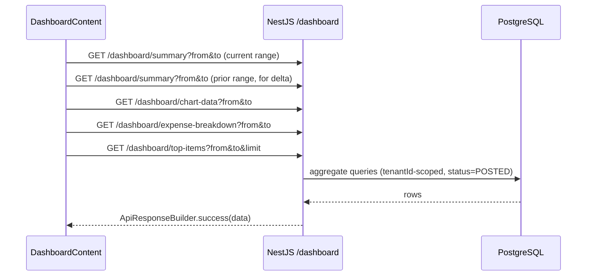

# ERP Home Dashboard — Visual Redesign — Design

**Date:** 2026-09-24
**Author:** Claude (dashboard session)
**Status:** Draft
**Scope:** `apps/dashboard/modules/home/**`, `apps/api/src/modules/reports/{dashboard.controller.ts,reports.service.ts}`, `packages/api-client/src/clients/dashboard.client.ts`
**Primary goal:** Make the ERP home page a genuinely useful, attractive at-a-glance dashboard (more charts, richer visuals, on-brand color use) while keeping the quick-action shortcuts exactly as visible and reachable as they are today.

---

## Context

- Current implementation: `apps/dashboard/modules/home/dashboard-content.tsx`, which composes `components/dashboard-kpi-cards.tsx`, `dashboard-cashbox-cards.tsx`, `dashboard-quick-actions.tsx`, `dashboard-chart.tsx`, `dashboard-low-stock.tsx`, `dashboard-recent-payments.tsx`, `dashboard-items-overview.tsx`, plus hooks in `hooks/`.
- Data today: `DashboardClient.summary()` / `.chartData()` (`packages/api-client/src/clients/dashboard.client.ts`), backed by `ReportsService.getDashboardSummary` / `.getDashboardChartData` (`apps/api/src/modules/reports/reports.service.ts`) and exposed via `apps/api/src/modules/reports/dashboard.controller.ts`. `dashboard-low-stock.tsx` calls `api.reports.stockBalance()` directly; `dashboard-recent-payments.tsx` calls `api.payments.list(...)` via `use-dashboard-movements.ts`.
- **10 unused files** sit directly in `modules/home/` — `appointments-summary-card.tsx`, `customers-totals-card.tsx`, `financial-summary-chart.tsx`, `financial-totals-cards.tsx`, `income-expense-chart.tsx`, `items-totals-card.tsx`, `sales-purchase-cards.tsx`, `upcoming-appointments-card.tsx`, `use-dashboard-data.ts`, `vehicle-stats-cards.tsx`, `work-orders-status-card.tsx`. None are imported by `dashboard-content.tsx` or anything else — leftovers from an unrelated (vehicle/appointments) template. Confirmed via repo-wide grep for each filename/export.
- Design tokens already exist in `apps/dashboard/app/globals.css`: Signal Green `--primary`/`--chart-1`, plus `--chart-2..5`, a full elevation scale, and a `.dark` theme. The current `dashboard-chart.tsx` hardcodes `#10b981` / `#3b82f6` instead of using these tokens.
- A shared `localize(value, locale, fallback?)` helper already exists at `apps/dashboard/shared/lib/localize.ts` for rendering `LocalizedString` (`{ar, en?}`) fields — but it is **not used** by any of the three places that currently reimplement the same logic inline: `dashboard-cashbox-cards.tsx` (`getLocalizedName`), `dashboard-recent-payments.tsx` (`resolveLocalizedName`), and `currencies.config.ts`. Since two of those three files are already being rewritten for this redesign, this spec adopts the existing shared helper there instead of leaving a third inline copy.
- Palette validated with the `dataviz` skill's `validate_palette.js` against the real OKLCH→hex values of `--chart-1..5`:
  - Light mode (surface ≈ `#fafcfa`): CVD separation **PASS**, normal-vision floor **PASS**, chroma floor **PASS**; lightness-band and contrast-vs-surface **WARN/FAIL** for the brand-green/orange/teal tokens used as *thin unfilled strokes* on a near-white card.
  - Dark mode (surface ≈ `#151815`): CVD separation, normal-vision floor, contrast-vs-surface all **PASS**.
  - Conclusion: the palette itself is colorblind-safe and usable as-is; light-mode line/area marks need the validator's prescribed mitigation (heavier strokes, direct value labels, always-on legend) rather than a new palette. This spec does not touch the global token file.
- Related specs: none prior for this page (dashboard was originally built ad hoc per memory notes, no existing design doc).

---

## Requirements

### Functional

- [ ] Keep Quick Actions visible near the top of the page, unchanged in position/prominence.
- [ ] KPI cards show a period-over-period trend delta (▲/▼ %), computed by calling the summary endpoint for both the selected range and the immediately preceding equal-length range.
- [ ] Add a Cash Distribution donut chart from existing `cashboxes` balances (no new endpoint), alongside — not replacing — the existing per-cashbox balance scroll-cards (the donut shows composition at a glance; the cards keep the exact per-cashbox numbers).
- [ ] Add a Revenue → Purchases → Expenses → Net Profit composition chart from existing `summary` fields (no new endpoint).
- [ ] Add a new `GET /dashboard/expense-breakdown` endpoint: posted expense amounts grouped by GL account, top 5 + "Other" bucket, for the selected date range.
- [ ] Add a new `GET /dashboard/top-items` endpoint: posted SALE invoice lines grouped by item, top N (default 5) by revenue, with quantity, for the selected date range.
- [ ] Restyle the existing Sales vs Purchases chart onto `--chart-1`/`--chart-2` tokens with thicker strokes and direct end-of-line value labels.
- [ ] Recolor KPI icons and quick-action hover accents onto the same `--chart-1..4` token family used by the charts (one consistent color story across the whole page).
- [ ] Delete the 10 orphaned files listed above.
- [ ] Fix, only in files already being rewritten for this redesign: the `any`-typed row in `dashboard-recent-payments.tsx`, and the "Total" stat in `dashboard-items-overview.tsx` mislabeling `totalActiveParties` (relabel to "Active Parties", keep its existing correct link to `/parties/customers`).
- [ ] Add loading skeletons and empty states for every new chart.

### Non-functional

- [ ] Tenant isolation on the two new endpoints (`tenantId` scoping, same as `getDashboardSummary`).
- [ ] i18n: en, ar, tr for all new/changed strings under `business.dashboard.*`.
- [ ] RTL-safe layout (logical CSS, already the house style).
- [ ] Dark mode verified for every new chart (tokens already theme-aware).
- [ ] `prefers-reduced-motion` respected for any new entrance animation (existing single fade/slide on mount is low-intensity and kept as-is).
- [ ] No `as any` / untyped API response handling introduced.

### Backend payload / API

**`GET /dashboard/expense-breakdown`**
Query: `from?`, `to?` (ISO 8601, same semantics as `/dashboard/summary` — defaults to current calendar month).
Response (via `ApiResponseBuilder.success`, matching the existing `/dashboard/summary` convention — no DTO class, manually declared client-side type, same as today):
```ts
type DashboardExpenseBreakdownItem = {
    accountId: string
    accountName: Record<string, string>   // ChartOfAccount.name is localized JSON
    total: number
}
// Response: DashboardExpenseBreakdownItem[], top 5 by total desc + one synthetic
// { accountId: "other", accountName: { en: "Other", ar: "أخرى" }, total } row
// when more than 5 accounts have posted expense lines in range.
```
Query implementation: group posted `ExpenseItem` rows (joined through `Expense` for `status='POSTED'`, `tenantId`, date range) by `accountId`, sum `amount`, join `ChartOfAccount` for `name`.

**`GET /dashboard/top-items`**
Query: `from?`, `to?`, `limit?` (default 5, max 10).
```ts
type DashboardTopItem = {
    itemId: string
    itemName: string
    itemCode: string
    quantity: number
    revenue: number
}
// Response: DashboardTopItem[]
```
Query implementation: group posted `InvoiceLine` rows (joined through `Invoice` for `status='POSTED'`, `invoiceType.direction='SALE'`, `tenantId`, date range) by `itemId`, sum `total` (revenue) and `quantity`, join `Item` for `name`/`code`, order by revenue desc, take `limit`.

Both follow the exact existing precedent of `getDashboardSummary`/`getDashboardChartData`: plain `ReportsService` methods, no repository/presenter/event layers (this controller predates and intentionally sits outside the 4-layer CRUD architecture — it is a read-only reporting surface, not a resource). Both are read-only aggregate queries over already-posted, immutable ledger-adjacent rows — no conflict with the sub-ledger isolation rule.

---

## UX requirements

- All new charts show a loading skeleton sized to their final shape (matching the existing `<Skeleton>` pattern already used throughout `modules/home/components/`).
- All new charts show a designed empty state (not a blank/zero chart) when a tenant has no posted data yet in range — short icon + message, consistent with the rest of the app's empty states.
- KPI trend chips: green up-arrow when favorable (sales/profit increasing, expenses decreasing) and vice versa — direction of "favorable" differs per metric (documented per-card in implementation).
- Every chart with ≥2 series keeps a visible legend; single-series charts are titled instead (per dataviz skill's identity-never-color-alone rule).
- Cash Distribution donut and Expenses-by-Account chart both show a compact legend/label list beside the chart (not color-only identity), since both can exceed 2 series.

---

## Proposed approach

### Option A — Frontend redesign + 2 new lightweight backend aggregates (recommended)

Extend the existing bespoke `/dashboard/*` reporting controller with two more read-only aggregate routes, reusing its established (DTO-free, manually-typed) convention exactly. Rebuild the home page's visual composition and color story around the app's existing (validated) chart tokens, using data that's mostly already available plus the two new aggregates for genuinely new insight (expense composition, best sellers).

**Why this option:** Matches the "boring over clever" rule — no new architecture, no new resource/DTO ceremony where none exists today. Two focused, cheap, read-only endpoints buy two genuinely new chart types (composition + ranking) that can't be derived from data already on the page. Full frontend restyle is achievable without any backend risk for 80% of the visual work (KPI deltas, cashbox donut, revenue breakdown, chart restyle).

### Option B — Frontend-only, zero backend changes (rejected — user chose Option A)

Would have restyled/recomposed only what `summary`/`chart-data` already return: KPI deltas (via second summary call), cashbox donut, revenue/cost/profit breakdown, chart restyle. Faster and zero backend risk, but caps "more charts" at what's already computed — no expense composition or top-sellers view. User explicitly chose to add the two endpoints instead.

### Option C — Full pluggable widget/grid system (rejected)

A drag-and-drop or registry-based widget architecture for the dashboard. Rejected as over-engineering (YAGNI) for a "make the home page nicer" request — no requirement for user-configurable layouts was raised.

---

## Data flow



---

## File map

### Create

| Path | Purpose |
|------|---------|
| `apps/dashboard/modules/home/hooks/use-dashboard-expense-breakdown.ts` | React Query hook for the new endpoint |
| `apps/dashboard/modules/home/hooks/use-dashboard-top-items.ts` | React Query hook for the new endpoint |
| `apps/dashboard/modules/home/components/dashboard-kpi-delta.tsx` | Small trend-chip subcomponent used by KPI cards |
| `apps/dashboard/modules/home/components/dashboard-cash-distribution.tsx` | Cashbox donut chart |
| `apps/dashboard/modules/home/components/dashboard-revenue-breakdown.tsx` | Revenue/cost/expense/profit composition chart |
| `apps/dashboard/modules/home/components/dashboard-expense-breakdown.tsx` | Expenses-by-account chart |
| `apps/dashboard/modules/home/components/dashboard-top-items.tsx` | Top-selling-items bar chart |

### Modify

| Path | Change |
|------|--------|
| `apps/api/src/modules/reports/reports.service.ts` | Add `getDashboardExpenseBreakdown`, `getDashboardTopItems` |
| `apps/api/src/modules/reports/dashboard.controller.ts` | Add `GET expense-breakdown`, `GET top-items` routes |
| `packages/api-client/src/clients/dashboard.client.ts` | Add `expenseBreakdown()`, `topItems()` methods + response types |
| `apps/dashboard/modules/home/dashboard-content.tsx` | New layout composition |
| `apps/dashboard/modules/home/components/dashboard-kpi-cards.tsx` | Trend deltas, token-based icon colors |
| `apps/dashboard/modules/home/components/dashboard-chart.tsx` | Token-based colors, thicker strokes, direct labels |
| `apps/dashboard/modules/home/components/dashboard-cashbox-cards.tsx` | Adopt shared `localize()`, minor visual polish (kept alongside the new donut) |
| `apps/dashboard/modules/home/components/dashboard-quick-actions.tsx` | Token-based hover colors (position unchanged) |
| `apps/dashboard/modules/home/components/dashboard-recent-payments.tsx` | Remove `any`, minor visual polish |
| `apps/dashboard/modules/home/components/dashboard-items-overview.tsx` | Relabel mismatched stat, visual polish |
| `apps/dashboard/modules/home/hooks/use-dashboard-summary.ts` | Support fetching a second (prior-period) range for deltas |
| `packages/i18n/src/{en,ar,tr}/business.json` | New keys under `dashboard.*` |

### Delete

| Path |
|------|
| `apps/dashboard/modules/home/appointments-summary-card.tsx` |
| `apps/dashboard/modules/home/customers-totals-card.tsx` |
| `apps/dashboard/modules/home/financial-summary-chart.tsx` |
| `apps/dashboard/modules/home/financial-totals-cards.tsx` |
| `apps/dashboard/modules/home/income-expense-chart.tsx` |
| `apps/dashboard/modules/home/items-totals-card.tsx` |
| `apps/dashboard/modules/home/sales-purchase-cards.tsx` |
| `apps/dashboard/modules/home/upcoming-appointments-card.tsx` |
| `apps/dashboard/modules/home/use-dashboard-data.ts` |
| `apps/dashboard/modules/home/vehicle-stats-cards.tsx` |
| `apps/dashboard/modules/home/work-orders-status-card.tsx` |

---

## Layer details

### 3. NestJS API

- `ReportsService.getDashboardExpenseBreakdown(tenantId, { from, to })`: Prisma `groupBy` on `ExpenseItem` (via a join filter on `expense: { tenantId, status: 'POSTED', date: dateFilter } }`), `_sum: { amount: true }`, then a second query to resolve `ChartOfAccount.name` for the involved `accountId`s. Sort desc, slice top 5, sum the remainder into an `"other"` row when applicable.
- `ReportsService.getDashboardTopItems(tenantId, { from, to, limit })`: Prisma `groupBy` on `InvoiceLine` (via `invoice: { tenantId, status: 'POSTED', invoiceType: { direction: 'SALE' }, date: dateFilter }`), `_sum: { total: true, quantity: true }`, order by summed total desc, take `limit`, resolve `Item.name`/`code` for the involved `itemId`s.
- Both new controller routes: `@RequirePermission('dashboard.view')` (same permission as the existing two routes), same `@ApiQuery` pattern, same `ApiResponseBuilder.success(...)` wrapping — no new DTO classes, matching the file's existing convention.

### 4. API client

- `DashboardClient.expenseBreakdown(filters?)` and `.topItems(filters?)`, same shape as `.summary()`/`.chartData()`: hardcoded path string, `as never` query cast, manually declared response type, default-to-empty-array fallback.

### 5. Dashboard

- New hooks follow the exact shape of `use-dashboard-summary.ts` (react-query, `["dashboard", "<key>", from, to]` query key).
- `use-dashboard-summary.ts` gains an optional second call: `dashboard-content.tsx` computes the prior-period `{from, to}` (same length, immediately preceding) and calls `useDashboardSummary` a second time with those params; the KPI cards component takes both `data` and `previousData` and computes `% change` inline (no new shared "delta" utility needed beyond the one small presentational `dashboard-kpi-delta.tsx`).
- All new chart components live under `modules/home/components/`, following the same props shape (`data`, `isLoading`) as existing siblings (`DashboardChart`, `DashboardKpiCards`).
- Color usage across every chart/card: `--chart-1` (brand green) reserved for the single most important series per chart (sales, or the largest/primary segment); `--chart-2..5` in fixed order for the rest — never re-cycled per the dataviz skill's categorical-order rule.

---

## Verification

```bash
pnpm turbo run build --filter=@devloggers/api
pnpm generate:dev   # API must be running — regenerates types even though this route stays DTO-free, to confirm no accidental drift
pnpm turbo run build --filter=@devloggers/dashboard
```

### Manual smoke test

- [ ] Home page loads with real tenant data, all charts render (light + dark mode)
- [ ] KPI trend chips show correct direction/color for a range with both up and down metrics
- [ ] Cash distribution donut sums to the visible cashbox balances
- [ ] Expense-by-account and top-items charts show real data for a tenant with posted expenses/sales; show designed empty state for a fresh tenant
- [ ] RTL (ar) layout: charts, legends, and cards mirror correctly
- [ ] Quick Actions remain in the same visible position, unchanged behavior
- [ ] No console errors; no `any` in changed files; orphaned files removed and build still passes

---

## Out of scope

- Changing the global `--chart-1..5` / `--primary` token values (palette already passes the load-bearing colorblind-safety checks; only local mark-rendering choices change).
- Fixing the "low stock" widget's `quantity <= 0` threshold to a real min-stock level — no `minQuantity`/`reorderLevel` field exists on `Item` today; that's a schema decision for a separate spec.
- User-configurable/drag-and-drop dashboard layout (Option C, rejected above).
- Any change to `/dashboard/summary` or `/dashboard/chart-data` response shape beyond what's needed for the prior-period delta (which reuses the existing `summary()` call with different query params — no shape change).

---

## Open questions

- [ ] Exact "Other" bucket cutoff for expense breakdown (top 5 + Other) — **Decision:** 5, matching a typical donut/bar legend's readable limit; revisit if a tenant's chart of accounts makes this awkward.

---

## Approval

- [ ] Design reviewed by: Mohammad Khyata
- [ ] Approved on: ___
