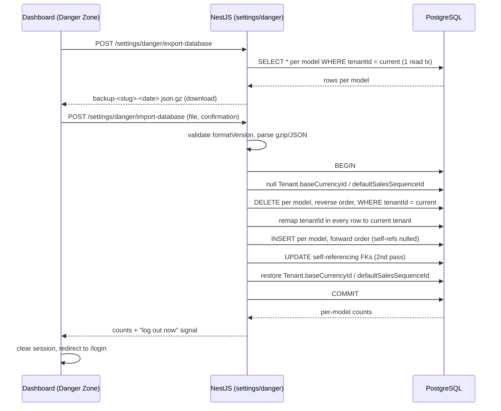

# Tenant Database Backup / Restore — Design

**Date:** 2026-09-24
**Author:** Claude Code
**Status:** Draft
**Scope:** New "Danger Zone" feature — full tenant data export/import (backend `identity/settings` domain + dashboard `settings` module)
**Primary goal:** Let a tenant admin export their entire tenant's data as one JSON backup, and restore it — either back into the same tenant (disaster recovery) or into a different tenant (environment migration).

---

## Context

- Existing precedent for destructive, tenant-scoped bulk operations: `apps/api/src/modules/identity/settings/services/data-reset.service.ts` + `apps/api/src/modules/identity/settings/controllers/data-reset.controller.ts` — phrase-confirmed, `danger.reset`-gated, single Prisma transaction, deletion counts returned.
- Existing dashboard pattern: `apps/dashboard/modules/settings/components/danger-zone.tsx` + `danger-zone-card.tsx` — permission-gated section, confirm-phrase dialog per destructive action.
- Existing (unrelated) precedent for the words "import/export": `createCrudImportExportController` (`packages/backend-core`) powers per-entity Excel import/export (see `units-import-export.controller.ts`). That pattern is scoped to one entity's rows and is not reused here — this feature spans ~47 Prisma models in one atomic operation, so it gets its own service pair rather than being shoehorned into the CRUD import/export factory.
- Permission catalog: `packages/api-contracts/src/permissions/permission-catalog.ts` — `danger: ['reset']`, enforced by `apps/api/src/modules/identity/auth/permissions/enforcement-coverage.spec.ts` (`ALL_PERMISSIONS` must list every `@RequirePermission` code used).
- Domain rule (`.ai/rules/domain.md`): financial documents/ledger rows must never bypass posting logic when *creating new* GL effects. This feature is exempt from that constraint in the sense described in "Restore does not re-post" below — it replays a previously-valid snapshot, it does not synthesize new postings.

---

## Requirements

### Functional

- [ ] Admin can export the current tenant's entire dataset as a single downloadable JSON file.
- [ ] Admin can upload a previously-exported JSON file to restore a tenant — either the same tenant (disaster recovery) or a different tenant (migration).
- [ ] Restore always wipes the target tenant's existing data first, then loads the backup (no partial/merge restore).
- [ ] Restore works uniformly regardless of whether the backup's tenant ID matches the current tenant (see "Tenant ID remap").
- [ ] Both operations are gated by dedicated permissions and (for import) a typed confirmation phrase, matching the existing danger-zone UX.

### Non-functional

- [ ] Tenant isolation preserved: export only ever reads rows scoped to the caller's `tenantId`; import only ever writes rows scoped to the caller's `tenantId`.
- [ ] i18n: en, ar, tr for all new dashboard strings.
- [ ] RTL-safe UI (logical CSS) — reuses `DangerZoneCard`, already compliant.
- [ ] OpenAPI/Swagger completeness for the two new routes.
- [ ] `apps/api/src/modules/identity/auth/permissions/enforcement-coverage.spec.ts` continues to pass (new permission codes catalogued).

### Backend payload / API

- `POST /settings/danger/export-database` — no request body. Response: `application/gzip` file download, `Content-Disposition: attachment; filename="backup-<tenant-slug>-<yyyyMMdd-HHmm>.json.gz"`.
- `POST /settings/danger/import-database` — `multipart/form-data` with fields `file` (the `.json.gz` backup) and `confirmation` (must equal `"IMPORT DATABASE"` exactly, same pattern as `ResetFinanceDto`/`ResetInventoryDto`). Response: JSON with per-model delete/insert counts.

---

## UX requirements

- Two new `DangerZoneCard`s appended to `apps/dashboard/modules/settings/components/danger-zone.tsx`:
  - **Export Database** — no confirmation phrase (non-destructive to the source tenant); triggers a browser file download.
  - **Import Database** — file picker + confirmation phrase (`"IMPORT DATABASE"`), and an explicit warning line: *"This replaces ALL data in this tenant and will log you out — you'll need to sign back in with an account from the restored backup."*
- Both cards hidden unless `can("danger.export")` / `can("danger.import")` respectively (mirrors the existing `can("danger.reset")` gate).
- On successful import, the frontend clears the auth session and redirects to `/login` (the JWT's `sub` may no longer resolve to an existing `AppUser` row).

---

## Proposed approach

### Option A (recommended): explicit ordered model list, raw transaction, no facade re-posting

A new `database-backup-models.ts` file declares, for every tenant-scoped Prisma model, `{ model, tenantScope: 'direct' | 'via-parent', selfReferencing?: 'fieldName' }` in a hand-maintained array — load order is the array order; wipe order is the reverse. `DatabaseExportService` reads each model `WHERE tenantId = current` (or via its parent, for the two polymorphic-adjacent-but-still-tenantId-bearing models, which is actually all of them here — every model in this ERP carries its own `tenantId` column per `.ai/rules/database.md`, so "via-parent" scoping doesn't actually arise; simplifies to always `WHERE tenantId = current`). `DatabaseImportService` does the remap → wipe → load sequence described below, in one Prisma interactive transaction with an extended timeout.

**Why this option:** matches the existing `DataResetService` style exactly (explicit, reviewable, no hidden magic), and the "explicit ordered list" choice was already confirmed over DMMF-reflection for exactly this reason — one line per model, impossible to silently miss one, easy to extend when a new model is added later (the enforcement-coverage-style pinning test described in Verification will catch a forgotten model).

### Option B (rejected): reflect over Prisma DMMF at runtime

Auto-discovers tenant-scoped models and topologically sorts from relation metadata. Rejected per the earlier decision: harder to review, and topological sort from relation metadata alone mishandles self-referencing FKs and the two Tenant-level cross-references (`Tenant.baseCurrencyId`, `Tenant.defaultSalesSequenceId`) without special-casing anyway — so the "less code to maintain" benefit doesn't materialize for this schema.

---

## Data flow



---

## Model list, load order, and special handling

Full ordered list (47 models; wipe = exact reverse). Every model has its own `tenantId` column (per `.ai/rules/database.md`), so scoping is always `WHERE tenantId = current` directly — no indirect ("via-parent") scoping is actually needed despite Option A's initial phrasing above.

**Excluded entirely:** `Permission` (global catalog, no `tenantId` — never touched), `AuditLog` (history, not state), `OutboxEvent` (transient delivery queue). `Tenant` itself is never deleted/recreated — only two of its FK columns are touched (see below).

| # | Model | Depends on (within this list) | Notes |
|---|-------|-------------------------------|-------|
| 1 | Currency | — | Tenant.baseCurrencyId points here — see special handling |
| 2 | ChartOfAccount | self (`parentId`) | two-pass insert |
| 3 | Unit | — | |
| 4 | Brand | — | |
| 5 | ItemCategory | self (`parentId`) | two-pass insert |
| 6 | CatalogEntity | self (`parentId`) | two-pass insert |
| 7 | Warehouse | — | |
| 8 | FiscalPeriod | — | |
| 9 | DocumentSequence | — | Tenant.defaultSalesSequenceId points here — see special handling |
| 10 | CodeSequence | — | |
| 11 | TenantSetting | — | |
| 12 | CustomField | — | |
| 13 | Tag | — | |
| 14 | Role | — | |
| 15 | AppUser | — | see "session invalidation" note |
| 16 | SetupTask | — | |
| 17 | File | — | metadata only, no blob |
| 18 | FinancialSetting | ChartOfAccount | |
| 19 | Party | ChartOfAccount (optional) | |
| 20 | Cashbox | Currency | |
| 21 | BankAccount | Currency | |
| 22 | InvoiceType | — | |
| 23 | Item | ItemCategory, Unit, Brand | |
| 24 | WarehouseItem | Warehouse, Item | |
| 25 | ItemCatalogEntity | Item, CatalogEntity | |
| 26 | ItemRelation | Item (×2) | |
| 27 | UserRole | AppUser, Role | |
| 28 | RolePermission | Role (+ global Permission, untouched) | |
| 29 | AiChatSession | AppUser | |
| 30 | AiChatMessage | AiChatSession | |
| 31 | StockBalance | Warehouse, Item | |
| 32 | OpeningBalanceSession | FiscalPeriod | |
| 33 | Invoice | InvoiceType, Party, Warehouse (opt), FiscalPeriod, Currency | |
| 34 | Expense | Cashbox, Currency, FiscalPeriod | `journalEntryId` is a bare string, no Prisma FK — order-agnostic |
| 35 | Payment | Cashbox, Party (opt), Currency, FiscalPeriod | |
| 36 | StockCount | Warehouse, FiscalPeriod | |
| 37 | StockMovement | Warehouse, Item, FiscalPeriod | |
| 38 | JournalEntry | FiscalPeriod, self (`reversalOfId`) | two-pass insert |
| 39 | TagAssignment | Tag | polymorphic `entityId`, no Prisma FK to target |
| 40 | CustomFieldValue | CustomField | polymorphic `entityId`, no Prisma FK to target |
| 41 | InvoiceLine | Invoice, Item, Unit | |
| 42 | ExpenseItem | Expense, ChartOfAccount | |
| 43 | StockCountLine | StockCount, Item | |
| 44 | JournalLine | JournalEntry, ChartOfAccount, Party/Cashbox/BankAccount/Currency (all opt) | |
| 45 | OpeningBalanceSessionLine | OpeningBalanceSession, Party/Cashbox/BankAccount/ChartOfAccount/Currency (all opt) | |
| 46 | PaymentAllocation | Payment, Invoice | |
| 47 | ReconciliationRun | — | append-only history; included for completeness, order-independent |

### Special handling details

1. **Tenant's own cross-references.** `Tenant.baseCurrencyId` → `Currency.id` and `Tenant.defaultSalesSequenceId` → `DocumentSequence.id` are real FKs on the `Tenant` row, which is *not* wiped. Before deleting `Currency`/`DocumentSequence` rows, the import sets both columns to `null` (avoids an FK violation on delete); after the corresponding models are reloaded, they're restored from the export's `tenantFkSnapshot: { baseCurrencyId, defaultSalesSequenceId }` (captured separately from the big per-model dump, since `Tenant` itself isn't one of the 47 exported/wiped models). IDs are preserved verbatim across export/import (see point 3), so this snapshot's values remain valid after reload.
2. **Self-referencing models** (`ChartOfAccount.parentId`, `ItemCategory.parentId`, `CatalogEntity.parentId`, `JournalEntry.reversalOfId`): inserted with the self-FK forced to `null` in pass 1, then patched to their original value in a pass-2 bulk update once every row of that model exists. Avoids needing to topologically sort by hierarchy depth.
3. **IDs are preserved, only `tenantId` is remapped.** Every row keeps its original primary key (UUID) from the export. Only `tenantId` columns (and nothing else) are rewritten to the importing admin's current tenant. This makes same-tenant restore a no-op remap (ids already match) and cross-environment migration correct (all FKs between restored rows still resolve, since every row keeps its original id).
4. **Session invalidation.** Because `AppUser`/`Role`/`UserRole` are wiped and reloaded, the importing admin's own current session's user row is replaced. This is expected: after import, the frontend clears the session and forces re-login with an account from the restored backup.
5. **`formatVersion`.** A hand-bumped integer constant, incremented whenever the model list or a model's shape changes. Import rejects (400) any file whose `formatVersion` doesn't exactly match the current constant, rather than attempting a best-effort partial load.
6. **Restore does not re-post.** `JournalEntry`/`JournalLine`/`StockMovement` rows are inserted as raw rows, not routed through `AccountingPostingFacade`/`InventoryMovementFacade`. This is safe specifically because restore recreates a snapshot that already satisfied every invariant (balanced debits/credits, valid account types, etc.) at export time — it does not synthesize a new transaction. `.ai/rules/domain.md`'s posting-logic requirement applies to code paths that *create* new ledger effects; this one replays existing ones byte-for-byte.

---

## File map

### Create

| Path | Purpose |
|------|---------|
| `apps/api/src/modules/identity/settings/services/database-backup-models.ts` | The ordered `{ model, selfReferencing? }[]` list (single source of truth for wipe/load order) |
| `apps/api/src/modules/identity/settings/services/database-export.service.ts` | Reads every model for the current tenant, assembles the JSON payload, gzips it |
| `apps/api/src/modules/identity/settings/services/database-import.service.ts` | Validates `formatVersion`, remaps `tenantId`, wipes, loads, handles self-refs + Tenant FK snapshot |
| `apps/api/src/modules/identity/settings/controllers/database-backup.controller.ts` | `POST export-database` (file stream response), `POST import-database` (multipart upload) |
| `apps/api/src/modules/identity/settings/dto/database-backup.dto.ts` | `ImportDatabaseDto` (confirmation phrase), `DatabaseBackupResultDto` (per-model counts) |
| `apps/api/src/modules/identity/settings/services/__tests__/database-backup.roundtrip.spec.ts` | Export → import round-trip integration test (see Verification) |

### Modify

| Path | Change |
|------|--------|
| `packages/api-contracts/src/permissions/permission-catalog.ts` | `danger: ['reset']` → `danger: ['reset', 'export', 'import']` |
| `apps/api/src/modules/identity/settings/settings.module.ts` | Register new controller + services |
| `apps/dashboard/modules/settings/components/danger-zone.tsx` | Add Export/Import `DangerZoneCard`s, `can("danger.export")`/`can("danger.import")` gates, post-import logout |
| `packages/api-client/src/clients/tenants.client.ts` (or wherever `resetFinance`/`resetInventory` live) | Add `exportDatabase()` / `importDatabase(file, confirmation)` methods |
| `apps/dashboard/messages/{en,ar,tr}.json` | New `business.settings.danger.exportDatabase.*` / `importDatabase.*` keys, incl. the logout warning copy |

### Delete

None.

---

## Layer details

### 1. Database

No schema changes. Purely a new read/write pattern over the existing schema.

### 2. API contracts

- `permission-catalog.ts`: extend `danger` resource with `export`, `import`.
- No new DTOs needed in `api-contracts` itself (the import/export DTOs are API-internal request/response shapes, following the same pattern as `ResetFinanceDto`/`FinanceResetResultDto` which also live in `apps/api/.../dto/`, not in `api-contracts`).

### 3. NestJS API

- `DatabaseExportService.exportTenant(tenantId): Promise<Buffer>` — one read-only transaction, builds the JSON object per the model list, `JSON.stringify` + gzip.
- `DatabaseImportService.importTenant(tenantId, fileBuffer): Promise<DatabaseBackupResultDto>` — gunzip + parse + validate `formatVersion`, then the remap → wipe → load sequence in one `prisma.$transaction(async (tx) => ...)` with `timeout`/`maxWait` raised (large payload).
- Controller mirrors `DataResetController`'s guard/decorator stack; export uses `@Header('Content-Type', 'application/gzip')` + manual `res.send(buffer)`, import uses `@UseInterceptors(FileInterceptor('file'))`.
- New permissions `danger.export` (read-only, but still Owner-gated since a full data dump is sensitive) and `danger.import` (destructive).

### 4. API client

- Two new methods alongside the existing `resetFinance`/`resetInventory` on whichever client currently hosts those (confirm exact file when implementing — likely `TenantsClient` given `api.tenants.resetFinance(...)` is the call site in `danger-zone.tsx`).

### 5. Dashboard

- `danger-zone.tsx`: two more `DangerZoneCard`s. Export card's `onConfirm` triggers a blob download (`URL.createObjectURL`) instead of a JSON toast-only result. Import card's `onConfirm` uploads the selected file + phrase, then on success clears the session and navigates to `/login`.

---

## Verification

```bash
pnpm turbo run build --filter=@devloggers/api
pnpm turbo run build --filter=@devloggers/dashboard
pnpm --filter @devloggers/api test -- database-backup
pnpm generate:dev   # new routes — API must be running
```

### Automated round-trip test (required, not optional)

A dedicated integration test seeds a tenant with at least one row in every one of the 47 models (reusing existing test factories where they exist), exports it, imports it back into a *different* freshly-created tenant, and asserts:
- Every model's row count matches source vs. destination.
- Spot-checked FKs resolve correctly post-remap (e.g. a `JournalLine.accountId` still points to the correct restored `ChartOfAccount` row; a restored `ChartOfAccount.parentId` still points to its correct restored parent).
- `Tenant.baseCurrencyId` / `defaultSalesSequenceId` on the *destination* tenant point to the freshly-restored `Currency`/`DocumentSequence` rows.

A second, cheap unit test guards against silently forgetting a model in the future: it reads Prisma's DMMF (`Prisma.dmmf.datamodel.models`), filters to models with a `tenantId` field, subtracts the explicitly-excluded set (`Permission`, `AuditLog`, `OutboxEvent`, `Tenant`), and asserts the resulting name set is identical to `DATABASE_BACKUP_MODELS.map(m => m.model)`. This is the same "discovers all X" pinning style as `enforcement-coverage.spec.ts`'s controller-discovery test — it doesn't drive the actual export/import logic (Option A's explicit list still does that), it only fails loudly if a new tenant-scoped model is added to the schema without a matching entry in `database-backup-models.ts`.

### Manual smoke test

- [ ] Export current dev tenant, inspect the gzip/JSON structure.
- [ ] Import the same file back into the same tenant (disaster-recovery path) — verify data is byte-identical after restore.
- [ ] Create a second, empty tenant; import the first tenant's backup into it — verify all data appears correctly scoped to the *new* tenant's id, and that logging in as a restored user works.
- [ ] Confirm phrase mismatch on import is rejected with a clear error.
- [ ] i18n renders in ar (RTL) and en for both new Danger Zone cards.

---

## Out of scope

- Streaming/chunked export or import for very large tenants — the whole payload is held in memory. Flagged as a future improvement if a real tenant's dataset gets large enough to matter.
- Selective/partial restore (e.g. "only inventory") — always all-or-nothing.
- Portable file *attachments* — only `File` table metadata is included; actual bytes stay wherever storage already has them, so cross-environment migration leaves attachment links broken until a separate file-migration step runs.
- Scheduled/automatic backups — this is an on-demand admin action only.

---

## Open questions

None outstanding — all decisions above were confirmed during brainstorming.

---

## Approval

- [x] Design reviewed by: user (conversational approval, 2026-09-24)
- [ ] Approved on written spec: pending user review of this file
