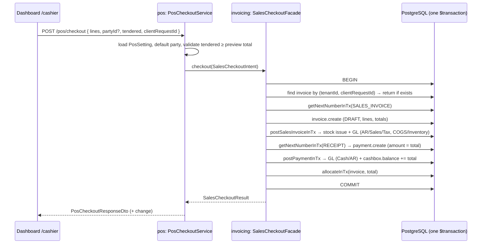

# POS Checkout (v1) — Design

**Date:** 2026-09-24
**Author:** Mohammad Khyata + Claude
**Status:** Approved (design) — pending spec review
**Scope:** DB → api-contracts → API (`pos` domain + invoicing `SalesCheckoutFacade`) → api-client → Dashboard `/cashier`
**Primary goal:** Let a cashier ring up a cash sale in one atomic operation that produces a POSTED sales invoice, the stock issue, the GL entries, and an allocated cash receipt — without coupling a new `pos` domain to invoicing internals.

---

## Context

- `/cashier` exists as a **mock**: `apps/dashboard/app/[locale]/(authenticated)/cashier/page.tsx` — ~330-line client component, hard-coded products, inline Arabic strings, `handleCheckout` only toggles a success flag. Nav entry at `apps/dashboard/config/navGroups.tsx:45` (no permission).
- A POS sale = sales invoice + stock issue + cash receipt. All three exist:
  - `InvoicePostingService.postSalesInvoice` (`apps/api/src/modules/invoicing/invoices/invoice-posting.service.ts:101`) — stock via `InventoryMovementFacade`, GL via `AccountingPostingFacade`, in its own `$transaction`.
  - `PaymentsService.createAs / post / allocate` (`apps/api/src/modules/invoicing/payments/payments.service.ts:47,79,179`) — each opens its own `$transaction`.
- **Gap 1 — not atomic.** `InvoicesService.create({ complete, openingPayment })` is best-effort (`invoices.service.ts:124-235`): invoice commits first, payment failure is only logged. Violates `.ai/rules/domain.md` §4 at a till.
- **Gap 2 — numbering race.** `DocumentSequencesRepository.getNextNumber` reads `nextNumber` then increments in a separate statement, outside any transaction (`document-sequences.repository.ts:22-38`). Concurrent tills can collide on `@@unique([tenantId, number])`; rolled-back sales burn numbers.
- `Invoice.partyId` is required; there is no walk-in customer.
- `Payment.cashboxId` is required; payments cannot target bank accounts today.
- `Item.barcode` and `Item.defaultSellingPrice` exist (`item.prisma:12,16`).
- `SaleIssuePolicy` throws "Insufficient stock" inside the posting transaction (`sale-issue.policy.ts:23`).
- Intent-based facade precedent: `AccountingPostingFacade.record(tx, intent)`, `InventoryMovementFacade.apply(tx, intent)`.
- Domain graph + manifest: `.ai/rules/api.md` (Domain boundaries), `apps/api/src/domain/manifest.ts`.

---

## Requirements

### Functional

- [ ] Cashier searches items (name / code) or scans a barcode; exact barcode match + Enter adds the item to the cart.
- [ ] Cart lines: quantity, unit price (defaults to `defaultSellingPrice`), per-line **discount percent**.
- [ ] Customer defaults to the tenant's **Walk-in Customer**; cashier may pick a named customer.
- [ ] Payment: **cash only, single tender**. Cashier enters amount tendered; change is displayed. `tendered < total` is rejected.
- [ ] Checkout is **atomic**: POSTED sales invoice + stock issue + GL + POSTED receipt for `total` + allocation, or nothing.
- [ ] Checkout is **idempotent** per cart (`clientRequestId`); double-click / retry never double-records a sale.
- [ ] Success shows a receipt dialog (invoice number, receipt number, total, tendered, change) with Print and New sale.
- [ ] Admin can provision POS (idempotent) and change the till cashbox / warehouse.

### Non-functional

- [ ] Tenant isolation on every query/mutation.
- [ ] Zero-trust: server resolves date, fiscal period, currency, cashbox, warehouse, invoice type; client never sends financial routing fields.
- [ ] `pos` is an **optional** domain; invoicing never imports `pos`.
- [ ] i18n: en, ar, tr, ar-SY under `business.pos.*`; RTL-safe logical CSS; tenant base currency formatting (no hard-coded ل.س).
- [ ] Complete Swagger decorators on all new DTOs; `pnpm generate` run.
- [ ] Permissions: `pos.checkout`, `pos.manage`.

---

## Decisions (from brainstorming)

| # | Decision |
|---|----------|
| Scope | Checkout only (no shifts, returns, held carts, split tender, offline) |
| Storage | A POS sale **is** a normal SALE `Invoice` under a dedicated `POS` invoice type + an allocated `Payment`. No `PosSale` table. |
| Customer | System **Walk-in Customer** party per tenant, referenced from `PosSetting` |
| Tender | Cash only, one payment = `total` (change never hits the books) |
| Atomicity | **Approach 1** — `SalesCheckoutFacade` in invoicing, exported via barrel, runs everything in one `$transaction` |
| Invoice discount | **Dropped for v1** — per-line percent only |
| Numbering | Fix race + gaps with an in-transaction atomic increment |

### Rejected approaches

- **POS calls `InvoicesService.create({ complete, openingPayment })`** — not atomic; widens invoicing's public surface.
- **Ambient transaction (CLS / AsyncLocalStorage unit-of-work)** — new cross-cutting infrastructure, hidden coupling; ADR-worthy on its own.
- **`PosSale` document** (with or without its own GL posting) — second document to keep in sync or duplicated posting logic.

---

## Architecture

### Domain graph

```
pos ─┬─► invoicing  (SalesCheckoutFacade, SalesCheckoutIntent, SalesCheckoutResult; InvoiceTypesService)
     └─► parties    (PartiesService — new barrel)
```

- `pos` does **not** import `catalog` or `inventory`. Item search and stock hints are read by the dashboard from existing endpoints (`GET /items`, stock balances).
- `parties` gets its first barrel `apps/api/src/modules/parties/index.ts` exporting `PartiesModule`, `PartiesService` (per `api.md`: add `index.ts` before another domain depends on it).

### Atomic checkout flow



Any throw (insufficient stock, closed/no open fiscal period, missing sequence, `tendered < total`) rolls back everything; no number is consumed.

---

## File map

### Create

| Path | Purpose |
|------|---------|
| `packages/db-prisma/src/schema/pos-setting.prisma` | `PosSetting` model |
| `packages/db-prisma/src/schema/migrations/<ts>_pos_checkout/` | `pos_settings` table; `invoices.client_request_id` + unique index |
| `apps/api/src/modules/invoicing/checkout/sales-checkout.facade.ts` | `SalesCheckoutFacade` |
| `apps/api/src/modules/invoicing/checkout/sales-checkout.intent.ts` | `SalesCheckoutIntent`, `SalesCheckoutResult` types |
| `apps/api/src/modules/invoicing/checkout/sales-checkout.module.ts` | wires facade (imports invoice posting + payments) |
| `apps/api/src/modules/invoicing/checkout/sales-checkout.facade.spec.ts` | atomicity / idempotency / failure specs |
| `apps/api/src/modules/parties/index.ts` | parties barrel |
| `apps/api/src/modules/pos/pos.module.ts` | domain module |
| `apps/api/src/modules/pos/index.ts` | barrel (`PosModule`) |
| `apps/api/src/modules/pos/checkout/{controllers,services,dto,presenters}/` | `POST /pos/checkout` |
| `apps/api/src/modules/pos/settings/{controllers,services,repositories,dto,presenters}/` | `GET/PATCH /pos/settings`, `POST /pos/settings/provision` |
| `apps/api/src/modules/pos/**/*.spec.ts` | service specs |
| `packages/api-contracts/src/resources/pos.resource.ts` | `defineResource({ key: 'pos', … })` |
| `packages/api-client/src/clients/pos.client.ts` | `PosClient` (custom, non-CRUD) |
| `apps/dashboard/modules/pos/` | module (see Dashboard) |

### Modify

| Path | Change |
|------|--------|
| `packages/db-prisma/src/schema/invoice.prisma` | `clientRequestId String? @map("client_request_id")`, `@@unique([tenantId, clientRequestId])` |
| `apps/api/src/modules/accounting/document-sequences/repositories/document-sequences.repository.ts` | add `getNextNumberInTx(tx, tenantId, documentType)` (atomic increment) |
| `apps/api/src/modules/accounting/document-sequences/services/document-sequences.service.ts` + barrel | expose `getNextNumberInTx` |
| `apps/api/src/modules/invoicing/invoices/invoice-posting.service.ts` | split `postSalesInvoice` → validate + `$transaction(tx => postSalesInvoiceInTx(tx, …))` |
| `apps/api/src/modules/invoicing/payments/payments.service.ts` | split `post`, `allocate` → `postInTx`, `allocateInTx` cores |
| `apps/api/src/modules/invoicing/index.ts` | export `SalesCheckoutModule`, `SalesCheckoutFacade`, intent/result types |
| `apps/api/src/domain/manifest.ts` | new `pos` entry; `DomainKey` union; `invoicing.provides`, `parties.provides` |
| `apps/api/src/domain/domain-modules.ts` | register `PosModule` |
| `apps/api/eslint/domain-boundaries.mjs` | `pos` restrictions; `parties` public entry |
| `apps/api/scripts/check-architecture-rules.mjs` | probes: `pos → invoicing` barrel OK, deep import rejected, `invoicing → pos` rejected |
| `.ai/rules/api.md` | domain table + dependency graph |
| permission seed / registry | `pos.checkout`, `pos.manage` |
| `packages/api-contracts/src/resources/index.ts` | register `pos` |
| `packages/api-client/src/clients/index.ts`, `src/api.ts` | register `PosClient` |
| `apps/dashboard/app/[locale]/(authenticated)/cashier/page.tsx` | replace mock with thin `export default () => <PosPage />` |
| `apps/dashboard/config/navGroups.tsx` | `permission: "pos.checkout"` on cashier item |
| `packages/i18n/src/{en,ar,tr,ar-SY}/business.json` | `business.pos.*` |

---

## Layer details

### 1. Database

```prisma
model PosSetting {
    id             String   @id @default(uuid())
    tenantId       String   @unique @map("tenant_id")
    defaultPartyId String   @map("default_party_id")
    invoiceTypeId  String   @map("invoice_type_id")
    cashboxId      String   @map("cashbox_id")
    warehouseId    String   @map("warehouse_id")
    createdAt      DateTime @default(now()) @map("created_at")
    updatedAt      DateTime @updatedAt @map("updated_at")

    tenant       Tenant      @relation(fields: [tenantId], references: [id], onDelete: Cascade)
    defaultParty Party       @relation(fields: [defaultPartyId], references: [id], onDelete: Restrict)
    invoiceType  InvoiceType @relation(fields: [invoiceTypeId], references: [id], onDelete: Restrict)
    cashbox      Cashbox     @relation(fields: [cashboxId], references: [id], onDelete: Restrict)
    warehouse    Warehouse   @relation(fields: [warehouseId], references: [id], onDelete: Restrict)

    @@map("pos_settings")
}
```

- Back-relations added on `Tenant`, `Party`, `InvoiceType`, `Cashbox`, `Warehouse` (Prisma requirement only; no behavior change).
- `Restrict` prevents deleting the walk-in party or till cashbox while configured (their hard-delete policy would otherwise allow it before any ledger rows exist).
- `Invoice.clientRequestId` — nullable, generic (not POS-specific), unique per tenant. Existing rows stay `NULL` (Postgres allows multiple NULLs in a unique index).

### 2. API contracts / DTOs

`CreatePosCheckoutDto` (request DTOs use `!`, never initializers — see `backend-resource-module` skill):

| Field | Type | Validation / Swagger |
|---|---|---|
| `partyId` | `string \| null` optional | `@ApiPropertyOptional({ type: 'string', nullable: true })`, `@IsOptional() @IsUUID()` |
| `lines` | `PosCheckoutLineDto[]` | `@ApiProperty({ type: () => PosCheckoutLineDto, isArray: true })`, `@ArrayMinSize(1) @ValidateNested({ each: true }) @Type(...)` |
| `tendered` | `number` | `@ApiProperty({ type: 'number' })`, `@IsNumber() @Min(0)` |
| `clientRequestId` | `string` | `@ApiProperty({ type: 'string' })`, `@IsUUID()` |
| `notes` | `string \| null` optional | `@ApiPropertyOptional({ type: 'string', nullable: true })` |

`PosCheckoutLineDto`: `itemId!` (UUID), `unitId!` (UUID), `quantity!` (`> 0`), `unitPrice!` (`≥ 0`), `discountPercent?` (`0–100`).

`PosCheckoutResponseDto`: `invoiceId`, `invoiceNumber`, `paymentId`, `paymentNumber`, `total`, `tendered`, `change`, `date` (ISO), `replayed` (boolean — true when returned via idempotency).

`PosSettingResponseDto`: ids + display names of party, invoice type, cashbox, warehouse. `UpdatePosSettingDto`: optional `cashboxId`, `warehouseId`.

Resource: `defineResource({ key: 'pos', routes: { checkout: '/pos/checkout', settings: '/pos/settings', provision: '/pos/settings/provision' } })`.

### 3. NestJS API

#### Invoicing — `SalesCheckoutFacade` (public port)

```ts
interface SalesCheckoutIntent {
  tenantId: string; userId: string;
  clientRequestId: string;
  invoiceTypeId: string; partyId: string;
  warehouseId: string; cashboxId: string;
  lines: { itemId; unitId; quantity; unitPrice; discountPercent? }[];
  notes?: string | null;
  /** When set, checkout fails (400, no writes) if the computed total exceeds it. */
  minimumTender?: number;
}
interface SalesCheckoutResult {
  invoiceId; invoiceNumber; paymentId; paymentNumber; total: number; date: Date; replayed: boolean;
}
```

Inside one `prisma.$transaction(async tx => …)`:

1. Idempotency lookup `tx.invoice.findUnique({ tenantId_clientRequestId })` → if found, load its allocated payment and return `replayed: true`.
2. Validate invoice type is SALE; resolve the **OPEN** fiscal period containing `now` (400 if none); currency = tenant base currency, `exchangeRate = 1`.
3. `getNextNumberInTx(tx, tenantId, 'SALES_INVOICE')`.
4. `computeInvoiceTotals(tenantId, lines)` → if `minimumTender` is set and `< total` → 400 (nothing written yet) → `tx.invoice.create({ status: DRAFT, clientRequestId, … })`.
5. `invoicePosting.postSalesInvoiceInTx(tx, …)`.
6. `getNextNumberInTx(tx, tenantId, 'RECEIPT')` → `tx.payment.create({ type: RECEIPT, amount: total, unallocatedAmount: total, … })`.
7. `payments.postInTx(tx, …)`.
8. `payments.allocateInTx(tx, { paymentId, invoiceId, amount: total })`.

A unique-violation on `clientRequestId` from a concurrent duplicate request (P2002) is caught outside the transaction and answered by re-reading the committed sale (`replayed: true`).

**`InTx` refactor rule:** each of `postSalesInvoice`, `PaymentsService.post`, `PaymentsService.allocate` becomes `load + validate → this.prisma.$transaction(tx => this.xInTx(tx, loaded, …))`. The `InTx` cores contain exactly the writes currently inside the transaction callbacks. Public signatures and behavior unchanged. `InTx` methods are public on the service class but **not** exported from the barrel — only the facade is.

**`getNextNumberInTx`:** `const seq = await tx.documentSequence.update({ where: { tenantId_documentType }, data: { nextNumber: { increment: 1 } } })`; number = `seq.nextNumber - 1` padded. Throws 404 if the sequence is missing (P2025 → NotFoundException). The row lock serializes concurrent tills; rollback restores the counter. Existing `getNextNumber` is left as-is (out of scope to migrate other callers).

#### `pos` domain

- `PosCheckoutService.checkout(tenantId, userId, dto)`:
  - load `PosSetting` → 400 `POS is not set up` if missing;
  - `partyId = dto.partyId ?? setting.defaultPartyId`;
  - call the facade with `minimumTender = dto.tendered`; `change = dto.tendered - result.total`.
  - **Tender rule:** POS does not compute totals itself (no duplicated money math). The facade throws 400 `Tendered amount is less than the total` right after computing totals (step 4 below), before any write, so the check uses the exact server total and sits inside the transaction.
- `PosSettingsService`: `get`, `update` (validates cashbox/warehouse belong to tenant and are active), `provision` (idempotent):
  - Walk-in party: find by setting, else create via `PartiesService` (`name: { ar: 'زبون نقدي', en: 'Walk-in Customer' }`, type `CUSTOMER`).
  - `POS` invoice type: find by `(tenantId, code 'POS')` via `InvoiceTypesService`, else create (`direction: SALE`, `affectsStock: true`, `name: { ar: 'مبيعات نقطة البيع', en: 'POS Sales' }`).
  - Cashbox / warehouse: first active (ordered by `createdAt`); 400 with a clear message if none exist.
  - Upsert `PosSetting`.
- Controllers: `@UseGuards(JwtAuthGuard)`, `@ApiTags('POS / Checkout')`, `@ApiTags('POS / Settings')`. `POST /pos/checkout` → `@RequirePermission('pos.checkout')`; settings routes → `pos.manage` (GET settings also allowed with `pos.checkout` so the screen can load).
- Error mapping: insufficient stock / closed period → existing exceptions propagate (400/409 as today); all roll back.

#### Manifest

```ts
{ key: 'pos', dependsOn: ['invoicing', 'parties'], provides: [], routes: ['pos'], optional: true }
```
`invoicing.provides += ['SalesCheckoutFacade', 'SalesCheckoutModule']`, `parties.provides = ['PartiesModule', 'PartiesService']`.

### 4. API client

```ts
export class PosClient {
  constructor(private readonly apiClient: ApiClient) {}
  checkout = (body: ApiRequestBody<typeof posResource.routes.checkout, 'post'>) => this.apiClient.post(posResource.routes.checkout, body)
  getSettings = () => this.apiClient.get(posResource.routes.settings)
  updateSettings = (body: ApiRequestBody<typeof posResource.routes.settings, 'patch'>) => this.apiClient.patch(posResource.routes.settings, body)
  provision = () => this.apiClient.post(posResource.routes.provision)
}
```
Registered as `pos: new PosClient(client)` in `createApi()`.

### 5. Dashboard

```
apps/dashboard/modules/pos/
├── pos.config.ts                    # PosCartLine type, computeCartTotals (pure, mirrors server rounding), no JSX
├── hooks/use-pos-cart.ts            # reducer: add (merge by itemId), setQty, setDiscountPercent, remove, clear
├── hooks/use-pos-checkout.ts        # useMutation → api.pos.checkout; clientRequestId per cart, reset on success
├── hooks/use-pos-settings.ts        # query api.pos.getSettings; provision mutation
├── components/pos-page.tsx          # two-column layout (moved from mock)
├── components/pos-product-grid.tsx  # search + category chips + cards (price, stock hint)
├── components/pos-cart-panel.tsx    # lines, totals, tendered input, change, Pay button
├── components/pos-customer-picker.tsx
├── components/pos-receipt-dialog.tsx# server numbers/total/change; Print (reuse invoice print layout), New sale
├── components/pos-setup-cta.tsx     # shown when settings missing; provision button (pos.manage)
└── index.ts
```

- Visual design is preserved from the mock (grid, cards, cart panel, logical CSS); invoice-level discount input removed; per-line discount becomes a percent.
- Product grid: `GET /items` with search (`name`, `code`, `barcode`) and `categoryId` from real categories; only active items. Stock hint from stock balances for `setting.warehouseId`.
- Barcode: Enter in search with exact `barcode` match → add to cart + clear search.
- Pay button disabled when cart empty, `tendered < previewTotal`, or mutation pending.
- On error: toast with server message; cart and `clientRequestId` are preserved (retry is safe).
- On success: receipt dialog uses **server** `total`/`change`; "New sale" clears cart and rotates `clientRequestId`.
- Money formatting via tenant base currency.
- i18n keys under `business.pos.*` in en / ar / tr / ar-SY.

---

## Voiding a sale (v1 — existing endpoints)

No new endpoint. Receipt/invoice screens link to the existing flow, in this order (enforced by `cancelInvoice`'s allocation guard, `invoice-posting.service.ts:187`):

1. `POST /payments/:id/allocations/:allocationId/remove`
2. `POST /payments/:id/cancel`
3. `POST /invoices/:id/cancel` (reverses JE + stock)

An atomic one-click void is a follow-up spec.

---

## Testing

**API (Jest, mocked-`tx` harness as in `invoice-posting.perpetual.spec.ts`):**

- `sales-checkout.facade.spec.ts`
  - happy path: exactly one `$transaction`; all writes on `tx`; order numbering → invoice create → stock issue → GL invoice intent → receipt create → GL payment intent → cashbox increment → allocation; payment amount = `total`.
  - idempotency: existing `clientRequestId` → returns prior sale with `replayed: true`, no writes.
  - `minimumTender > total` → 400, no writes.
  - `movements.apply` rejects (insufficient stock) → rethrown, no payment write.
  - no OPEN fiscal period for today → 400.
- `document-sequences.repository.spec.ts` — `getNextNumberInTx` issues a single atomic increment on `tx`; returns the pre-increment number padded; missing sequence → NotFound.
- Regression pins **unchanged and passing**: `invoice-posting.perpetual.spec.ts`, `invoices.service.spec.ts`, payment specs, `*.delete-guard.spec.ts`.
- `pos-checkout.service.spec.ts` — missing setting → 400; omitted `partyId` → walk-in; change computed from result total.
- `pos-settings.service.spec.ts` — provision twice → one party, one invoice type, one setting; no cashbox/warehouse → 400.
- `enforcement-coverage.spec.ts` — new routes carry `pos.*` permissions.

**Architecture:** `pnpm --filter @devloggers/api lint:architecture` passes; probes reject `pos` deep imports into invoicing/parties and any `invoicing → pos` import.

**Dashboard:** unit tests for `use-pos-cart` reducer and `computeCartTotals` (fixtures matching server rounding).

---

## Verification

```bash
pnpm --filter @devloggers/db-prisma db:migrate:dev
pnpm generate
pnpm --filter @devloggers/api-contracts build
pnpm --filter @devloggers/api-client build
pnpm --filter @devloggers/api test
pnpm --filter @devloggers/api lint:architecture
pnpm --filter @devloggers/dashboard test
pnpm turbo run lint typecheck build
```

### Manual smoke test

- [ ] `/cashier` with no settings shows setup CTA; provision succeeds; re-provision is a no-op.
- [ ] Sale to walk-in: invoice POSTED + fully paid; cashbox balance +total; stock −qty; JE balanced; receipt allocated.
- [ ] Sale to named customer: party statement shows invoice and receipt netting to zero.
- [ ] Over-stock line: error toast, cart intact, **no** invoice/payment rows, **no** sequence number consumed.
- [ ] Double-click Pay / retry after network error: exactly one sale.
- [ ] ar (RTL) and en render correctly; nav hidden without `pos.checkout`.
- [ ] `DISABLED_DOMAINS=pos`: API boots, invoicing specs pass, `/pos/*` returns 404.

---

## Out of scope

- Cashier shifts / till sessions (opening float, close-out, over/short).
- Card / bank tender, split tender (requires `Payment.bankAccountId`).
- Invoice-level discount (proration rounding spec).
- Returns / refunds, atomic one-click void.
- Held / parked carts, offline mode, dedicated receipt printers.
- Migrating other `getNextNumber` callers to `getNextNumberInTx`.
- Multi-currency POS sales.

---

## Open questions

- None — all resolved during brainstorming (see Decisions).

---

## Approval

- [x] Design reviewed by: Mohammad Khyata (section-by-section, 2026-09-24)
- [ ] Spec approved on: ___
