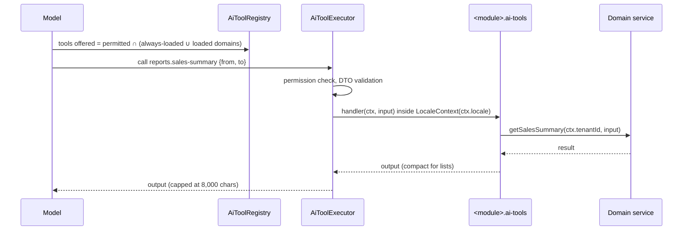

# AI Agent Tools, Phase 2 — Design

**Date:** 2026-09-26
**Author:** Claude (brainstorming session with Mohammad Khyata)
**Status:** Approved (2026-09-26)
**Scope:** API tool providers across catalog, parties, inventory, invoicing, accounting, reports → ai-agent registry → Dashboard chat labels
**Primary goal:** Let the AI agent manage master data and answer business questions (sales, profit, balances, open invoices) without any path to post, cancel or delete financial documents.

---

## Context

- Phase 1 spec: `docs/superpowers/specs/2026-09-24-ai-agent-runtime-design.md`. Sub-project #2 ("broad CRUD
  rollout") is this spec, widened with read-only financial lookups and reports. Sub-project #3 (financial
  actions) stays separate.
- Today the agent has 14 tools: `units.*`, `items.*`, `customers.*` (list/show/create/update) plus
  `tools.search` / `tools.load`.
- Tool providers: `@AiToolProvider()` classes inside each domain module, discovered by
  `apps/api/src/modules/ai-agent/tools/ai-tool-registry.ts`. Reference: `apps/api/src/modules/parties/parties.ai-tools.ts`.
- Builders in `packages/backend-core/src/ai-tools/`: `defineCrudAiTools`, `defineAiTool`, `dtoInput`, `withId`.
- Prerequisite, done 2026-09-26: `LocaleResolverService` is a singleton (`LocaleContext` + `localeMiddleware`)
  and the registry rejects request-scoped tool providers. Without it, every module whose presenter localizes
  names (currencies, warehouses, cashboxes, bank accounts, invoices, invoice types) could not expose tools.
- Domain rules: `.ai/rules/domain.md` (sub-ledger isolation, never delete posted documents), deletion table in
  `.ai/rules/api.md`.

## Decisions (from brainstorming)

| Topic | Decision |
|-------|----------|
| Round scope | A (master-data CRUD) + B (read-only financial lookups and reports). No financial actions. |
| Delete | Only for pure catalog data: brands, item-categories, tags. Everything else: no `delete` tool. |
| Structure | One `*.ai-tools.ts` per module, next to its service (Phase 1 pattern). No central catalog, no OpenAPI-generated tools. |
| Read helper | None. Read tools use `defineAiTool({ risk: 'read', input: dtoInput(Dto), handler })`. |
| Always-loaded domains | `ai-agent`, `catalog`, `parties`, **`reports`** (new). Others via `tools.load`. |
| Permissions | Reuse the HTTP permission key for each operation. No new keys. |

---

## Requirements

### Functional

- [ ] **Master data (A)** via `defineCrudAiTools`, ops list/show/create/update, plus delete where marked:

  | Domain | Prefix | Service | Permissions (view / create / update / delete) | Special rules |
  |---|---|---|---|---|
  | catalog | `brands` | `BrandsService` | `brands.*` | delete enabled |
  | catalog | `item-categories` | `ItemCategoriesService` | `itemCategories.*` | delete enabled |
  | catalog | `tags` | `TagsService` | `tags.*` | delete enabled |
  | parties | `suppliers` | `PartiesService` | `parties.view/create/update` | `listWhere` + `isInScope`: type ∈ {SUPPLIER, CUSTOMER_SUPPLIER}; `createDefaults.type = SUPPLIER`; omit `type`, `receivableAccountId`, `payableAccountId` |
  | inventory | `warehouses` | `WarehousesService` | `warehouses.view/create/update` | — |
  | invoicing | `cashboxes` | `CashboxesService` | `cashboxes.view/create/update` | — |
  | invoicing | `bank-accounts` | `BankAccountsService` | `bankAccounts.view/create/update` | — |
  | invoicing | `invoice-types` | `InvoiceTypesService` | `invoiceTypes.view/create/update` | — |
  | accounting | `currencies` | `CurrenciesService` | `currencies.view/create/update` | omit `isBase` (base-currency changes stay UI-only) |

- [ ] **Read-only (B)** via `defineAiTool`, `risk: 'read'`:

  | Domain | Tool | Backed by | Permission | Input |
  |---|---|---|---|---|
  | invoicing | `invoices.list` | `InvoicesService.findAll` | `invoices.view` | `direction?`, `status?`, `partyId?`, `page?`, `limit?` |
  | invoicing | `invoices.show` | `InvoicesService.findById` | `invoices.view` | `id` |
  | invoicing | `expenses.list` | `ExpensesService.findAll` | `expenses.view` | `status?`, `page?`, `limit?` |
  | invoicing | `expenses.show` | `ExpensesService.findById` | `expenses.view` | `id` |
  | invoicing | `payments.list` | `PaymentsService.list` | `payments.view` | `type?`, `status?`, `partyId?`, `page?`, `limit?` |
  | invoicing | `payments.show` | `PaymentsService.findById` | `payments.view` | `id` |
  | inventory | `stock.balances` | `InventoryService.getBalances` | `inventory.view` | `warehouseId?`, `itemId?` |
  | inventory | `stock.movements` | `StockLedgerService.findMovements` | `stockLedger.view` | `warehouseId?`, `itemId?`, `movementType?`, `page?`, `limit?` |
  | reports | `reports.sales-summary` | `ReportsService.getSalesSummary` | `reports.view` | `from?`, `to?`, `partyId?` |
  | reports | `reports.purchase-summary` | `ReportsService.getPurchaseSummary` | `reports.view` | `from?`, `to?`, `partyId?` |
  | reports | `reports.profit-summary` | `ReportsService.getProfitSummary` | `reports.view` | `from?`, `to?` |
  | reports | `reports.party-statement` | `ReportsService.getPartyStatement` | `reports.view` | `partyId` |
  | reports | `reports.dashboard-summary` | `ReportsService.getDashboardSummary` | `dashboard.view` | `from?`, `to?` |
  | reports | `reports.top-items` | `ReportsService.getDashboardTopItems` | `dashboard.view` | `from?`, `to?`, `limit?` |

  Stock tools use `domain: 'inventory'`, and the invoice/expense/payment tools use `domain: 'invoicing'`.
  Tool-name prefixes (`stock`, `reports`) are nouns, not domain keys; the registry checks only `domain`.

- [ ] **Input validation** (class-validator DTOs, colocated in each tool file):
  dates are `@IsISO8601()` strings; enums (`status`, `direction`, `type`, `movementType`) are `@IsIn(<Prisma enum values>)`,
  so the JSON schema lists them; ids are `@IsUUID()`; `page ≥ 1`, `1 ≤ limit ≤ 50`, default 20.
- [ ] **Compact list output:** `invoices.list`, `expenses.list` and `payments.list` map each row to
  `{ id, number, date, partyName, status, currency, total, paid?, remaining? }` (fields that exist on the entity)
  and return `{ items, total, page }`. `*.show` returns the full record. `invoices.*` go through the existing
  `InvoicePresenter` (localized names, `amountPaid` / `balanceDue` / `paidStatus`).
- [ ] **Compact report output:** `getSalesSummary` / `getPurchaseSummary` return every matching invoice and
  `getPartyStatement` returns every invoice and payment, which would overflow the output cap. Their tools return
  aggregates only: `{ count, totalSales | totalPurchases }` and `{ party: { id, name, code }, totalInvoiced, totalPaid,
  balance, invoiceCount, paymentCount }`. The model uses `invoices.list` / `payments.list` for rows.
  `reports.profit-summary` and `reports.dashboard-summary` return the service result unchanged; `reports.top-items`
  uses the service's own `limit` (max 20). `stock.balances` returns at most 50 rows plus `total`.
- [ ] **Paging DTO:** add `AiPageDto` (`page`, `limit`) to `packages/backend-core/src/ai-tools/ai-tool-dtos.ts` for read
  tools whose services do not support free-text search.
- [ ] **`CreateInvoiceTypeDto.direction`** changes from an initializer (`= PURCHASE`) to `direction!:`. With the
  initializer, a create call that omits `direction` silently becomes a purchase type — the hazard described in
  `backend-resource-module` ("Satisfying strictPropertyInitialization"). The model omitting a field is likely, so
  this is fixed with the tool.
- [ ] `ALWAYS_LOADED_DOMAINS` gains `'reports'`.
- [ ] System prompt (`runtime/system-prompt.ts`) adds guidance: resolve names to ids with a `*.list` call before
  id-taking tools; convert relative dates ("this month") to ISO dates from today's date; use `tools.search` /
  `tools.load` for invoicing, inventory and accounting.
- [ ] Dashboard chat labels: `business.aiAgent.resources.<prefix>` and `business.aiAgent.ops.<op>` keys for every
  new prefix and op (`delete`, `balances`, `movements`, `sales-summary`, `purchase-summary`, `profit-summary`,
  `party-statement`, `dashboard-summary`, `top-items`) in `packages/i18n/src/{en,ar,tr}/business.json`.

### Non-functional

- [ ] Tenant isolation: every handler uses `ctx.tenantId`; no tool input accepts a tenant id.
- [ ] No tool posts, cancels, allocates, reverses or deletes a financial document or ledger row.
- [ ] No new cross-domain imports; `lint:architecture` and `domain/manifest.ts` unchanged.
- [ ] Every tool provider's dependency tree is static (enforced by the registry at boot).
- [ ] Tool output stays under the executor's 8,000-character cap for default page sizes.

---

## Proposed approach

### Option A — per-module tool providers (chosen)

Each module gets `<module>.ai-tools.ts` (an `@AiToolProvider()` class injecting its own service) and one
`providers` entry in its module. `ai-agent` discovers them; it imports nothing from other domains.

**Why:** keeps the Phase 1 safety model (domain services with their business rules and 409 guards, per-tool
field hiding and scoping, explicit risk), keeps domain boundaries intact, and scales one module at a time.

### Option B — central catalog in `ai-agent` (rejected)

Adds `ai-agent` → seven domains import edges, which breaks `lint:architecture`, and couples every domain change to the AI module.

### Option C — tools generated from OpenAPI (rejected)

Cannot hide fields or scope a resource per tool, guesses risk from HTTP verbs (financial `POST`s look like plain
writes), and adds an internal HTTP hop plus re-authentication.

---

## Data flow



Write tools (`create`/`update`/`delete`) pause for user approval before the executor runs them (Phase 1 behaviour),
and non-read tools write an audit row with `source: 'AI_AGENT'`.

---

## File map

### Create

| Path | Purpose |
|------|---------|
| `apps/api/src/modules/catalog/brands/brands.ai-tools.ts` | `brands.*` incl. delete |
| `apps/api/src/modules/catalog/item-categories/item-categories.ai-tools.ts` | `item-categories.*` incl. delete |
| `apps/api/src/modules/catalog/tags/tags.ai-tools.ts` | `tags.*` incl. delete |
| `apps/api/src/modules/parties/suppliers.ai-tools.ts` | `suppliers.*` (scoped parties) |
| `apps/api/src/modules/inventory/warehouses/warehouses.ai-tools.ts` | `warehouses.*` |
| `apps/api/src/modules/inventory/inventory.ai-tools.ts` | `stock.balances` (provider in `InventoryModule`) |
| `apps/api/src/modules/inventory/stock-ledger/stock-ledger.ai-tools.ts` | `stock.movements` (provider in `StockLedgerModule`, which owns `StockLedgerService`) |
| `apps/api/src/modules/invoicing/cashboxes/cashboxes.ai-tools.ts` | `cashboxes.*` |
| `apps/api/src/modules/invoicing/bank-accounts/bank-accounts.ai-tools.ts` | `bank-accounts.*` |
| `apps/api/src/modules/invoicing/invoice-types/invoice-types.ai-tools.ts` | `invoice-types.*` |
| `apps/api/src/modules/invoicing/invoices/invoices.ai-tools.ts` | `invoices.list/show` |
| `apps/api/src/modules/invoicing/expenses/expenses.ai-tools.ts` | `expenses.list/show` |
| `apps/api/src/modules/invoicing/payments/payments.ai-tools.ts` | `payments.list/show` |
| `apps/api/src/modules/accounting/currencies/currencies.ai-tools.ts` | `currencies.*` (no `isBase`) |
| `apps/api/src/modules/reports/reports.ai-tools.ts` | `reports.*` |
| `*.ai-tools.spec.ts` next to each provider | Unit tests (see Verification) |
| `apps/api/src/modules/ai-agent/tools/ai-tool-registry.integration.spec.ts` | All providers register; permission keys exist |

### Modify

| Path | Change |
|------|--------|
| Each module file owning a provider above (`brands.module.ts`, …, `parties.module.ts`, `inventory.module.ts`, `stock-ledger.module.ts`, `reports.module.ts`) | Add provider |
| Controllers of brands, item-categories, tags, warehouses, cashboxes, bank-accounts, currencies | Move inline `filterSchema` into an exported `<X>_FILTER_SCHEMA` constant (no behaviour change) |
| `apps/api/src/modules/invoicing/invoice-types/controllers/invoice-types.controller.ts` | Add `INVOICE_TYPES_FILTER_SCHEMA` (`name` localized, `isActive`) — also fixes HTTP search on localized names |
| `apps/api/src/modules/invoicing/invoice-types/dto/invoice-type.dto.ts` | `direction!:` instead of a defaulted initializer |
| `packages/backend-core/src/ai-tools/ai-tool-dtos.ts` | Add `AiPageDto` |
| `apps/api/src/modules/ai-agent/tools/tool-names.ts` | `ALWAYS_LOADED_DOMAINS` += `'reports'` |
| `apps/api/src/modules/ai-agent/runtime/system-prompt.ts` | Guidance sentence (ids, dates, tool loading) |
| `packages/i18n/src/{en,ar,tr}/business.json` | `aiAgent.resources.*`, `aiAgent.ops.*` keys |

### Delete

None.

---

## Layer details

### 1. Database
No schema changes.

### 2. API contracts
No changes. Tools are not HTTP routes; OpenAPI and generated types are unaffected, except `invoice-types` gaining a
filter schema, which does not change its DTOs.

### 3. NestJS API
- Providers follow `parties.ai-tools.ts`. Master data passes `filterSchema` and `searchFields` matching the controller.
- `ops: ['list','show','create','update','delete']` plus `permissions.delete` only for brands, item-categories and tags.
  `defineCrudAiTools` marks delete tools `destructive`; the registry's `NEVER_DELETE_RESOURCES` still blocks
  ledger resources.
- Read tools map service results to the compact row shape inside the handler. No service changes.

### 4. API client
No changes.

### 5. Dashboard
Only i18n keys for chat labels. No component changes.

---

## Verification

```bash
pnpm --filter @devloggers/backend-core build
pnpm --filter @devloggers/api test
pnpm --filter @devloggers/api lint
pnpm --filter @devloggers/api lint:architecture
pnpm --filter @devloggers/api exec tsc --noEmit
pnpm turbo run build --filter=@devloggers/api
pnpm --filter @devloggers/dashboard lint     # i18n JSON only, but confirms nothing else broke
```

### Unit tests (per provider, mocked service)
- [ ] Tool names, `risk`, `permission`, `domain` as in the tables above.
- [ ] Hidden fields absent from the JSON schema (`isBase`; suppliers' `type`, `receivableAccountId`, `payableAccountId`).
- [ ] `suppliers.*`: list applies the type filter; show/update of a pure customer returns not-found; create forces `SUPPLIER`.
- [ ] `delete` exists only for brands, item-categories, tags.
- [ ] Read tools reject bad input (non-ISO date, unknown enum value, non-UUID id, `limit > 50`).
- [ ] `*.list` read tools return the compact row shape; the service receives `ctx.tenantId` even when the input contains a `tenantId` key.

### Registry integration test
- [ ] A testing module with all new providers boots; the registry registers every tool and passes the request-scope guard.
- [ ] Every tool's `permission` exists in `packages/api-contracts/src/permissions/permission-catalog.ts`.

### Live smoke test (local DB, as in the 2026-09-26 fix)
- [ ] Boot the app context; record the registered tool count.
- [ ] Execute `brands.list`, `suppliers.list`, `warehouses.list`, `cashboxes.list`, `currencies.list`, `invoices.list`,
  `stock.balances`, `reports.sales-summary`; all return `kind: 'output'`.
- [ ] Dashboard chat: "how much did we sell this month?" → `reports.sales-summary` without `tools.load`.
- [ ] Dashboard chat: "create a brand called Test" → approval card → brand created → audit row with `source = AI_AGENT`.
- [ ] Chat tool-call labels render in en, ar (RTL) and tr.

---

## Out of scope

- Posting, cancelling, allocating or reversing invoices, payments, expenses, journal entries (Phase 3, own spec).
- Delete for any non-catalog resource.
- Chart of accounts, fiscal periods, document sequences, journal entries, roles, users, custom fields, item relations, POS.
- RAG (Phase 4).
- Changing the base currency through the agent.

---

## Open questions

None — resolved in brainstorming.

---

## Approval

- [x] Design reviewed by: Mohammad Khyata (section by section, 2026-09-26)
- [x] Approved on: 2026-09-26
