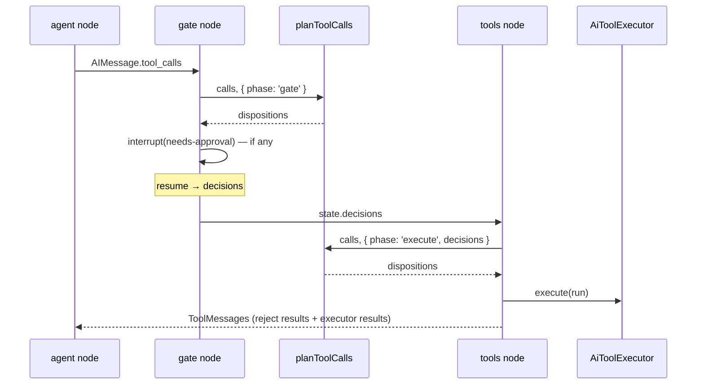

# AI Tool-Call Disposition — Design

**Date:** 2026-09-26  
**Author:** Claude (architecture review + grilling with Mohammad Khyata)  
**Status:** Implemented 2026-09-26 — `tool-call-disposition.spec.ts` deferred at the user's request (see Tests)  
**Scope:** API → `ai-agent` runtime → approval gate (`gate` / `tools` graph nodes)  
**Primary goal:** Give the rule "no write or destructive tool runs without an approval decision" one home and one test surface.

---

## Context

The **tool-call disposition** (see `CONTEXT.md`) — run it, hold it for an
**approval decision**, or reject it — is derived today inline in two graph nodes,
each re-looking up the tool and re-running `prepare()`:

- `apps/api/src/modules/ai-agent/runtime/agent-graph.ts`
  - `gate` node: skips id-less, unknown, `read` and invalid-input calls; the rest become `PendingApprovalCall`s → `interrupt()`.
  - `tools` node: re-derives unknown / denied / "approval missing" / run, then calls the executor.
- Neither node has a spec. Recent fixes in this area: `c06d538` (id-less tool calls),
  `74c9cdd` (approvals in mixed batches), `a489cbe` (resume hardening).
- Related specs: `2026-09-24-ai-agent-runtime-design.md`, `2026-09-26-ai-agent-tools-phase2-design.md`.
- Source: architecture review candidate 1 (`/improve-codebase-architecture`, 2026-09-26).

---

## Requirements

### Functional

- [ ] One module decides the disposition of every model tool call in a batch.
- [ ] **Behaviour-preserving**: every outcome, message text and ordering in the table below is identical to today.
- [ ] `gate` and `tools` nodes consume the module; they no longer call `registry.find` or `tool.prepare` themselves.
- [ ] Every row of the decision table is pinned by a test at the module's interface.

### Non-functional

- [ ] No change to HTTP API, DTOs, OpenAPI, persisted checkpoint state or UI stream.
- [ ] Tenant isolation / permissions unchanged — permission filtering stays inside `AiToolRegistry.find`.
- [ ] `lint:architecture` unaffected (module stays inside the `ai-agent` domain).

---

## Decision table (current behaviour, to be preserved)

Evaluated per call, in the model's order. Id-less calls are dropped in both phases
(no result, no `ToolMessage`).

| # | Tool found & permitted? | Risk | Approval decision | Input valid? | `gate` phase | `execute` phase |
|---|---|---|---|---|---|---|
| 1 | no | — | — | — | *(ignored)* | **reject** → error `Tool "<name>" is unknown or not permitted` |
| 2 | yes | `read` | — | any | *(ignored)* | **run** (executor reports invalid input) |
| 3 | yes | write/destructive | rejected | any | n/a | **reject** → denied, reason `decision.reason ?? 'no reason given'` |
| 4 | yes | write/destructive | approved | any | n/a | **run** |
| 5 | yes | write/destructive | none | no | *(ignored)* | **run** (executor reports `Invalid tool input` — nothing executes) |
| 6 | yes | write/destructive | none | yes | **needs-approval** | **reject** → denied, reason `approval missing` |

Row 6 is the **only** cell where the two phases differ — that is the whole
meaning of the phase argument. "*(ignored)*" = the module returns the same
disposition it would in `execute`; the `gate` node only acts on `needs-approval`.

---

## Proposed approach

### Option A (recommended) — batch module in `runtime/`

New file `apps/api/src/modules/ai-agent/runtime/tool-call-disposition.ts`:

```ts
import type { ToolCall } from '@langchain/core/messages';
import type { AiTool, AiToolContext, AiToolResult } from '@devloggers/backend-core';
import type { AiToolRegistry } from '../tools/ai-tool-registry';
import type { ApprovalDecision, PendingApprovalCall } from './agent-state';

export type ToolCallPhase =
    | { readonly phase: 'gate' }
    | { readonly phase: 'execute'; readonly decisions: Readonly<Record<string, ApprovalDecision>> };

export type ToolCallDisposition =
    | { kind: 'run'; toolCallId: string; name: string; tool: AiTool; args: Record<string, unknown> }
    | { kind: 'needs-approval'; toolCallId: string; pending: PendingApprovalCall }
    | { kind: 'reject'; toolCallId: string; name: string; result: AiToolResult };

/** One disposition per id-bearing call, in model order. */
export function planToolCalls(
    registry: Pick<AiToolRegistry, 'find'>,
    ctx: AiToolContext,
    calls: readonly ToolCall[],
    phase: ToolCallPhase,
): Promise<ToolCallDisposition[]>;
```

Interface facts a caller must know:

- Takes model tool names (`units__create`); returns registry names (`units.create`). The `fromModelToolName` translation moves inside.
- `run` carries the resolved `AiTool` and **raw** args — the executor still validates independently (defence in depth is kept).
- Calls `prepare()` only to tell row 5 from row 6; never executes anything.
- Pure with respect to the graph: no `interrupt()`, no messages, no state writes.

Graph nodes after the change:

- **`gate`**: `planToolCalls(..., { phase: 'gate' })` → keep `needs-approval` → `interrupt()` if any.
  Still side-effect free before `interrupt()` (LangGraph re-runs the node on resume).
- **`tools`**: `planToolCalls(..., { phase: 'execute', decisions: state.decisions })` →
  `reject` → `toolMessage(id, result)`; `run` → `executor.execute(...)` then the existing `tools.load` special case.

**Why this option** (grilling decisions Q1–Q13):

- Batch, not per-call: both nodes iterate the same array and both drop id-less calls — one place for that filter.
- Explicit phase discriminant instead of `decisions?: …` — no meaningful `undefined`; `decisions` exists only where it is legal.
- Plain function taking `Pick<AiToolRegistry, 'find'>` — no DI lifecycle; tests use a `Map`-backed fake.
- Lives in `runtime/` next to `agent-state.ts`: it encodes approval policy, which is agent-runtime concern, not tool-contract concern (`backend-core` stays domain-free).

### Option B (rejected) — also route executor and translator through the module

Would remove the executor's permission/validation re-check (weakens defence in
depth) and couple the display-only `risk` lookup in `ui-stream.translator.ts` to
approval policy without a locality gain.

---

## Data flow



---

## File map

### Create

| Path | Purpose |
|------|---------|
| `apps/api/src/modules/ai-agent/runtime/tool-call-disposition.ts` | `planToolCalls` + types |
| `apps/api/src/modules/ai-agent/runtime/tool-call-disposition.spec.ts` | Decision-table tests |

### Modify

| Path | Change |
|------|--------|
| `apps/api/src/modules/ai-agent/runtime/agent-graph.ts` | `gate` and `tools` nodes delegate to `planToolCalls`; drop their inline lookups / `prepare()` calls |
| `CONTEXT.md` | Added **Approval decision** and **Tool-call disposition** (done during grilling) |

### Delete

None.

---

## Tests (`tool-call-disposition.spec.ts`)

Fixture: a `Map`-backed `find(ctx, name)` returning fake `AiTool`s built with
`defineAiTool` + a tiny `AiToolInput` (valid iff `args.ok === true`), one per risk.

- [ ] Rows 1–6 × both phases, asserting `kind`, `name`, and the exact `AiToolResult` for rejects.
- [ ] Id-less calls produce no disposition (both phases).
- [ ] Output order equals input order for a mixed batch (read + write + unknown + id-less) — the `74c9cdd` scenario.
- [ ] Model names are translated: `units__create` → `units.create`.
- [ ] A rejected decision short-circuits before `prepare()` is called (row 3 with invalid input still yields denied).
- [ ] `needs-approval.pending` equals `{ toolCallId, name, risk, input: args }` exactly as the gate emits today.

No graph-level test in this change (needs the model seam — review candidate 4).

---

## Verification

```bash
pnpm --filter @devloggers/api test -- tool-call-disposition
pnpm --filter @devloggers/api test          # full suite still green
pnpm --filter @devloggers/api lint
pnpm --filter @devloggers/api lint:architecture
pnpm turbo run build --filter=@devloggers/api
```

### Manual smoke test

- [ ] Chat: ask for a read (e.g. list units) → runs without approval.
- [ ] Chat: ask to create a unit → approval card → approve → created.
- [ ] Same, reject → model told "Rejected by user".
- [ ] Send a new message while an approval is pending → superseded, conversation continues.

---

## Out of scope

- `tools.load` special case in the `tools` node (review candidate 5).
- `AiToolExecutor`, `AiToolRegistry`, `ui-stream.translator.ts` — unchanged.
- Turn protocol extraction from `ChatService` (candidate 2), stream transport (candidate 3), model seam and graph-level tests (candidate 4).
- Any change to approval semantics.

---

## Open questions

- None — all resolved in grilling (Q1–Q13).

---

## Approval

- [ ] Design reviewed by: ___
- [ ] Approved on: ___
