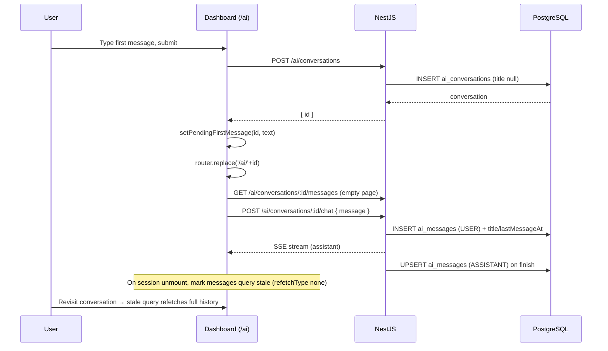

# AI Agent — ChatGPT-style New Chat Draft — Design

**Date:** 2026-10-05
**Author:** opencode (brainstorming session with Mohammad Khyata)
**Status:** Approved (2026-10-05)
**Scope:** Dashboard → AI Agent (`/ai`) — new-conversation flow only
**Primary goal:** Do not create a DB conversation until the user submits the first message; show a ChatGPT-style centered composer on `/ai` and enter the conversation on submit.

---

## Context

- Current flow:
  - `/ai` renders `<AiAgentPage />` with no `conversationId`; the main area shows only the `emptyState` placeholder (`apps/dashboard/modules/ai-agent/components/ai-agent-page.tsx:18`).
  - Sidebar "New conversation" calls `POST /ai/conversations` immediately, then navigates (`conversation-list.tsx:25-32` → `hooks/use-conversations.ts:28`).
  - `Composer` only exists inside `ChatSession` (`components/chat-view.tsx:43-48`), so a chat cannot be started without first creating a conversation row.
  - Creating a conversation writes an `ai_conversations` row with `title = null`, `lastMessageAt = now` (`apps/api/src/modules/ai-agent/conversations/services/conversations.service.ts:52-55`). Title is derived from the first user message (`:79-91`).
- AI SDK v7 (`@ai-sdk/react@4.0.116`): `useChat` recreates its internal `Chat` when the `id` option changes (`apps/dashboard/node_modules/@ai-sdk/react/dist/index.js:356-363`). Preserving an in-flight stream across a draft→conversation id change is therefore non-trivial and avoided by this design.
- Message history is cached with `staleTime: Infinity` (`hooks/use-conversation-history.ts:51`) and `onFinish` invalidates only the conversation list (`use-agent-chat.ts:24`) — navigating away and back to a conversation can show stale (pre-turn) history. The new flow makes this visible immediately because the cached first page is the empty one.
- Related specs: `docs/superpowers/specs/2026-09-24-ai-agent-runtime-design.md`, `2026-09-26-ai-agent-tools-phase2-design.md`.

## Decisions (from brainstorming)

| Topic | Decision |
|-------|----------|
| Orchestration | **Approach A**: draft form + one-shot first-message handoff. No API, contracts, routing, or DB changes. |
| Draft screen | Heading + centered composer (no suggestion chips). |
| Conversation creation | Only on first submit (`POST /ai/conversations` at submit time). |
| Handoff | Module-level one-shot store keyed by conversation id, ~15s TTL guard. |
| Mobile | Draft screen by default with a conversation-list toggle button. |
| History cache | Mark the conversation's message query stale (`refetchType: 'none'`) when a chat session unmounts, so revisits refetch persisted messages. |
| Rejected: client-generated id + catch-all route | Cleaner long-term, but touches contracts/OpenAPI and route structure; unnecessary for the perceived UX. |
| Rejected: server combined create+chat endpoint | Changes SSE protocol/controller and duplicates creation logic; overkill. |
| Non-goal | Clicking "New conversation" while already on `/ai` keeps typed draft text (no clearing). |

---

## Requirements

### Functional

- [ ] `/ai` (no conversation) renders a centered draft screen: heading + composer. No API call on load.
- [ ] No `ai_conversations` row is created by page load or by clicking "New conversation".
- [ ] "New conversation" navigates to `/ai` (draft) instead of calling the API.
- [ ] On draft submit: create the conversation, navigate to `/ai/:id`, and auto-send the submitted message so the assistant streams in the new conversation.
- [ ] Existing conversation behavior (streaming, approvals, rename, delete, history pagination) is unchanged.
- [ ] Revisiting a conversation after leaving shows all persisted messages (history-cache fix).
- [ ] On mobile, the draft screen is shown by default with a button to view the conversation list.

### Non-functional

- [ ] i18n: en, ar, tr for the new heading string.
- [ ] RTL-safe UI (logical CSS; composer already uses `dir="auto"`).
- [ ] No Prisma/API/api-contracts changes; no migration.

### UX requirements

- Draft screen: heading above an input matching the chat composer's styling, centered vertically and horizontally in the main area, max-width ~`2xl`.
- Submit while creating: composer busy (send disabled / pending state).
- Create failure: error toast, draft text preserved, user stays on the draft.
- Stream failure after creation: existing in-chat error + retry behavior; conversation remains with the user message.

---

## Proposed approach

### Option A (chosen) — Draft form + first-message handoff

1. `/ai` renders `NewChatView` (heading + centered `Composer`); "New conversation" routes here without any write.
2. On submit, `NewChatView` awaits `POST /ai/conversations`, stores `{ id → text }` in a module-level one-shot store, then `router.replace('/ai/:id')`.
3. `ChatSession` mounts on the new conversation; after its (empty) history loads, a mount effect consumes the pending text once and calls `useChat.sendMessage`.
4. The existing chat endpoint persists the user message, derives the title, streams the reply, and persists it on finish — identical to today.

**Why:** smallest change that satisfies the requirements; keeps the delicate SSE/approval/turn-lock code untouched; no contract or route churn.

### Option B (rejected) — Client-generated conversation id + optional catch-all route

Generate the UUID client-side, lazily create the conversation inside the chat transport, and make `/ai` + `/ai/:id` one route so navigation does not remount the chat. Smoother URL swap and no handoff store, but requires an optional `id` on `CreateConversationDto`, OpenAPI regeneration, and a route restructure.

### Option C (rejected) — Server combined create+chat endpoint

A single `POST /ai/chat` that creates the conversation and streams the reply, emitting the new id in the stream. Most atomic, but changes the SSE protocol/controller and duplicates creation logic. Overkill for this UX change.

---

## Data flow



---

## File map

### Create

| Path | Purpose |
|------|---------|
| `apps/dashboard/modules/ai-agent/pending-first-message.ts` | One-shot in-memory store: `setPendingFirstMessage(id, text)`, `takePendingFirstMessage(id)` with ~15s TTL |
| `apps/dashboard/modules/ai-agent/pending-first-message.test.ts` | Vitest: consume-once, TTL expiry, missing id |
| `apps/dashboard/modules/ai-agent/components/new-chat-view.tsx` | Heading + centered composer; create → store → navigate |

### Modify

| Path | Change |
|------|--------|
| `apps/dashboard/modules/ai-agent/components/composer.tsx` | Optional controlled mode (`value` / `onValueChange`) so draft text survives a failed create |
| `apps/dashboard/modules/ai-agent/components/chat-view.tsx` | Consume pending first message on mount; ref-guarded one-shot send |
| `apps/dashboard/modules/ai-agent/components/conversation-list.tsx` | "New conversation" → `router.push('/ai')`; add optional `onNew` prop; drop create mutation usage |
| `apps/dashboard/modules/ai-agent/components/ai-agent-page.tsx` | Render `NewChatView` when no id; mobile draft/list state |
| `apps/dashboard/modules/ai-agent/hooks/use-agent-chat.ts` | Unmount cleanup: mark `conversationKeys.messages(id)` stale with `refetchType: 'none'` |
| `packages/i18n/src/en/business.json` | Add `business.aiAgent.newChatTitle`; remove unused `emptyState` |
| `packages/i18n/src/ar/business.json` | Same |
| `packages/i18n/src/tr/business.json` | Same |

### Delete

None.

---

## Layer details

### 1. Dashboard — pending store (`pending-first-message.ts`)

- Module-scoped `Map<string, { text: string; at: number }>`.
- `setPendingFirstMessage(id, text)`: writes with `Date.now()`.
- `takePendingFirstMessage(id)`: returns and deletes the entry; returns `null` if missing or older than `PENDING_TTL_MS = 15_000` (guards the case where the user leaves in the create→send gap and opens the conversation later).
- No React dependency; unit-testable.

### 2. Dashboard — composer

- Add optional `value?: string` and `onValueChange?: (value: string) => void`.
- When `value` is provided, the component is controlled; otherwise it keeps today's internal state (existing `ChatSession` usage unchanged).
- The draft owns its text and clears it only after a successful create.

### 3. Dashboard — new chat view

- `NewChatView` props: `onOpenList?: () => void` (mobile-only button).
- Uses `useConversationMutations().create`, `useRouter()`, local `text` state, `create.isPending`.
- `handleSend(value)`:
  1. `const created = await create.mutateAsync()`
  2. if `!created.data` → toast error and return (text kept)
  3. `setPendingFirstMessage(created.data.id, value)`
  4. `router.replace('/ai/' + created.data.id)`
  5. catch → `toast.error(toastErrorMessage(error, t("actionFailed")))`; text kept.
- Layout: `flex flex-1 items-center justify-center p-4`, inner `w-full max-w-2xl space-y-4`, heading `t("newChatTitle")`, then `Composer`.
- Mobile: an `md:hidden` ghost button (e.g. `PanelLeftIcon`) above the heading calls `onOpenList`.

### 4. Dashboard — chat view

- `ChatSession` consumes the pending text in a mount `useEffect`, guarded by a `useRef` so React StrictMode's double-invoke cannot send twice:
  ```ts
  const sentPending = useRef(false);
  useEffect(() => {
    if (sentPending.current) return;
    sentPending.current = true;
    const text = takePendingFirstMessage(conversationId);
    if (text) void chat.sendMessage({ text });
  }, [conversationId, chat]);
  ```
- Consuming in an effect (not a `useState` initializer) avoids StrictMode's double-invoked initializers dropping the entry; normal chat sessions are unaffected because the store returns `null`.

### 5. Dashboard — conversation list

- `onNew` becomes `router.push('/ai')`; the create mutation and its pending spinner are removed from this component (the mutation itself stays in `useConversationMutations` for `NewChatView`).
- `ConversationList` gains an optional `onNew?: () => void` prop (default: `router.push('/ai')`) so the mobile layout can also close the list.

### 6. Dashboard — page layout and mobile

- `AiAgentPage` holds `const [mobileListOpen, setMobileListOpen] = useState(false)`.
- No `conversationId`:
  - Desktop (`md+`): sidebar + `NewChatView` (`onOpenList` unused).
  - Mobile: `mobileListOpen ? ConversationList (full width) : NewChatView (with list button)`.
    - `NewChatView.onOpenList` → `setMobileListOpen(true)`.
    - `ConversationList.onNew` → `setMobileListOpen(false); router.push('/ai')`.
    - Selecting a conversation → `router.push('/ai/:id')` (existing behavior); the list is hidden automatically because `conversationId` is now set.
- With `conversationId`: unchanged (`ChatView`, sidebar hidden on mobile).

### 7. Dashboard — history cache fix

- In `useAgentChat`, add an unmount cleanup effect:
  ```ts
  useEffect(
    () => () => {
      void queryClient.invalidateQueries({
        queryKey: conversationKeys.messages(conversationId),
        refetchType: "none",
      });
    },
    [queryClient, conversationId],
  );
  ```
- Marks the cached history stale without refetching while mounted; the next mount refetches persisted messages. This fixes revisit-staleness for all conversations, including the newly created one.

### 8. i18n

- Add `newChatTitle`; remove `emptyState` (only used at `ai-agent-page.tsx:18`).
  - en: `"How can I help you today?"`
  - ar: `"كيف يمكنني مساعدتك اليوم؟"`
  - tr: `"Bugün size nasıl yardımcı olabilirim?"`

---

## Edge cases

| Case | Behavior |
|------|----------|
| Create fails | Toast; draft text preserved; stays on `/ai`; composer re-enabled. |
| Stream fails after create | Conversation exists with the user message; existing in-chat error + retry. |
| User leaves during create→send gap | Pending entry expires via TTL; conversation stays empty and opens with the existing `startHint` empty state. |
| Double submit / React StrictMode | Composer busy during create; `useRef` guard prevents duplicate auto-send. |
| "New conversation" clicked while on `/ai` with text | Text persists (explicit non-goal). |
| Existing empty conversations | Unchanged; `startHint` still shown inside `MessageList`. |

---

## Verification

```bash
pnpm --filter @devloggers/dashboard test:unit
pnpm --filter @devloggers/dashboard lint
pnpm --filter @devloggers/dashboard typecheck
pnpm turbo run build --filter=@devloggers/dashboard
pnpm --filter @devloggers/i18n build
```

### Manual smoke test

- [ ] Load `/ai`: centered heading + composer; no new row in `ai_conversations` (check Prisma Studio or list API).
- [ ] Click "New conversation" from a chat: navigates to draft; still no row.
- [ ] Submit from draft: row + USER message + ASSISTANT reply exist; sidebar title derived from the message.
- [ ] Navigate to another conversation and back: full turn is shown (history refetch).
- [ ] Create failure simulation (offline / API down): toast shows, text remains.
- [ ] Mobile viewport: draft default, list toggle works, conversation opens.
- [ ] ar (RTL) renders the heading and centered composer correctly.

---

## Out of scope

- Client-generated conversation ids, optional catch-all route, or any route restructure.
- Server-side combined create+chat endpoint.
- Clearing already-typed draft text when "New conversation" is clicked on the draft.
- Mobile back button inside the chat view (pre-existing behavior).
- Reworking the history cache strategy beyond the targeted stale-marking fix.

---

## Open questions

None — all decisions resolved during brainstorming.

---

## Approval

- [x] Design reviewed in conversation: Mohammad Khyata, 2026-10-05
- [x] Written spec reviewed (this document)
- [x] Implementation plan created (`docs/superpowers/plans/2026-10-05-ai-new-chat-draft.md`)
