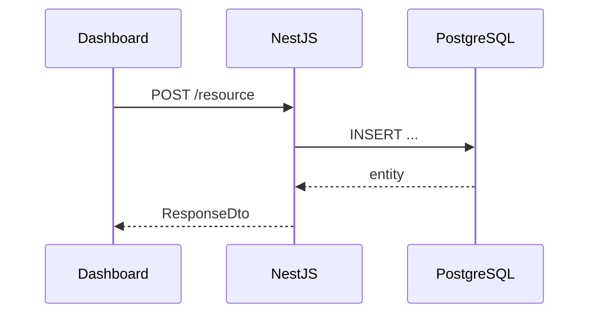

# <Feature Title> — Design

**Date:** YYYY-MM-DD  
**Author:** <name or agent>  
**Status:** Draft | Approved | Implemented  
**Scope:** <e.g. Dashboard → Catalog → Units list page>  
**Primary goal:** <one sentence — what problem this solves>

---

## Context

<!-- What exists today? Link files, patterns, prior specs. -->

- Current implementation lives in:
  - `path/to/existing/files`
- Golden reference: **units** vertical slice (if CRUD)
- Related specs: `docs/superpowers/specs/<prior>-design.md` (if any)

---

## Requirements

### Functional

- [ ] Requirement 1
- [ ] Requirement 2

### Non-functional

- [ ] Tenant isolation (`tenantId` on all mutations)
- [ ] i18n: en, ar, tr
- [ ] RTL-safe UI (logical CSS)
- [ ] OpenAPI/Swagger completeness if API changes

### Backend payload / API (if applicable)

<!-- Field requirements, validation rules, relations -->

---

## UX requirements (if applicable)

<!-- Readonly vs edit modes, error display, loading states -->

---

## Proposed approach

### Option A (recommended)

<!-- Describe data flow: Prisma → contracts → API → client → dashboard -->

**Why this option:** <trade-offs vs alternatives>

### Option B (rejected / deferred)

<!-- Brief — why not chosen -->

---

## Data flow



---

## File map

### Create

| Path | Purpose |
|------|---------|
| `packages/db-prisma/src/schema/<entity>.prisma` | Model |
| `packages/api-contracts/src/resources/<entity>.resource.ts` | Resource definition |
| `apps/api/src/modules/<domain>/<entities>/` | NestJS module |
| `packages/api-client/src/clients/<entities>.client.ts` | HTTP client |
| `apps/dashboard/modules/<entities>/` | Dashboard module |

### Modify

| Path | Change |
|------|--------|
| `apps/dashboard/config/navGroups.tsx` | Add nav entry |
| `apps/dashboard/messages/en.json` | i18n keys |

### Delete

<!-- None, or list files to remove -->

---

## Layer details

### 1. Database

<!-- Schema changes, indexes, migrations -->

### 2. API contracts

<!-- DTOs, resource keys -->

### 3. NestJS API

<!-- Service hooks, business rules, events -->

### 4. API client

<!-- CrudClient registration -->

### 5. Dashboard

<!-- Resource, form, columns, routes -->

---

## Verification

```bash
pnpm --filter @devloggers/db-prisma db:migrate:dev
pnpm turbo run build --filter=@devloggers/api
pnpm turbo run build --filter=@devloggers/dashboard
pnpm generate:dev   # if API DTOs changed — API must be running
```

### Manual smoke test

- [ ] List loads with tenant data
- [ ] Create / edit / delete works
- [ ] i18n renders in ar (RTL) and en
- [ ] Error states display correctly

---

## Out of scope

- Item explicitly excluded from this change
- Future work deferred to another spec

---

## Open questions

- [ ] Question 1 — **Decision:** TBD

---

## Approval

- [ ] Design reviewed by: ___
- [ ] Approved on: ___
